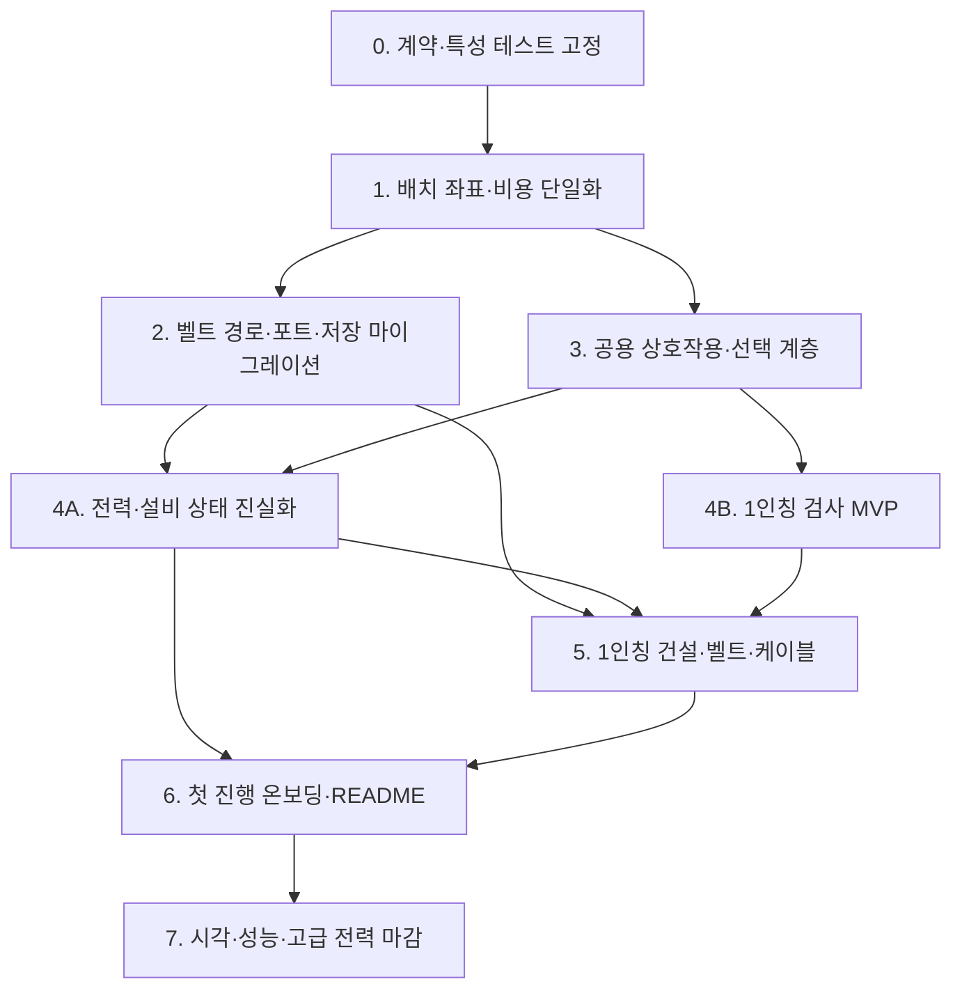

# FactoryX 공장 핵심 플레이 복구 로드맵

> - 문서 상태: 핵심 복구 구현·실행 검증 기록 v1.0
> - 기준일: 2026-08-02
> - 대상: 건설, 벨트 물류, 전력, 설비 선택·검사, 1인칭 조작, 온보딩, 회귀 테스트
> - 제외: 월드 배경, 지형·절벽·식생·수계·날씨 제작, World Studio, 환경 자산 파이프라인
> - 관련 문서: [자원·생산 계보 기획](./production-lineage-design.ko.md), [건물 비주얼 디자인 원칙](./machine-visual-design-principles.ko.md)

## 구현 체크포인트 — 2026-08-02

- [x] 배치 anchor, 회전 footprint, 모델 중심, 월드 포트를 하나의 순수 투영 계약으로 통합
- [x] 프리뷰와 실제 커밋의 셀 스냅·중심·회전 일치
- [x] 연속 1칸 컨베이어와 기계 포트의 실제 생산 그래프 연결
- [x] 드래그 벨트 전체 경로의 합산 재료 검증
- [x] 선택 설비 월드 외곽선과 검사 패널 클릭 차단
- [x] 전력·생산 정지 원인을 구조화된 12개 표시 상태로 통합
- [x] 전력 HUD의 `OFFLINE`, `BLACKOUT`, `NO LOAD`, `LIMITED`, `GRID` 구분
- [x] 1인칭 검사, 단일 건물 배치, 벨트 시작/완료, 철거, 회전·레시피·전력 단축키
- [x] 프리뷰에 실제 포트 마커와 연결 예정선 표시
- [x] 코어·프로젝트 도크 같은 preplaced unique 설비의 통합 선택 identity
- [x] 전력 케이블 전용 조준 포트 선택과 케이블 미리보기
- [x] 브라우저 플레이스루 기반 선택·포트 시각 회귀와 7단계 온보딩 완성

이 체크포인트는 2026-08-02 핵심 복구 패스에서 완료된 범위를 기록한다. 아래 단계별 계획은 구현 의존성과 장기 구조 개선의 기준으로 계속 사용하되, 실제 적용 결과는 다음 표를 권위 있는 현황으로 본다.

### 적용 결과와 검증 근거

| 영역 | 적용 결과 | 검증 |
| --- | --- | --- |
| 배치 | anchor·회전 footprint·모델 중심·월드 포트가 `PlacementPlan` 계열 순수 투영을 공유 | 4회전, 직사각형, preview=commit, 전체 경로 quote 테스트 |
| 컨베이어 | 포인터를 놓은 최종 셀을 다시 계산하고 직선·양방향 L 코너를 실제 포트 방향이 맞는 세그먼트로 확정 | 실제 registry에서 기계→직선→코너→직선→기계 연결 테스트 |
| 선택 | `worldInstanceId`를 권위 identity로 사용하고 설치 설비·코어·도크를 같은 owner resolver로 선택 | 선설치 unique 설비 선택·상세·철거 금지 테스트와 브라우저 코어 선택 |
| 전력 | `L` 전용 도구에서 저작된 정확한 `ownerId + portId`를 조준·미리보기·확정에 동일하게 사용 | 거리, 전압 규격, 방향, 층, 점유, 중복, 포트·설비 한도 테스트 |
| 상태 표시 | 12개 대표 설비 상태와 5개 전력망 HUD 상태를 실제 전력·생산 원인에서 계산 | reducer·물리 전력망·HUD 계약 테스트 |
| 1인칭 | 중앙 ray 기반 검사·건설·벨트·케이블·철거와 도구 전환, 모달·포인터 락 안전 상태를 공용 명령에 연결 | action state machine·조준·충돌 테스트와 브라우저 도구 전환 |
| 온보딩 | 코어 검사부터 첫 제품까지 실제 월드·전력 topology·생산 snapshot으로 진행하는 7단계 작업 카드 | 단계 reducer 테스트와 브라우저 `STEP 1 → STEP 2` 전환 |

이번 패스에서는 컨베이어 저장 표현을 하나의 가변 길이 `TransportRoute`로 전면 마이그레이션하지 않고, 기존 셀 세그먼트 저장 호환을 유지한 채 전용 코너 정의와 단일 경로 분류기로 논리 연결을 바로잡았다. 장기적인 경로 단위 FIFO·LOD·저장 마이그레이션은 7단계 최적화 작업으로 남기며, 현재 플레이어 입력과 실제 생산 그래프의 연결 계약은 회귀 테스트로 고정한다.

## 1. 결론

현재 FactoryX의 핵심 문제는 생산·전력 기능이 없는 것이 아니다. 정의 기반 생산 월드, 물리 전력망, 연료·축전·부하 차단, 프로젝트 계약과 1인칭 이동·충돌까지 상당 부분 구현돼 있다.

문제는 플레이어 입력에서 월드 결과까지 이어지는 경로가 두 세대의 규칙으로 갈라져 있다는 점이다.

```text
플레이어 입력
  → 레거시 Tool / BuildType / COST / 셀 배치
  → 일부는 새 BuildingDefinition / PortDefinition 월드로 변환
  → 생산·전력 시뮬레이션
  → 다시 축약된 레거시 상태와 HUD로 표시
```

이 과정에서 좌표, 회전, 포트, 비용, 건물 종류와 상태 원인이 서로 다르게 해석된다. 그 결과 화면에서는 연결된 벨트가 실제 생산 그래프에서는 끊기고, 정전된 공장이 정상처럼 보이며, 배전 기둥이 성형기로 표시되고, 1인칭에서는 이동 이외의 행동이 모두 사라진다.

복구 순서는 다음 원칙을 따른다.

1. **논리 계약을 먼저 하나로 고정한다.**
2. **미리보기와 확정 결과가 같은 명령을 사용하게 한다.**
3. **시뮬레이션의 실제 원인을 UI와 모델까지 손실 없이 전달한다.**
4. **오버뷰와 1인칭은 별도 게임이 아니라 같은 상호작용 명령의 다른 조준 방식으로 만든다.**
5. **동작이 진실해진 뒤 온보딩과 시각 마감을 올린다.**

월드에 존재하는 설비의 정규 identity는 `worldInstanceId`로 통일한다. 레거시 숫자 `structureId`는 저장 마이그레이션과 호환 어댑터에서만 사용하고 선택, 생산, 전력, 모델과 UI가 서로 다른 ID를 권위 소스로 삼지 않는다.

## 2. 기존 문서가 이미 정한 계약

이번 로드맵은 새 시스템을 임의로 발명하는 문서가 아니다. 기존 기획이 요구한 계약과 현재 런타임의 간격을 메우는 실행 문서다.

| 기존 계약 | 근거 | 현재 간격 |
| --- | --- | --- |
| `BuildingDefinition`과 `PortDefinition`을 정규 정의로 사용 | 생산 계보 §11 | 레거시 `BuildType`, `TOOL_INFO`, `COST`가 화면과 배치 일부를 계속 결정 |
| 포트 배열이 모델, 미리보기, 연결과 회전의 단일 기준 | 생산 계보 §11 `PortDefinition` | 벨트 경로, 레거시 모델, 데이터 포트가 서로 다른 회전·좌표 사용 |
| 모델과 시뮬레이션에 같은 회전 변환 적용 | 생산 계보 §14.6 | 미리보기와 확정 모델의 회전 부호 및 중심점 불일치 |
| 건설 미리보기에서 점유, 포트 셀, 진행 방향과 연결 결과 표시 | 생산 계보 §14.6, §21.16 | 현재 고스트는 모델 유효 색상 위주이며 연결 원인과 포트가 보이지 않음 |
| 상태 대표 우선순위를 원인 기준으로 판정 | 생산 계보 §14.8 | 전력 부족이 원료 부족으로 바뀌거나 `가동 중`으로 남을 수 있음 |
| 생산 진행과 핵심 애니메이션에 같은 전력 만족도 사용 | 생산 계보 §14.7, §21.10 | 생산 속도, 모델 동작, 케이블 펄스가 서로 다른 상태 사용 |
| 정전 원인을 5초 안에 식별 | 생산 계보 §21.12, §21.19 | `0/0`, `100%`가 미연결·부하 차단을 정상처럼 가림 |
| 선택 설비가 속한 전력망을 HUD에 표시 | 생산 계보 §21.14 | 선택 상세에는 전력망·요청·공급·차단 원인이 없음 |
| 1인칭에서 UI를 열면 포인터 잠금을 해제하고 닫을 때 원래 시점으로 복귀 | 생산 계보 §20.2 | 일부 모달은 열리지만 현장 상호작용과 도구 상태가 없음 |
| 1인칭에서 HUD 없이도 공정 핵심부와 상태를 읽음 | 건물 비주얼 원칙 §6, §8 | 근거리 모델 기준은 있으나 조준 대상·상태 카드·상호작용이 없음 |

특히 생산 계보 문서의 다음 문장은 이번 복구의 최상위 불변 조건이다.

> 포트 배열을 모델, 배치 미리보기, 물류 연결과 회전의 단일 기준으로 사용한다.

따라서 벨트 미리보기 위치에 단순히 `+0.5`를 더하는 식의 국소 수정은 완료로 간주하지 않는다.

생산 계보 §22의 완료 체크는 주의해서 읽어야 한다. 일부 항목은 도메인 계산과 회귀 테스트가 존재한다는 뜻으로는 완료됐지만, 플레이어가 화면에서 상태를 식별하고 조작할 수 있다는 의미로는 완료되지 않았다. 이후 문서 상태는 `데이터 계약`, `시뮬레이션`, `런타임 통합`, `플레이어 UI`, `브라우저 시나리오`를 분리해 기록한다.

또한 생산 계보 §21.17의 `PowerVisualState`와 `PowerGridSnapshot`에는 이후 코드가 사용하게 된 `shed`, `fuel_starved`, 차단 전 수요와 정전 원인 필드가 빠져 있다. 4A단계에서 새 정규 상태 스키마를 확정할 때 기존 문서도 함께 갱신한다.

## 3. 현재 구현 기준선

### 3.1 이미 보존할 기반

- 정의 기반 아이템·레시피·건물·프로젝트 레지스트리
- 고정 생산 틱, WIP와 버퍼 보존
- 물리 전력 연결 요소, 발전 디스패치, 연료, 축전, 부하 차단과 복구
- 건설 이력과 undo/redo 기반
- 1인칭 WASD 이동, 달리기, 점프, 지형·설비 충돌, 위치 저장과 시작점 복구
- 생산 계보, 프로젝트, 전력 제어 화면의 기본 골격
- 생산·전력 도메인 단위 테스트

관련 생산·전력 집중 테스트 47개는 감사 시점에 통과했다. 이는 계산 기반을 유지할 가치가 있다는 뜻이지만, 포인터 입력부터 화면 결과까지의 통합 동작을 보증하지는 않는다.

### 3.2 P0 — 벨트와 건설 좌표가 서로 다른 공장을 만든다

현재 확인된 문제는 다음과 같다.

- 벨트 미리보기는 셀 정수 좌표에 놓이고 확정 모델은 풋프린트 중심만큼 이동한다.
- 미리보기 회전과 확정 모델 회전의 부호가 다르다.
- 포인터 호버는 반올림 셀을 사용하고 데이터 월드는 최소 셀 anchor를 사용한다.
- 직사각형 건물은 90도 회전 뒤에도 렌더 중심 계산에서 회전 전 풋프린트를 사용할 수 있다.
- `pointerup`은 최종 셀을 계산하지만 마지막 경로를 재생성하지 않고 이전 미리보기를 확정한다.
- 긴 경로는 세그먼트별 재료 검증만 통과하고 전체 비용은 확정 시 실패할 수 있다.
- UI의 1칸 연속 벨트와 실제 데이터 포트 연결 규칙이 달라, 시각적으로 붙은 경로가 생산 그래프에서 연결 0개가 될 수 있다.
- 레거시 월드 마이그레이션이 기존 회전을 그대로 복사하므로 회전 계약 수정 시 저장 호환 문제가 생긴다.

기존 기획에서 컨베이어는 `1×1 건물 여러 개`보다 `폭 1의 가변 길이 경로`에 가깝다. 시작·끝 포트, 코너·경사 공통 샘플링, 실제 경로 길이 기반 FIFO와 수용량을 요구한다. 장기 구현은 경로를 논리 transport 단위로 만드는 편이 문서 의도와 맞다.

### 3.3 P0 — 전력망이 고장 원인을 숨긴다

- 새 월드의 현장 전력 코어와 프로젝트 도크는 전력 edge 없이 고립돼 있다.
- 코어는 24MW 발전기지만 연결 요소가 없으면 HUD 용량도 0으로 나온다.
- 코어와 도크는 일반 피킹 그룹 밖에 있어 선택·검사할 수 없다.
- 수동 케이블 연결은 양 끝 설비 선택을 요구하므로 코어에서 첫 케이블을 시작할 수 없다.
- 첫 전력망은 보이지 않는 코어 포트에 배전 기둥을 정확히 맞대는 숨은 퍼즐이 된다.
- 자동 부하 차단 뒤 차단된 요청량이 0이 되면 전력 패널이 만족도 100%를 계산한다.
- 물리 전력 런타임의 `unconnected`, `shed`, `tripped`, `restoring`, `fuel_starved` 원인이 생산 상태와 HUD로 충분히 전달되지 않는다.
- 케이블 펄스와 일부 시작 설비 애니메이션은 실제 공급량보다 발전기 존재 여부 또는 하드코딩된 상태를 사용한다.
- 전력 0은 공정 속도만 0으로 만들고 대표 상태를 반드시 전력 부족으로 바꾸지 않아, 멈춘 설비가 `가동 중`으로 남을 수 있다.
- `전력 부족` 문자열이 HUD에서 `원료 부족`으로 분류될 수 있다.

### 3.4 P0 — 레거시 도구와 새 정의가 충돌한다

현재 런타임은 `CampaignWorldRuntime`, 레거시 `FactorySimulation`과 `WorldProductionSimulation`을 함께 운용한다. 호환 어댑터로 한정되지 않고 선택·피킹·애니메이션·전력과 건설 일부가 각기 다른 상태를 읽기 때문에 동일 설비를 서로 다른 정체성과 상태로 해석한다.

매핑되지 않은 데이터 건물은 레거시 `assembler`로 떨어진다. 전력 기둥, 발전기, 차단기 등도 여기에 포함된다.

실행 화면에서 배전 기둥 Mk.1을 선택했을 때 다음 정보가 동시에 표시되는 현상을 재현했다.

- 고스트와 토스트: 배전 기둥 Mk.1
- 하단 활성 도구: 성형기
- 하단 가격: `₡260`
- 실제 건설 비용: 정의의 재료 `buildCost[]`
- 오른쪽 상세: 이전에 선택한 아크 제련기

비용, 건물 정체성, 풋프린트와 상세 정보가 하나의 정의에서 나오기 전에는 개별 HUD 문구를 고쳐도 같은 문제가 반복된다.

### 3.5 P1 — 선택과 검사에는 월드 피드백이 없다

- 선택은 `selectedId` 저장과 React 콜백만 수행한다.
- 월드 모델 외곽선, 풋프린트 링, 포트 강조, 선택 음향이 없다.
- 호버 피킹이 없어 클릭하기 전 대상 여부를 알 수 없다.
- 선설치 코어와 도크는 선택 목록에 없다.
- 도구를 바꿔도 이전 인스펙터가 남을 수 있다.
- 인스펙터에 명시적 닫기 버튼이 없고 `Esc`도 선택 해제가 아니다.
- HUD 컨테이너의 포인터 이벤트 설정 때문에 인스펙터의 레시피 버튼 클릭이 캔버스로 통과한다.
- 상세 정보가 capability가 아니라 레거시 타입 중심이라 전력 설비, 벨트 처리량과 실제 레시피 정보가 틀릴 수 있다.

### 3.6 P1 — 1인칭은 이동 모드일 뿐 플레이 모드가 아니다

현재 1인칭에서 가능한 핵심 행동은 이동, 달리기, 점프, 시점 회전과 지상·동굴 전환이다. 기반 자체는 쓸 만하지만 공장 운영 루프가 연결돼 있지 않다.

직접 원인은 다음과 같다.

- 1인칭 진입 시 도구를 강제로 `inspect`로 바꾸고 기존 선택·고스트를 지운다.
- 포인터 이동, 포인터 업, 휠과 컨텍스트 메뉴 처리가 1인칭이면 즉시 반환한다.
- 포인터 다운은 첫 클릭의 포인터 잠금만 처리하고 잠긴 뒤의 클릭 행동은 없다.
- 키 입력은 이동·점프·`V`·`C` 처리 뒤 1인칭이면 반환해 숫자 도구, `F`, `L`, `R`, 철거, undo/redo를 모두 막는다.
- 지면 셀과 구조물 피킹 레이는 오버뷰 카메라를 사용하며 1인칭 화면 중앙 조준 레이가 없다.
- 중앙 조준점은 장식 요소일 뿐 대상 이름, 거리, 행동 또는 유효 여부와 연결되지 않는다.
- 인스펙터와 건설 도크는 CSS로 숨겨진다.
- 건설 카탈로그는 전용 단축키가 없어서 포인터 잠금 중 즉시 열기 어렵다.
- 화면 버튼으로 카탈로그를 열어 건물을 선택하면 1인칭인데도 건설 도구가 활성화된다. 고스트는 마지막 오버뷰 셀에 생길 수 있지만 실제 배치는 불가능해 함정 상태가 된다.
- 설비 검사, 레시피 변경, 벨트·케이블 연결, 건설, 철거와 현장 전력 진단이 불가능하다.
- 포인터 잠금 실패 이벤트, 창 blur·visibility 변경 시 눌린 키 초기화와 모달 종료 후 포커스 복구가 없다. 잠금이 풀려 시점은 고정됐는데 WASD 이동은 계속될 수 있다.
- 오버뷰에서 1인칭으로 전환할 때 이전 플레이어 위치를 사용하고, 1인칭에서 오버뷰로 돌아올 때도 카메라 target을 현장 위치로 옮기지 않아 두 시점의 공간 맥락이 끊긴다.
- 설비 충돌은 높이 없는 XZ 풋프린트라 낮은 컨베이어도 바닥부터 천장까지 막는 벽처럼 취급된다.
- 숨겨진 건설 도크는 `opacity: 0`일 뿐 조건부 제거가 아니라 키보드 탭 순서와 접근성 트리에 남을 수 있다.
- 1인칭 테스트는 이동과 충돌의 순수 함수에 집중돼 있고 조준·선택·모달 복귀·현장 건설 통합 테스트가 없다.

### 3.7 P2 — 설명과 첫 진행이 구현을 따라가지 못한다

- 루트 README는 아직 vinext 스타터 설명이다.
- 첫 토스트는 출력 포트와 벨트만 언급한다.
- 배전 반경, 기둥 한도, 발전량, 연료, 케이블 연결 단계와 정전 원인 설명이 없다.
- 프로젝트 화면은 납품량을 보여주지만 첫 생산선을 어떤 순서로 만드는지는 안내하지 않는다.
- 코드에 샘플 생산선 함수가 있어도 새 게임의 실제 첫 학습 루프와 연결돼 있지 않다.

## 4. 복구 후 목표 플레이 루프

### 4.1 오버뷰 목표

새 저장에서 플레이어가 외부 설명 없이 다음 흐름을 완료할 수 있어야 한다.

1. 현장 전력 코어를 선택해 `24MW`, 현재 연결 상태와 출력 포트를 확인한다.
2. 배전 기둥 Mk.1을 선택하면 코어 연결 스냅, 공급 반경과 귀속 예정 설비를 본다.
3. 채굴기, 제련기와 성형기를 배치하고 미리보기 위치 그대로 확정한다.
4. 설비의 실제 출력 포트에서 벨트를 시작하고 실제 입력 포트에 끝낸다.
5. 벨트를 놓자마자 생산 그래프에서도 하나의 연속 경로가 된다.
6. 정전 또는 미연결이 생기면 원인 위치와 해결 행동을 5초 안에 찾는다.
7. 도크를 선택해 현재 계약, 납품 포트와 단계별 전력 요구를 확인한다.

### 4.2 1인칭 목표

1인칭의 역할은 단순 관광이 아니라 **현장 운영자 모드**다. 오버뷰의 모든 대량 배치 효율을 복제할 필요는 없지만, 현장에서 본 문제를 진단하고 작은 수정까지 완료할 수 있어야 한다.

최소 완료 루프는 다음과 같다.

1. 설비를 조준하면 약한 외곽선과 `이름 · 대표 상태 · E 검사` 프롬프트가 나타난다.
2. `E`로 검사하면 포인터 잠금을 유지한 채 작은 현장 상태 카드가 열린다.
3. 카드에서 실제 레시피, 입력·출력, 요청/공급 MW, 연결 기둥과 정지 원인을 확인한다.
4. 필요한 경우 레시피를 바꾸거나 전력 차단기·수동 레버를 조작한다.
5. `B`로 카탈로그를 열어 설비를 고르고, 화면 중앙 지면 레이로 고스트를 배치한다.
6. 벨트는 드래그 대신 `시작 클릭 → 경로 미리보기 → 끝 클릭` 방식으로 놓는다.
7. 전력 케이블은 호환 포트를 직접 조준해 `시작 포트 → 끝 포트`로 연결한다.
8. 철거는 위험 행동으로 분리하고 선설치 코어·도크는 검사 가능하지만 철거할 수 없다.
9. 생산 계보·프로젝트·전력망 모달을 열면 포인터 잠금이 해제되고, 닫으면 1인칭과 선택 상태를 복원한 뒤 한 번의 클릭으로 시점 제어를 재개한다.

## 5. 구현 의존성



`4A`와 `4B`는 공용 상호작용 계층이 완성된 뒤 병렬로 진행할 수 있다. 반대로 배치·포트 계약이 잠기기 전에 1인칭 건설을 별도로 구현하면 현재의 이중 규칙이 세 개로 늘어난다.

## 6. 단계별 구현 계획

### 0단계 — 계약과 현재 실패를 테스트로 고정

#### 목표

수정 중에 겉보기만 달라지고 생산·저장 데이터가 다시 깨지는 일을 막는다.

#### 작업

- `worldInstanceId`를 선택·생산·전력·모델·UI가 공유하는 정규 identity로 고정하고 숫자 `structureId`의 잔여 사용처를 목록화한다.
- 셀 anchor, 회전된 풋프린트, 모델 중심, 점유 셀과 월드 포트 변환을 순수 함수 계약으로 정의한다.
- 기본 방향을 문서대로 로컬 `-X 입력 → +X 출력`으로 고정한다.
- `1타일 = 1m = Three.js 1단위`를 공통 상수에서 읽게 한다.
- 현재 저장 스키마 버전과 레거시 벨트 회전 의미를 기록한다.
- 다음 실패를 의도적으로 재현하는 특성 테스트를 추가한다.
  - 미리보기와 확정 transform 불일치
  - UI 방식 연속 벨트의 데이터 연결 0개
  - 배전 기둥이 성형기로 표시
  - 부하 차단 뒤 `0/0`, `100%`
  - 인스펙터 버튼 클릭 관통
- 1인칭 조준점에서 설비를 선택할 수 없음
- 1인칭 카탈로그 선택 뒤 배치할 수 없는 도구 상태

1인칭 건설이 완성되기 전까지는 카탈로그에서 건물을 고를 때 명시적으로 오버뷰 전환을 확인시키거나 1인칭 선택을 막는다. 숨겨진 도구가 활성화되는 현재 상태는 그대로 두지 않는다.

#### 완료 게이트

- 0·90·180·270도 표 기반 좌표 테스트가 있다.
- 직사각형 풋프린트의 회전 중심 테스트가 있다.
- 실제 `START_REGISTRY`를 쓰는 기계→벨트→기계 통합 테스트가 실패 원인을 정확히 보여준다.
- 저장 마이그레이션 없이 회전 의미를 바꾸는 변경은 병합할 수 없다.

### 1단계 — 배치 좌표, 비용과 건물 정체성 단일화

#### 목표

미리보기와 확정 배치가 동일한 계산 결과를 소비하게 한다.

#### 권장 구조

```text
PlacementPlan
  buildingId
  anchorCell
  rotation
  rotatedFootprint
  occupiedCells[]
  modelTransform
  worldPorts[]
  constructionQuote
  warnings[]
  errors[]
```

오버뷰, 1인칭, 고스트, 실제 건설, 철거 예측과 HUD는 각자 좌표를 다시 계산하지 않고 같은 `PlacementPlan`을 사용한다.

#### 작업

- `legacyTypeForBuilding`의 기본 `assembler` 폴백을 데이터 건설 경로에서 제거한다.
- `selectedBuildingId`와 `BuildingDefinition`을 건설 도구 정체성의 권위 소스로 사용한다.
- 레거시 CR 가격과 실제 `buildCost[]` 중 하나만 화면에 표시한다. 캠페인 건설은 `buildCost[]`를 기준으로 한다.
- 회전된 풋프린트로 모델 중심, 고스트, 지형 높이 샘플과 점유를 계산한다.
- 포트 마커도 `PortDefinition`의 월드 변환 결과를 직접 사용한다.
- 미리보기 검증과 확정 명령이 동일한 batch quote를 공유한다.
- 최종 `pointerup` 위치에서 plan을 다시 계산한 뒤 확정한다.
- `pointercancel`과 `lostpointercapture`에서 미리보기와 예약 상태를 정리한다.

#### 완료 게이트

- `preview.modelTransform === commit.modelTransform`이 허용 오차 안에서 항상 성립한다.
- 포인터가 가리킨 셀, 호버, 고스트, 점유 셀과 확정 모델이 일치한다.
- 긴 경로에 필요한 재료가 하나 부족하면 미리보기부터 전체 경로가 실패한다.
- 하단 HUD, 카탈로그, 고스트와 확정 결과가 같은 건물 이름·비용·풋프린트를 표시한다.

### 2단계 — 벨트를 실제 가변 경로로 통합

#### 목표

화면에 연결된 벨트가 생산 월드에서도 같은 하나의 경로가 되게 한다.

#### 결정

권장안은 컨베이어를 셀별 일반 건물 묶음이 아니라 `TransportRoute`로 표현하는 것이다.

```text
TransportRoute
  id, definitionId
  startPortRef?, endPortRef?
  anchors[]
  sampledPath[]
  lengthMeters
  capacity
  items[]
  routingState
```

단기적으로 셀별 segment를 유지해야 한다면 인접 segment 연결, 기계 포트 접점과 회전을 전용 어댑터 하나로 통일한다. 두 표현을 런타임에서 동시에 권위 소스로 유지하지 않는다.

#### 작업

- 포트에서 시작하거나 지면에서 시작하는 경로를 같은 정규 path builder로 계산한다.
- 직선, 두 방향 L 코너와 역방향 드래그를 지원한다.
- 프리뷰와 확정 batch가 동일한 경로 객체를 공유한다.
- 처리량, 최소 아이템 간격, 수용량과 FIFO를 실제 경로 길이로 계산한다.
- 기계 출력→벨트→코너→벨트→기계 입력을 하나의 데이터 그래프로 연결한다.
- 월드 기반 벨트 아이템이 레거시 fallback에서 삭제되지 않게 단일 실행 경로를 사용한다.
- undo/redo는 전체 경로를 한 명령으로 처리한다.
- 기존 저장의 연속 벨트 셀과 레거시 회전을 새 경로로 재구성하는 명시적 마이그레이션을 추가한다.
- 재구성할 수 없는 저장은 조용히 방향을 바꾸지 말고 진단과 복구 선택지를 남긴다.

#### 완료 게이트

- 실제 registry의 Mk.1/2/3가 각각 정의된 60/120/240개·분 처리량을 지킨다.
- 네 방향 기계→벨트→기계 경로가 실제 아이템을 전달한다.
- 10분 고정 시뮬레이션 뒤 아이템 보존식이 맞는다.
- 역압, 저장·불러오기, undo/redo에서 아이템이 삭제·복제되지 않는다.
- 마지막 포인터 이동 없이 놓기, 캔버스 밖 release와 pointer cancel을 통과한다.

### 3단계 — 카메라 공용 상호작용과 선택 계층

#### 목표

오버뷰와 1인칭이 같은 설비 ID와 같은 행동을 사용하게 한다.

#### 권장 구조

```text
InteractionTarget
  ownerId: worldInstanceId
  kind: building | belt | port | resource | project
  stratumId
  selectable
  demolishable
  interactionBounds
  actions[]

InteractionHit
  target
  point
  distance
  action
```

카메라별 차이는 ray origin과 조준 방식뿐이다.

- 오버뷰: 포인터 NDC와 오버뷰 카메라
- 1인칭: 화면 중앙 `(0, 0)`과 1인칭 카메라

#### 작업

- 선택, 생산 node, 전력 consumer/generator와 모델 group이 모두 같은 `worldInstanceId`를 참조하도록 하고 레거시 ID 변환은 경계 어댑터 한 곳에 둔다.
- 선설치 코어와 도크도 `selectable`, `demolishable: false` 대상으로 등록한다.
- 보이지 않는 층과 LOD 비활성 대상은 피킹 후보에서 제외한다.
- 얇은 벨트와 포트에는 실제 풋프린트와 맞는 투명 피킹 프록시를 둔다.
- 호버는 약한 중립 외곽선과 이름·상태 칩을 표시한다.
- 선택은 지속적인 풋프린트 링, 코너 브래킷 또는 별도 outline overlay를 표시한다.
- 선택 overlay는 공유 모델 재질을 직접 바꾸지 않고 운전 상태색을 덮지 않는다.
- `SelectedInfo`를 레거시 타입이 아니라 건물 capability로 구성한다.
  - 생산: 실제 레시피, 주기, 포트별 입력·출력, 요청·공급 MW
  - 벨트: 정의 처리량, 방향, 양 끝 연결, 현재 품목과 막힌 위치
  - 발전·배전: 발전량, 연료, 망, 반경, 케이블과 소비자 수
  - 축전·차단: 저장량, 충·방전, 레버와 트립 상태
- 인스펙터 포인터 이벤트를 복구하고 닫기 버튼과 명시적인 선택 해제를 추가한다.
- 도구 전환 시 기존 인스펙터를 닫을지 고정할지 명시적으로 결정하고 stale 상태를 허용하지 않는다.

#### 완료 게이트

- 호버, 선택, 재선택, 빈 공간 해제, 철거와 층 전환 상태 전이 테스트가 있다.
- 인스펙터 버튼을 눌러도 캔버스로 클릭이 통과하지 않는다.
- 선택 모델, 오른쪽 패널과 전력 HUD가 항상 같은 owner ID를 가리킨다.
- 선택 전후 실제 운전 재질과 애니메이션 상태가 변하지 않는다.

### 4A단계 — 전력과 설비 상태를 진실하게 표시

#### 목표

수학적 만족도와 플레이어에게 보여줄 건강 상태를 분리한다.

`requestedMW === 0`일 때 `satisfaction = 1`인 계산은 유지할 수 있지만 이를 곧바로 `정상`으로 표시하지 않는다.

#### 권장 상태 스냅샷

```text
EquipmentOperationalSnapshot
  primaryState
    tripped | unconnected | shed | fuel_starved | power_limited
    | missing_input | output_blocked | recipe_missing | manual_off
    | restoring | idle | working
  causes[]
  requestedMW, servedMW, satisfaction
  powerGridId?, distributionNodeId?
  missingPortIds[], blockedPortIds[]
  progress, speedMultiplier
```

대표 상태 우선순위는 생산 계보 §14.8을 따른다.

```text
보호 트립
→ 전력 미연결
→ 필수 입력 미연결
→ 부하 차단/연료 없음
→ 전력 제한
→ 수동 정지
→ 레시피 없음
→ 출력 막힘
→ 입력 부족
→ 가득 참
→ 대기
→ 정상 가동
```

#### 작업

- 전력 snapshot에 차단 전 수요, 차단된 수요, shed 소비자, 미연결 소비자와 발전기 운전 원인을 보존한다.
- `unconnected`, `shed`, `tripped`, `restoring`, `fuel_starved`를 HUD까지 전달한다.
- 생산 상태 reducer가 전력 원인을 먼저 판정하고 문자열 정규식으로 상태를 재분류하지 않게 한다.
- 생산 진행도와 핵심 모델 애니메이션 모두 동일한 `satisfaction` 또는 `speedMultiplier`를 사용한다.
- 케이블 펄스는 발전기 존재 여부가 아니라 실제 흐름 또는 공급 상태를 사용한다.
- 포트, 제어반, 레버와 모델의 상태를 `PowerVisualState` 하나에서 파생한다.
- 상단 HUD를 `LOAD / AVAILABLE / SUPPLIED / BAT` 의미로 정리한다.
- 전력 제어 화면에 발전원 이름·연료, 차단 구역, 미연결 소비자와 복구 중 상태를 추가한다.
- 건설 카탈로그에 발전 용량·연료, 기둥 반경·한도, 축전 용량과 케이블 프로필을 표시한다.

#### 첫 전력망 안전장치

최종 목표는 플레이어가 첫 배전 기둥을 직접 연결하며 규칙을 배우는 것이다.

- 코어를 선택·검사할 수 있다.
- 코어 출력 포트가 지속적으로 보인다.
- 첫 기둥 고스트가 유효 포트에 스냅한다.
- 기둥 반경과 귀속 예정 채굴기·제련기를 보여준다.
- 성공 전까지 짧은 토스트가 아니라 화면 목표가 유지된다.

이 안내와 스냅이 완성되기 전의 안전한 임시 상태는 코어에 Mk.1 기둥 한 개를 미리 연결하는 것이다. 아무 설명 없이 고립된 코어를 출하하지 않는다.

#### 완료 게이트

- 미연결, 연료 부족, 용량 부족, 부하 차단과 트립을 5초 안에 구분할 수 있다.
- shed 상태가 `0/0`, `100% 정상`으로 보이지 않는다.
- 전력 50%에서 실제 생산 진행과 핵심 애니메이션이 모두 50% 속도로 움직인다.
- 연료 없음·트립 망의 케이블에 정상 에너지 펄스가 흐르지 않는다.
- 새 저장에서 첫 자동 생산 라인을 현장 코어로 기동할 수 있다.

### 4B단계 — 1인칭 검사 MVP

#### 목표

건설보다 먼저 `조준 → 검사 → 원인 확인 → 간단 조작` 루프를 완성한다.

#### 입력 상태

```text
FirstPersonActionMode
  look
  inspect
  modal
  build
  belt_start
  belt_route
  cable_start
  cable_end
  demolish
```

모든 상태 전이는 명시적으로 관리한다. 첫 클릭으로 포인터 잠금을 얻은 동시에 설비를 조작하거나 건설하지 않는다.

#### 기본 조작안

| 입력 | 행동 |
| --- | --- |
| 마우스 | 시점 및 중앙 조준 |
| `WASD`, `Shift`, `Space` | 이동, 달리기, 점프 |
| `E` | 조준 설비 검사·주 상호작용 |
| `F` | 선택 설비 레시피 변경 또는 상세 보조 행동 |
| `B` | 건설 카탈로그 |
| `1` | 검사 도구 |
| `2` | 벨트 도구 |
| `L` | 전력 케이블 도구 |
| `X` | 철거 도구 |
| `R` | 건설 회전 |
| 우클릭 또는 `Esc` | 현재 행동 취소·현장 카드 닫기 |
| `G`, `P`, `H`, `J` | 계보, 프로젝트, 전력, 탐사 화면 |
| `V` | 오버뷰/1인칭 전환 |
| `C` | 지상/동굴 전환 |

#### 작업

- 1인칭 카메라 중앙에서 최대 상호작용 거리와 시야 차폐를 적용한 ray query를 만든다.
- 조준 대상은 약한 외곽선, 조준점 변화와 `E 검사` 프롬프트를 표시한다.
- 범위 밖, 다른 층, 벽 뒤 대상과 숨겨진 LOD는 상호작용하지 않는다.
- `E` 검사 시 포인터 잠금을 유지하고 작은 현장 카드를 표시한다.
- 현장 카드는 대표 상태와 원인, 포트별 물류, 전력 요청·공급과 가능한 행동을 보여준다.
- 코어·도크·발전·차단 설비도 같은 방식으로 검사한다.
- 모달을 열 때 카메라 모드, 선택, 도구와 행동 상태를 저장한다.
- 모달을 닫으면 원래 1인칭 상태를 복원하고 브라우저 정책상 필요한 `클릭하여 시점 재개`를 명확히 표시한다.
- 오버뷰 전환이 선택을 무조건 삭제하지 않게 하고, 유지할 수 없는 행동만 안전하게 취소한다.
- `pointerlockerror`를 처리해 권한 거부·브라우저 실패를 화면에 알리고 정상적인 비잠금 상태로 되돌린다.
- pointer lock 해제, 창 blur와 `visibilitychange`에서 눌린 키, 이동 속도와 jump request를 정리한다. 잠금이 없는 동안에는 WASD 이동을 멈춘다.
- 1인칭에서 오버뷰로 전환하면 기본적으로 플레이어 위치를 오버뷰 target으로 사용한다. 반대 전환은 마지막 현장 위치 유지와 현재 오버뷰 위치로 이동 중 하나를 명시적 정책으로 정하고 UI에 표시한다.
- 숨긴 HUD 도구는 조건부 렌더, `inert` 또는 올바른 `aria-hidden`으로 포커스 순서에서도 제거한다.
- 마우스 감도·Y축 반전, head bob/FOV 변화와 모션 감소 설정을 1인칭 옵션으로 분리한다.

#### 완료 게이트

- 1인칭에서 채굴기, 벨트, 코어와 도크를 조준·선택할 수 있다.
- 조준점과 프롬프트가 실제 선택 owner ID와 일치한다.
- `E` 검사 후 이동 입력이 stuck 되지 않는다.
- 계보 창을 열고 닫은 뒤 같은 1인칭 위치·시선·선택으로 돌아온다.
- pointer lock 실패·해제 또는 창 전환 뒤 이동 입력이 붙지 않는다.
- 1인칭에서 오버뷰로 돌아오면 방금 있던 현장이 카메라 중심에 남는다.
- 숨은 층 또는 벽 뒤 설비를 선택할 수 없다.
- 키보드와 모션 감소 설정에서도 같은 정보를 확인할 수 있다.

### 5단계 — 1인칭 현장 건설, 벨트와 케이블

#### 원칙

1인칭 전용 좌표·비용·연결 로직을 만들지 않는다. 1~2단계의 `PlacementPlan`과 `TransportRoute`를 그대로 사용하고 ray source만 바꾼다.

#### 일반 설비 건설

- `B`로 카탈로그를 열면 포인터 잠금을 해제한다.
- 건물을 선택하면 1인칭 build 상태로 돌아오고 클릭하여 시점 제어를 재개한다.
- 화면 중앙 지면 hit를 anchor로 사용하며 최대 건설 거리를 제한한다.
- 고스트는 점유, 포트, 회전, 비용, 전력 연결 예상과 실패 원인을 표시한다.
- 현재 플레이어 캡슐과 겹치는 건설은 금지한다.
- 첫 클릭은 포인터 잠금만 얻고, 잠긴 뒤 다음 클릭이 확정이다.
- `R` 회전, 우클릭/`Esc` 취소, `Ctrl+Z` undo를 지원한다.

#### 이동과 공장 충돌

- 건물 충돌 정의에 높이 또는 `step_over / block / pass_through` 정책을 둔다.
- 낮은 컨베이어·파이프는 허용 높이 이하면 걸어 넘거나 점프로 넘을 수 있게 한다.
- 큰 설비 질량과 보호 가드는 보이는 높이·형태에 맞춰 막는다.
- 안전 시작점 탐색이 실패하면 잘못된 위치로 1인칭을 시작하지 않고 확실한 대체 위치를 찾거나 진입을 거부한다.
- 충돌 정책은 `BuildingDefinition` 또는 별도 공장 collision capability에서 파생하고 환경 충돌 파일에 공장별 예외를 넣지 않는다.

#### 벨트

- 포트 또는 지면을 조준해 시작점을 한 번 클릭한다.
- 시작점은 지속 강조되고 HUD에 `1/2 시작점 선택됨`을 표시한다.
- 현재 조준점까지 실제 경로, 방향, 길이, 전체 재료와 연결 결과를 갱신한다.
- 두 번째 클릭으로 전체 route를 원자적으로 확정한다.
- `Shift`는 코너 우선순위를 바꾸며 결과가 미리보기와 동일해야 한다.
- 취소·포인터 잠금 해제·모달 진입 시 예약과 미리보기를 안전하게 정리하거나 명시적으로 복원한다.

#### 전력 케이블

- 선택 설비에 `L`을 두 번 누르는 숨은 상태 대신 전용 cable action을 사용한다.
- 시작 설비의 실제 호환 포트를 직접 조준한다.
- 가능한 끝 포트, 거리 한도, 케이블 프로필과 병합될 두 망을 표시한다.
- P1~P4 다중 포트는 플레이어가 원하는 포트를 직접 선택한다.
- 사용 중 포트, 최대 케이블 수, 거리와 프로필을 확정 전에 검증한다.
- 코어와 도크는 철거 불가여도 케이블 endpoint가 될 수 있다.

#### 철거

- `X`는 조준 대상만 철거 후보로 만든다.
- 일반 설비는 짧은 hold 또는 명시적 확인 후 철거한다.
- 철거 전에 회수 재료, 벨트 아이템, 전력 손실과 끊길 연결을 표시한다.
- 코어·도크와 기타 `preplaced_unique`는 검사 가능하지만 철거 명령을 제공하지 않는다.

#### 완료 게이트

1인칭을 나가지 않고 다음 시나리오를 완료한다.

1. 설비 검사
2. 레시피 변경
3. 배전 기둥 배치
4. 코어 또는 기존 기둥과 케이블 연결
5. 기계 출력에서 입력까지 벨트 경로 배치
6. 잘못 놓은 일반 설비 철거 또는 undo
7. 전력·생산 원인 재확인
8. 낮은 벨트를 정상적으로 넘고 큰 설비 본체는 통과하지 못함

모든 결과는 같은 명령을 오버뷰에서 실행했을 때와 월드 snapshot이 같아야 한다.

### 6단계 — 첫 진행 온보딩과 플레이어 문서

#### 구현 원칙

온보딩은 깨진 동작을 설명하는 임시 우회로가 아니다. 1~5단계의 완료 게이트가 통과된 뒤 실제 동작을 안내한다.

#### 첫 진행 순서

1. 코어 검사와 24MW 확인
2. 첫 배전 기둥 연결과 반경 확인
3. 철 채굴기 배치와 출력 포트 확인
4. 벨트로 제련기 연결
5. 제련기 출력에서 성형기 연결
6. 전력 미연결 또는 과부하 원인 한 번 확인
7. 철판·철봉·건축 블록·체결재 팩의 1단계 계약 확인
8. 도크 납품과 다음 해금 확인

#### UI

- 일회성 토스트 대신 현재 단계, 완료 조건과 `왜 안 되는지`를 남기는 작은 작업 카드 사용
- 이미 아는 플레이어는 건너뛸 수 있고 도움말에서 다시 열 수 있음
- 포트, 배전 반경, 상태 우선순위와 단축키를 정적 도움말에 기록
- 첫 실패 상황에서만 관련 설명을 맥락적으로 제시
- 오버뷰와 1인칭 조작을 각각 표로 제공

#### README

루트 README를 다음 내용으로 교체한다.

- 게임 한 문장 소개와 현재 프로토타입 범위
- 실행 방법
- 첫 생산선 목표
- 오버뷰 및 1인칭 조작표
- 벨트·포트 연결 규칙
- 전력 코어, 배전 반경과 케이블 규칙
- 대표 상태와 정전 복구
- 저장 데이터와 알려진 제한
- 관련 설계 문서 링크

#### 완료 게이트

- 처음 보는 플레이어가 외부 설명 없이 첫 철 생산선을 완성한다.
- 전력 미연결과 물류 미연결을 서로 구분한다.
- 첫 생산선 이후 다음 프로젝트 품목을 어디서 확인하는지 안다.
- 문서 조작표와 실제 키 동작이 자동 테스트 또는 체크리스트로 일치한다.

### 7단계 — 시각, 접근성, 성능과 고급 기능 마감

이 단계는 배경·환경 작업이 아니라 설비·포트·상태·상호작용 표현에 한정한다.

- 벨트 트레드, 끝단 롤러와 아이템 이동 방향 동기화
- 막힌 벨트의 트레드 정지와 출력단 앰버 표식
- 전력 포트·제어반·레버의 물리 상태 표현
- 1인칭 현장 패널, 손잡이, 보호 프레임과 실제 상호작용 대상의 일치
- 선택 overlay와 상태 overlay의 우선순위 및 모션 감소 대응
- 반복 벨트·기둥의 인스턴싱과 LOD
- 전력망 월드 포커스와 원격 차단
- 발전원 우선순위, 고압망과 고급 복구 UI

시각 완료 기준은 기존 문서를 따른다.

- 오버뷰에서 입력과 출력 방향을 2초 안에 찾는다.
- 1인칭에서 공정 핵심부와 상태 위치를 HUD 없이 설명할 수 있다.
- 색을 제거해도 선택, 미연결, 부족, 막힘과 트립을 형태·패턴·움직임으로 구분한다.
- 생산이 멈춘 설비가 생산하는 것처럼 계속 움직이지 않는다.

## 7. 테스트 전략

### 7.1 순수 계약 테스트

- 월드 포인트→anchor 셀
- 회전된 footprint와 모델 중심
- 포트 위치·방향의 4회전 변환
- 경로 샘플과 길이·수용량
- 건설 quote와 전체 재료
- 대표 상태 reducer와 우선순위
- 1인칭 action state 전이
- 충돌 높이·step-over와 안전 시작점 실패 처리

### 7.2 실제 registry 통합 테스트

- 실제 채굴기→Mk.1 벨트→제련기 연결
- 4방향 기계→벨트→기계 전달
- 벨트 FIFO, 역압, 처리량과 10분 보존식
- 새 월드 코어→기둥→소비 설비의 전력 연결
- 미연결, shed, fuel-starved, tripped와 restoring snapshot
- 선택된 설비 상세와 해당 전력망 HUD의 ID 일치
- 레거시 저장→새 경로 마이그레이션

### 7.3 런타임 입력 통합 테스트

- `pointermove` 없는 최종 release
- pointer cancel과 lost capture
- 인스펙터 버튼 클릭 시 선택 유지
- 오버뷰 호버·선택·해제
- 1인칭 중앙 ray의 거리·시야·층 필터
- 첫 클릭 pointer lock과 두 번째 행동 분리
- 모달 open/close 뒤 카메라·도구·선택 복원
- 1인칭 build/belt/cable 취소와 undo
- pointer lock 오류, blur·visibility 후 입력 초기화
- 오버뷰/1인칭 전환 시 카메라 위치 동기화
- 숨긴 도구의 탭 접근 차단과 reduced-motion 카메라 동작

### 7.4 브라우저 플레이 시나리오

| 시나리오 | 판정 |
| --- | --- |
| 새 저장 첫 철 라인 | 벨트 연결, 실제 생산, 전력 공급과 납품이 모두 진행 |
| 벨트 4방향·L 코너 | 미리보기와 확정 위치가 같고 생산 그래프가 연속 |
| 전력 미연결 | `0/0 100%` 대신 원인과 해결 행동 표시 |
| 연료 고갈·부하 차단·트립 | 서로 다른 상태와 복구 행동 표시 |
| 오버뷰 선택 | 월드 강조, 패널, 버튼과 선택 해제가 정상 |
| 1인칭 검사 | 조준, E 검사, 레시피와 전력 원인 확인 가능 |
| 1인칭 건설 | 설비·벨트·케이블 배치 및 취소·undo 가능 |
| 모달 왕복 | 포인터 잠금 해제 후 이전 1인칭 상태로 복귀 |
| 저장 왕복 | 벨트 방향, WIP, 아이템, 전력 상태와 플레이어 위치 보존 |

## 8. 권장 PR 분할

| 순서 | 범위 | 병합 조건 |
| --- | --- | --- |
| PR 0 | 특성 테스트와 좌표·상태 계약 | 현재 실패를 재현하고 기존 도메인 테스트 유지 |
| PR 1 | `PlacementPlan`, 회전 풋프린트, 정의 기반 비용·정체성 | preview=commit, 레거시 assembler 폴백 제거 |
| PR 2 | `TransportRoute`, 실제 포트 연결과 저장 마이그레이션 | 기계→벨트→기계 실제 전달 및 보존식 통과 |
| PR 3 | 공용 interaction registry, 호버·선택·인스펙터 | 코어·도크 포함 선택 및 UI 클릭 통과 수정 |
| PR 4 | 전력·설비 대표 상태와 HUD/모델 동기화 | 미연결·shed·연료·트립 원인 판별 |
| PR 5 | 1인칭 중앙 ray와 검사 MVP | E 검사, 현장 카드, 모달 복원 통과 |
| PR 6 | 1인칭 설비·벨트·케이블·철거 | 오버뷰와 동일한 command snapshot 생성 |
| PR 7 | 첫 진행 온보딩과 루트 README | 신규 플레이어 첫 라인 시나리오 통과 |
| PR 8 | 설비 상태 시각·접근성·LOD 마감 | 기존 시각 문서 완료 기준과 성능 게이트 통과 |

PR 2와 PR 3은 PR 1 뒤 일부 병렬 진행이 가능하다. PR 4와 PR 5도 PR 3 뒤 병렬 진행할 수 있다. 동일한 `runtime.ts`를 여러 작업자가 동시에 크게 수정하지 않도록 새 도메인·상호작용 모듈로 책임을 먼저 분리한다.

## 9. 파일 책임과 배경 작업 격리

이 로드맵의 구현은 다음 영역을 중심으로 한다.

```text
app/game/domain/**
app/game/sim/**                 # 생산·전력·이동 중 공장 기능만
app/game/interaction/**         # 신규 권장
app/game/runtime.ts
app/game/types.ts
app/components/GameHud.tsx
app/components/BuildCatalog.tsx
app/components/PowerControlPanel.tsx
app/FactoryGame.tsx
tests/game/**                   # 공장 기능 회귀
README.md
docs/factory-core-gameplay-recovery-roadmap.ko.md
```

다음 영역은 배경·월드 담당 작업과 겹치므로 이 로드맵에서 수정하지 않는다.

```text
app/game/environment/**
app/components/WorldStudio.tsx
app/game/worldStudio.ts
art/blender/environment/**
public/assets/environment/**
docs/world-environment-*.ko.md
docs/terrain-*.ko.md
docs/environment-world-design.ko.md
```

1인칭 상호작용은 기존 지형·장애물 충돌 API를 소비하되 환경 구현을 수정하지 않는다. 추가 정보가 필요하면 상호작용 계층에 좁은 read-only 인터페이스를 두고 배경 담당과 별도 계약한다.

## 10. 피해야 할 수정 방식

- 벨트 미리보기에만 `+0.5`를 더해 논리 연결 불일치를 남기는 수정
- 새 데이터 건물을 레거시 `assembler`로 계속 축약하는 수정
- 정전 상태를 문자열 포함 검사로 분류하는 수정
- `requestedMW === 0`을 조건 없이 정상 전력망으로 표시하는 수정
- 선택 표시를 위해 공유 재질을 직접 바꿔 모든 같은 재질 건물을 함께 변색하는 수정
- 코어·도크의 철거 불가와 선택 불가를 같은 플래그로 취급하는 수정
- 1인칭 입력 분기를 `runtime.ts` 곳곳에 추가해 오버뷰와 별도 건설 로직을 만드는 수정
- 첫 클릭으로 포인터 잠금 획득과 건설 확정을 동시에 수행하는 수정
- 동작이 안정되기 전에 토스트와 튜토리얼 문구만 추가하는 수정
- 저장 마이그레이션 없이 벨트 회전·좌표 의미를 바꾸는 수정
- 공장 핵심 복구를 위해 배경·환경 파일을 함께 수정하는 작업

## 11. 최종 완료 판정

다음 조건을 모두 만족해야 공장 본연의 기능 복구가 완료된 것으로 본다.

- 미리보기, 확정 모델, 점유, 포트와 생산 그래프가 동일한 좌표·회전을 사용한다.
- 화면상 연결된 벨트는 실제로 아이템을 운송하고 저장 왕복 뒤에도 방향이 유지된다.
- 카탈로그, HUD, 고스트, 확정 결과와 인스펙터가 같은 건물 정의와 비용을 표시한다.
- 선택한 설비를 월드에서 즉시 찾을 수 있고 상세 패널을 실제로 조작할 수 있다.
- 코어와 도크는 검사·케이블 연결이 가능하지만 철거할 수 없다.
- 미연결, 저전압, 부하 차단, 연료 부족, 트립과 복구 중을 서로 구분한다.
- 전력에 따른 실제 생산 속도와 핵심 애니메이션 속도가 일치한다.
- 새 저장에서 첫 철 생산선과 첫 전력망을 외부 설명 없이 완성할 수 있다.
- 1인칭에서 이동뿐 아니라 검사, 레시피 확인, 설비·벨트·케이블 배치와 안전한 철거가 가능하다.
- 오버뷰와 1인칭의 동일 명령이 동일한 월드 snapshot을 만든다.
- 루트 README와 게임 내 도움말이 실제 조작과 상태를 정확히 설명한다.
- 위 흐름을 실제 registry와 브라우저 플레이 시나리오가 회귀 검증한다.

## 12. 2026-08-02 감사 근거 위치

이 표의 줄 번호는 구현이 시작되면 이동할 수 있다. 수정 전 기준선을 다시 찾기 위한 출발점으로만 사용한다.

| 주제 | 현재 코드 위치 |
| --- | --- |
| 레거시 건물 타입 폴백 | `app/game/runtime.ts:103-112` |
| 데이터 건물 선택과 레거시 도구 전환 | `app/game/runtime.ts:429-472` |
| 숨은 2단계 전력 케이블 상태 | `app/game/runtime.ts:611-685` |
| 1인칭 진입 시 선택·도구 초기화 | `app/game/runtime.ts:754-777` |
| 선설치 코어·도크의 별도 모델 | `app/game/runtime.ts:837-845` |
| 1인칭 이동·충돌·카메라 | `app/game/runtime.ts:1170-1237` |
| 오버뷰 카메라에 고정된 셀 피킹 | `app/game/runtime.ts:1239-1252` |
| 설비 고스트와 회전 중심 | `app/game/runtime.ts:1273-1305` |
| 벨트 경로·미리보기 | `app/game/runtime.ts:1308-1398` |
| 선택 피킹과 상세 snapshot | `app/game/runtime.ts:1401-1451` |
| 1인칭 포인터 조기 반환 | `app/game/runtime.ts:1658-1690`, `1713-1715` |
| 1인칭 키보드 조기 반환 | `app/game/runtime.ts:1859-1919` |
| 모델 동작과 전력 시각 상태 전달 | `app/game/runtime.ts:2062-2090`, `2200-2210`, `2275-2279` |
| HUD 전력 합계와 레거시 상세 | `app/components/GameHud.tsx:210-225`, `261-336` |
| 1인칭 HUD 숨김과 조작 안내 | `app/components/GameHud.tsx:377-445`, `app/globals.css:1313-1326` |
| 인스펙터 클릭 관통 | `app/globals.css:59`, `384-520` |
| 모달과 포인터 잠금 해제 | `app/FactoryGame.tsx:214-273` |
| 물리 전력 연결·귀속 | `app/game/sim/physicalPowerNetwork.ts:220-310` |
| 부하 차단과 만족도 재계산 | `app/game/sim/powerGrid.ts:175-278`, `428-464` |
| 생산 진행도 전력 감속 | `app/game/sim/worldProduction.ts:396-401` |
| 1인칭 이동·충돌 단위 기반 | `app/game/sim/firstPersonLocomotion.ts`, `app/game/sim/firstPersonCollision.ts` |
| 포트·상태·전력의 기존 설계 계약 | `docs/production-lineage-design.ko.md:396-516`, `618-663`, `1482-1982` |
| 1인칭 기계 가독성 기준 | `docs/machine-visual-design-principles.ko.md:153-184` |
