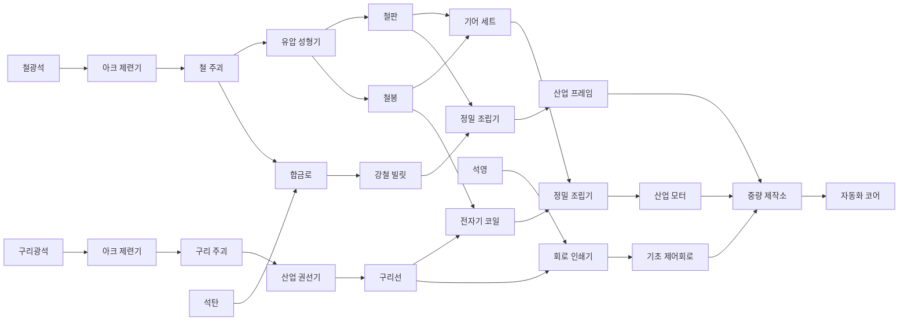
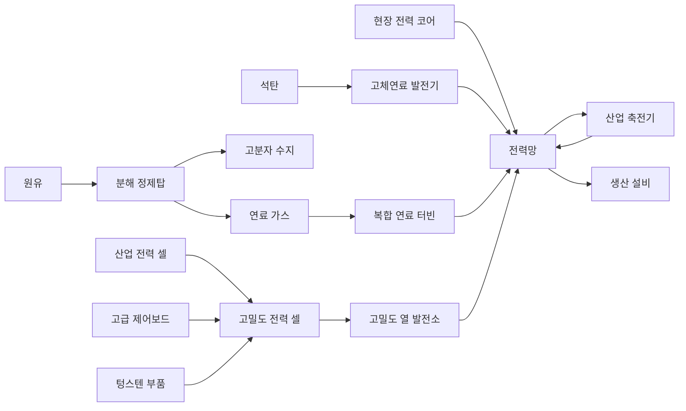

# FactoryX 자원·생산 계보 기획

> - 문서 상태: 설비 설계 보강안 v0.2
> - 적용 범위: 자원, 아이템, 생산 설비, 프로젝트 최종품, 단계별 해금 구조, 블록아웃 설계 계약
> - 제외 범위: 텍스처, 최종 밸런스 확정, 최종 UI
> - 이번 검토 범위: 문서 보강만 수행하며 게임 코드와 모델은 변경하지 않는다.

## 1. 기획 목표

FactoryX의 생산 구조는 아이템 종류를 무작정 늘리는 대신, `A-17 개척 프로젝트`라는 하나의 장기 목표를 향해 공정이 확장되는 형태로 구성한다.

플레이어가 생산 단계를 올릴 때마다 새로운 자원뿐 아니라 새로운 공장 설계 문제를 하나씩 배우게 한다.

1. 채굴과 일대일 가공
2. 두 생산 라인의 합류와 합금
3. 다단계 부품 및 전자 공정
4. 유체, 부산물, 고급 복합 조립
5. 이전 단계 생산품을 대량으로 소비하는 최종 프로젝트

초기 버전에서는 `철·구리·석탄·석영 → 자동화 코어`까지 구현하고, 원유와 알루미늄 계보는 이후 단계에서 확장한다.

## 2. 레퍼런스에서 가져올 원칙

### Satisfactory

- 전용 프로젝트 부품을 납품해 다음 티어를 해금한다.
- 후반 프로젝트 부품이 초반 부품을 다시 요구하므로 기존 공장이 버려지지 않는다.
- 레시피와 생산 설비가 티어 및 연구 진행과 함께 해금된다.
- 대체 레시피는 기본 생산망이 안정된 이후의 최적화 수단으로 사용한다.

### Factorio

- 연구 단계마다 생산 복잡도가 점진적으로 상승한다.
- 화학 단계에서 원유와 플라스틱이라는 새로운 생산 문법을 도입한다.
- 회로처럼 여러 고급 제품에 반복 사용되는 핵심 중간재가 공장 규모 확장의 중심이 된다.
- 제작 시간과 소비량 차이가 자연스럽게 생산 비율 문제를 만든다.

### Dyson Sphere Program

- 작은 작업장에서 시작해 거대한 산업 프로젝트로 확장되는 장기 목표가 명확하다.
- 단순 생산 라인에서 복합 생산망으로 발전한다.
- 최종 프로젝트가 플레이어가 건설한 공장 규모를 시각적으로 증명한다.

위 원칙은 진행 구조만 참고하며, 아이템 이름과 레시피 및 세계관은 FactoryX에 맞게 새로 구성한다.

## 3. 세계관과 최종 목표

플레이어는 산업 개척 구역 `A-17`의 자동화 책임자다. 최종 목표는 새로운 개척지를 스스로 건설할 수 있는 자율 생산 설비인 `AX-17 개척 시드`를 제작해 프로젝트 도크로 출하하는 것이다.

| 단계 | 프로젝트 최종품 | 핵심 학습 요소 | 다음 단계 해금 |
| --- | --- | --- | --- |
| 1단계 | 기초 정착 패키지 | 채굴, 제련, 단일 가공 | 합금 및 고속 물류 |
| 2단계 | 산업 전력 노드 | 두 재료 합류, 생산 비율 | 전자 공정 및 자동 제어 |
| 3단계 | 자동화 코어 | 복합 부품, 다단계 조립 | 유체·화학 공정, 후반 경금속 공정 |
| 4단계 | AX-17 개척 시드 | 유체, 부산물, 대량 생산 | 최종 완료 및 반복 목표 |

프로젝트 최종품은 일반 건설 재료와 분리한다. 플레이어가 프로젝트 도크에 납품한 물품은 되돌릴 수 없는 영구 소비처가 된다.

### 3.1 프로젝트 명칭과 납품 계약

`자동화 코어`를 3단계 프로젝트 부품의 정식 명칭으로 사용한다. 문서와 내부 ID에서 별도 정의되지 않은 `자율 생산 코어`라는 이름은 사용하지 않는다.

- **자동화 코어:** 철·구리·석탄·석영 계보를 모두 사용해 만드는 3단계 복합 프로젝트 부품이다. 현재 프로토타입의 `20개 생산` 목표도 같은 아이템을 사용한다.
- **프로토타입 샌드박스:** 캠페인 해금이 구현되기 전에는 철·구리·석탄·석영과 관련 레시피를 처음부터 열고 자동화 코어 20개 생산으로 전체 라인을 검증한다. 이 모드의 시작 상태를 캠페인 1단계와 혼동하지 않는다.
- **프로젝트 납품품:** 도크 입력 버퍼에 들어온 것만으로는 소비되지 않으며, 고체는 납품 컨테이너의 기계식 잠금이 완료된 순간, 유체는 전동 밸브가 실제 부피를 수용한 고정 틱에만 회수 불가능한 누적 수량으로 기록한다. 부분 납품을 허용하고 요구량을 모두 채운 시점에만 다음 단계를 해금한다.
- **일반 생산품:** 설비 버퍼와 저장고에서 자유롭게 이동할 수 있으며 프로젝트 도크에 투입하기 전에는 영구 소비되지 않는다.

각 프로젝트 단계는 `필요 품목과 수량 → 부분 납품 진행도 → 완료 연출 → 해금 목록`을 하나의 데이터 정의로 가져야 한다. 임시 프로토타입 목표를 정식 프로젝트 단계로 승격할 때는 표시 문구만 바꾸지 않고 납품 계약과 해금 보상을 함께 정의한다.

### 3.2 단계별 납품과 해금 초안

캠페인에는 중앙의 `개척 프로젝트 도크` 한 기가 시작부터 설치돼 있다. 이 도크는 철거·복제할 수 없고 초기 단계 납품은 전력 없이도 받는다. 따라서 도크를 만들기 위해 도크의 해금 보상이 필요한 순환을 만들지 않는다.

| 단계 | 납품 계약 초안 | dockPowerMode | 완료 보상 |
| --- | --- | --- | --- |
| 1단계 기초 정착 패키지 | 철판 120 + 건축 블록 80 + 체결재 팩 40 | `manual` | 석탄, 합금로, 산업 권선기, 정밀 조립기, 고체연료 발전기, 컨베이어 Mk.2 |
| 2단계 산업 전력 노드 | 강철 빌릿 160 + 구리선 200 + 전자기 코일 80 + 산업 프레임 20 | `manual` | 석영, 회로 인쇄기, 중량 제작소, 산업 저장고, 축전·고압 배전 계열 |
| 3단계 자동화 코어 | 자동화 코어 120 | `powered` | 원유, 유체 추출기, 분해 정제탑, 파이프·유체 탱크, 유체 물류 스타터 키트, 복합 연료 터빈, 컨베이어 Mk.3 |
| 4단계 전반 화학 안정화 | 고분자 수지 200 + 연료 가스 400m³ | `powered` | 보크사이트, 전해 환원기, 경금속 계열 |
| 4단계 중반 열관리 검증 | 고급 제어보드 20 + 경량 구조 셸 2 | `powered` | 텅스텐광, 고온 소재 레시피, 고밀도 열 발전소 |
| 4단계 개척 시드 | 경량 구조 셸 10 + 정밀 액추에이터 20 + 산업 전력 셀 20 + 열 제어 모듈 10 + 자동화 코어 10 | `powered` | AX-17 개척 시드 완성, 반복 프로젝트 |

이 방식으로 한 번의 해금 알림에서 `원유 → 보크사이트 → 텅스텐`을 동시에 소개하지 않는다.

열관리 검증에 납품한 경량 구조 셸 2개는 검증 장치에 영구 소비되며 최종 계약의 10개에 포함되지 않는다. 따라서 캠페인 4단계 전체에서 생산·납품해야 하는 경량 구조 셸은 총 12개다.

1단계 전용 기초 레시피는 다음과 같이 둔다.

| 제품 | 재료 | 설비 | 기본 주기 | unlockId |
| --- | --- | --- | ---: | --- |
| 건축 블록 2 | 석회암 4 | 파쇄기 | 4초 | `start` |
| 체결재 팩 2 | 철봉 1 | 유압 성형기 | 3초 | `start` |

납품 수량은 밸런스 초안이며, 해금 순서와 순환 방지 규칙은 수치 조정 후에도 유지한다.

시작 시 사용 가능한 설비는 광맥 채굴기, 아크 제련기, 파쇄기, 유압 성형기, 컨베이어 Mk.1, 분배기, 병합기, 소형 저장고, 현장 전력 코어, 배전 기둥 Mk.1과 중앙 프로젝트 도크다. 캠페인의 자동화 코어 요구량은 단계별 원재료 규모가 감소하지 않도록 120개로 두고, 빠른 통합 검사용 샌드박스 목표만 20개로 유지한다.

`기초 정착 패키지`와 `산업 전력 노드`는 도크 내부에서 납품 재료가 누적되며 완성되는 **프로젝트 조립 단계 이름**이다. 일반 인벤토리 아이템이나 벨트 운송물로 생성하지 않는다. 반면 자동화 코어와 4단계 프로젝트 부품은 실제 생산 설비에서 만들어 벨트로 납품한다.

### 3.3 설비 해금 ID 기준

모든 `BuildingDefinition`은 아래 마일스톤 중 하나의 `unlockId`를 가져야 한다.

| unlockId | 최초 해금 설비·물류 |
| --- | --- |
| `start` | 채굴기, 제련기, 파쇄기, 성형기, 벨트 Mk.1, 분배기, 병합기, 소형 저장고, 현장 전력 코어, 배전 기둥 Mk.1, 중앙 도크 |
| `phase_1_complete` | 합금로, 산업 권선기, 정밀 조립기, 고체연료 발전기, 벨트 Mk.2 |
| `phase_2_complete` | 회로 인쇄기, 중량 제작소, 산업 저장고, 산업 축전기, 전력 차단기, 우선순위 분전반, 배전 기둥 Mk.2, 변전소, 고압 송전탑 |
| `phase_3_complete` | 유체 추출기, 분해 정제탑, 파이프 Mk.1, 파이프 T 접합부, 유체 탱크, 파이프 펌프, 비상 플레어, 복합 연료 터빈, 벨트 Mk.3 |
| `chemistry_stable` | 전해 환원기와 경금속 레시피 |
| `thermal_verified` | 텅스텐·고온 소재 레시피와 고밀도 열 발전소 |

새 단계의 첫 설비는 그 설비로 만들어야 하는 재료를 건설 비용으로 요구하지 않는다. 최소 한 대는 직전 단계의 재료만으로 건설할 수 있어야 한다. 시작 인벤토리에는 첫 철 채굴기 1대, 제련기 1대, 성형기 1대와 이들을 연결할 벨트·배전 기둥 재료를 제공하고, 이후 설비는 `BuildingDefinition.buildCost[]`를 통해 실제 계보 재료를 소비한다.

부트스트랩 검증에 사용하는 최초 건설 비용 기준은 다음과 같다. 수치는 밸런스 조정 대상이지만, 각 행이 해당 `unlockId` 이전에 만들 수 있는 재료만 요구한다는 의존성은 바꾸지 않는다.

| 설비 | unlockId | 최초 건설 비용 초안 | 순환 방지 기준 |
| --- | --- | --- | --- |
| 두 번째 광맥 채굴기 | `start` | 철판 12 + 철봉 8 + 체결재 팩 4 | 지급된 철 라인만으로 제작 |
| 첫 파쇄기 | `start` | 철판 12 + 철봉 8 + 체결재 팩 4 | 건축 블록을 요구하지 않음 |
| 추가 아크 제련기 | `start` | 철판 16 + 건축 블록 8 + 체결재 팩 6 | 첫 파쇄기 가동 후 증설 |
| 첫 합금로 | `phase_1_complete` | 철판 24 + 건축 블록 24 + 체결재 팩 10 | 강철을 요구하지 않음 |
| 첫 산업 권선기 | `phase_1_complete` | 철판 20 + 철봉 12 + 체결재 팩 8 | 구리선을 요구하지 않음 |
| 첫 정밀 조립기 | `phase_1_complete` | 철판 24 + 건축 블록 16 + 체결재 팩 12 | 기어·코일을 요구하지 않음 |
| 첫 고체연료 발전기 | `phase_1_complete` | 철판 40 + 건축 블록 32 + 체결재 팩 16 | 강철·발전 부품을 요구하지 않음 |
| 첫 회로 인쇄기 | `phase_2_complete` | 강철 빌릿 16 + 구리선 40 + 전자기 코일 8 + 산업 프레임 2 | 회로를 요구하지 않음 |
| 첫 중량 제작소 | `phase_2_complete` | 강철 빌릿 30 + 철판 40 + 전자기 코일 12 + 산업 프레임 6 | 자동화 코어를 요구하지 않음 |
| 첫 유체 추출기 | `phase_3_complete` | 강철 빌릿 30 + 산업 프레임 6 + 산업 모터 4 + 기초 제어회로 4 | 원유·수지를 요구하지 않음 |
| 첫 분해 정제탑 | `phase_3_complete` | 강철 빌릿 50 + 산업 프레임 10 + 산업 모터 6 + 기초 제어회로 8 | 정제 산출물을 요구하지 않음 |
| 첫 전해 환원기 | `chemistry_stable` | 강철 빌릿 60 + 산업 프레임 12 + 산업 모터 6 + 고급 제어보드 4 | 알루미늄을 요구하지 않음 |
| 첫 고밀도 열 발전소 | `thermal_verified` | 강철 빔 80 + 경량 케이스 60 + 고급 제어보드 20 + 산업 전력 셀 12 + 자동화 코어 8 | 텅스텐·고밀도 전력 셀을 건설비로 요구하지 않음 |

이 표는 캠페인 진행 가능성을 검증하는 최소 집합이다. 벨트, 배전 기둥, 저장고와 반복 건설 비용은 같은 원칙으로 별도 데이터에 두며, 새 설비 하나를 짓기 위해 그 설비의 출력 또는 아직 잠긴 레시피가 필요한 경우 정적 검증 실패로 처리한다.

`phase_3_complete`의 유체 물류 스타터 키트는 파이프 Mk.1 48m, T 접합부 2개, 유체 탱크 1개와 펌프 1개의 일회성 건설 크레딧이다. 레벨의 첫 유정→정제탑과 정제탑→도크 경로는 합계 48m 안에 들어와야 한다. 이후 증설 비용은 강철 빌릿·철판·체결재 팩·산업 모터·기초 제어회로처럼 `phase_2_complete`까지 생산 가능한 재료만 사용하고 수지·알루미늄을 요구하지 않는다.

## 4. 천연자원 계보

| unlockId | 자원 | 주 사용처 | 텍스처 없는 형태 기준 |
| --- | --- | --- | --- |
| `start` | 철광석 | 판재, 봉, 기어, 프레임 | 묵직하고 각진 청회색 덩어리 |
| `start` | 구리광석 | 전선, 코일, 회로 | 얇고 뾰족한 적갈색 파편 |
| `start` | 석회암 | 건축 블록과 기초재 | 밝고 둥근 파쇄석 덩어리 |
| `phase_1_complete` | 석탄 | 강철, 전력, 탄소 소재 | 작고 불규칙한 검은 조각 |
| `phase_2_complete` | 석영 | 회로 기판, 센서, 렌즈 | 길쭉한 반투명 결정 기둥 |
| `phase_3_complete` | 원유 | 수지, 절연재, 연료 | 파이프로만 운송되는 점성 유체 |
| `chemistry_stable` | 보크사이트 | 알루미늄과 경량 케이스 | 여러 붉은 알갱이가 뭉친 형태 |
| `thermal_verified` | 텅스텐광 | 고온 부품과 정밀 공구 | 짧고 조밀한 짙은 금속 결정 |

한 번의 프로젝트 해금에서 새로운 천연자원을 두 종류 이상 동시에 도입하지 않는 것을 원칙으로 한다. 프로젝트와 단계 내 하위 목표를 이용해 `석탄 → 석영 → 원유 → 보크사이트 → 텅스텐` 순서로 학습시킨다. 새 자원은 반드시 기존 생산망과 결합되어야 하며 독립된 별도 라인으로 끝나지 않아야 한다.

## 5. 생산 설비 목록

### 5.1 채취 및 1차 가공

| 설비 | 역할 | 입력 수 | 출력 수 | 형태 키워드 |
| --- | --- | ---: | ---: | --- |
| 광맥 채굴기 | 고체 자원 채굴 | 0 | 1 | 수직 드릴, 지지 풋, 배출 슈트 |
| 유체 추출기 | 원유 추출 | 0 | 1 | 펌프 잭, 왕복 암, 배관 |
| 파쇄기 | 석회암·석영·보크사이트 분쇄 및 정제 | 1 | 1 | 이중 롤러, 투입 호퍼, 분진 후드 |
| 아크 제련기 | 광석을 금속 주괴로 제련 | 1 | 1 | 노심, 단열 링, 굴뚝 |
| 합금로 | 두 소재를 고온 합금으로 변환 | 2 | 1 | 이중 투입구, 두꺼운 용기, 주조 슈트 |
| 전해 환원기 | 알루미나를 알루미늄 주괴로 환원 | 2 | 1 | 전해 셀, 대형 버스바, 집진 후드 |
| 분해 정제탑 | 원유를 수지와 연료로 분리 | 1 | 2 | 수직 탑, 배관, 분리 탱크 |

### 5.2 성형 및 부품 생산

| 설비 | 역할 | 입력 수 | 출력 수 | 형태 키워드 |
| --- | --- | ---: | ---: | --- |
| 유압 성형기 | 단일 소재의 판·봉·빔·케이스·전극 성형 | 1 | 1 | 대형 프레스, 금형, 슬라이드 |
| 산업 권선기 | 구리 주괴 인발 및 구리선 권취 | 1 | 1 | 인발 다이스, 회전 스풀, 장력 롤러 |
| 회로 인쇄기 | 기판, 회로, 센서 생산 | 2 | 1 | 밀폐 작업대, 헤드 레일, 검사등 |
| 정밀 조립기 | 두 부품을 하나로 조립 | 2 | 1 | 열린 작업 셀, 두 공구 암, 턴테이블 |
| 중량 제작소 | 3~4종 고급 부품 조립 | 4 | 1 | 넓은 갠트리, 다중 투입 베이, 이젝터 |

### 5.3 물류 및 프로젝트

| 설비 | 역할 |
| --- | --- |
| 컨베이어 Mk.1~3 | 고체 아이템 운송 |
| 분배기 | 한 입력을 여러 출력으로 분리 |
| 병합기 | 여러 입력을 한 출력으로 합류 |
| 소형 저장고 | 단일 품목의 초기 저장 |
| 산업 저장고 | 대용량 적층 저장 |
| 유체 탱크 | 원유와 정제 유체 저장 |
| 파이프 Mk.1 | 유체 60m³/분 운송 |
| 파이프 T 접합부 | 유체 한 줄을 분기하거나 두 줄을 병합 |
| 파이프 펌프 | 흐름 방향 고정과 수직 양정 제공 |
| 비상 플레어 | 플레이어가 승인한 잉여 연료 가스의 제한적 소각 |
| 개척 프로젝트 도크 | 프로젝트 최종품 납품 및 단계 해금 |

## 6. 초기 구현 생산 계보

초기 구현은 자원 4종, 주요 가공품 11종, 프로젝트 최종품 1종으로 제한한다. 이 절은 단계 잠금을 끈 `프로토타입 샌드박스` 범위이며, 캠페인 순서는 3절의 프로젝트 계약을 따른다. 석회암과 건축 블록은 캠페인 1단계 재료지만 이 통합 목표에서는 제외한다.



### 6.1 권장 초기 레시피

고체 광맥 채굴기의 기준 출력은 `광석 2개 / 4초 = 30개/분`으로 둔다. 따라서 철·구리 제련 레시피의 `광석 2개 / 4초` 소비와 정확히 1:1로 맞고, 컨베이어 Mk.1 한 줄은 광부 두 대의 총 60개/분까지 운반한다.

| 제품 | 재료 | 설비 | 기본 주기 | unlockId |
| --- | --- | --- | ---: | --- |
| 철 주괴 1 | 철광석 2 | 아크 제련기 | 4초 | `start` |
| 구리 주괴 1 | 구리광석 2 | 아크 제련기 | 4초 | `start` |
| 철판 2 | 철 주괴 1 | 유압 성형기 | 4초 | `start` |
| 철봉 2 | 철 주괴 1 | 유압 성형기 | 4초 | `start` |
| 구리선 4 | 구리 주괴 1 | 산업 권선기 | 4초 | `phase_1_complete` |
| 강철 빌릿 1 | 철 주괴 1 + 석탄 1 | 합금로 | 6초 | `phase_1_complete` |
| 기어 세트 1 | 철판 1 + 철봉 2 | 정밀 조립기 | 5초 | `phase_1_complete` |
| 전자기 코일 1 | 구리선 4 + 철봉 1 | 정밀 조립기 | 5초 | `phase_1_complete` |
| 기초 제어회로 1 | 석영 1 + 구리선 3 | 회로 인쇄기 | 6초 | `phase_2_complete` |
| 산업 모터 1 | 기어 세트 1 + 전자기 코일 2 | 정밀 조립기 | 10초 | `phase_1_complete` |
| 산업 프레임 1 | 강철 빌릿 2 + 철판 4 | 정밀 조립기 | 10초 | `phase_1_complete` |
| 자동화 코어 1 | 산업 모터 1 + 기초 제어회로 2 + 산업 프레임 1 | 중량 제작소 | 16초 | `phase_2_complete` |

자동화 코어 하나의 이론상 원재료는 `철광석 13 + 구리광석 7 + 석탄 2 + 석영 2`다. 중량 제작소 한 대의 최대 생산량인 3.75개/분을 완전히 채우려면 반올림 기준 `철 광부 2 + 구리 광부 1 + 석탄 광부 1 + 석영 광부 1`이 필요하다. 이 값은 초기 공장 규모의 기준선이며 실제 병목은 플레이 테스트로 조정한다.

현재 프로토타입의 목표인 `조립품 20개 생산`은 샌드박스에서 `자동화 코어 20개 생산`으로 교체한다.

### 6.2 초기 단계의 학습 순서

1. 철광석을 제련해 철 주괴를 만든다.
2. 철 주괴를 철판과 철봉으로 분기한다.
3. 구리 생산 라인을 추가해 구리선을 만든다.
4. 두 입력을 조립기에 넣어 기어와 코일을 만든다.
5. 석탄을 투입해 강철 생산을 시작한다.
6. 석영과 구리선을 결합해 회로를 만든다.
7. 세 생산 분기를 중량 제작소에 모아 자동화 코어를 생산한다.

## 7. 확장 생산 계보

### 7.1 화학 및 경금속 단계

확장 단계도 설비, 수량과 포트 수가 검증되도록 수치 레시피로 정의한다. 아래 값은 계보 완결성을 위한 1차 초안이다.

| 제품 | 재료 | 설비 | 기본 주기 | unlockId |
| --- | --- | --- | ---: | --- |
| 원유 3m³ | 유정 | 유체 추출기 | 6초 | `phase_3_complete` |
| 고분자 수지 1 + 연료 가스 2m³ | 원유 3m³ | 분해 정제탑 | 6초 | `phase_3_complete` |
| 절연 시트 2 | 고분자 수지 2 | 유압 성형기 | 4초 | `phase_3_complete` |
| 정제 석영 2 | 석영 2 | 파쇄기 | 4초 | `phase_3_complete` |
| 절연 기판 1 | 정제 석영 1 + 절연 시트 1 | 회로 인쇄기 | 6초 | `phase_3_complete` |
| 고급 제어보드 1 | 기초 제어회로 1 + 절연 기판 1 | 회로 인쇄기 | 8초 | `phase_3_complete` |
| 광학 센서 1 | 정제 석영 1 + 기초 제어회로 1 | 회로 인쇄기 | 6초 | `phase_3_complete` |
| 알루미나 2 | 보크사이트 3 | 파쇄기 | 6초 | `chemistry_stable` |
| 탄소 전극 1 | 석탄 2 | 유압 성형기 | 4초 | `chemistry_stable` |
| 알루미늄 주괴 1 | 알루미나 2 + 탄소 전극 1 | 전해 환원기 | 8초 | `chemistry_stable` |
| 경량 케이스 2 | 알루미늄 주괴 1 | 유압 성형기 | 4초 | `chemistry_stable` |
| 강철 빔 2 | 강철 빌릿 1 | 유압 성형기 | 5초 | `chemistry_stable` |
| 산업 전력 셀 1 | 경량 케이스 1 + 탄소 전극 1 + 절연 시트 2 | 중량 제작소 | 12초 | `chemistry_stable` |
| 정밀 액추에이터 1 | 산업 모터 1 + 고급 제어보드 1 + 경량 케이스 1 + 광학 센서 1 | 중량 제작소 | 14초 | `chemistry_stable` |

원유 단계부터 부산물을 도입한다. 그 이전 단계에는 한 레시피에서 여러 출력이 발생하지 않도록 해 기본 물류 학습을 단순하게 유지한다.

유체 추출기와 분해 정제탑은 처리량 기준 `1:1`이다. 정제탑의 연료 가스를 전량 복합 연료 터빈으로 보낼 때는 `정제탑 1 : 터빈 1`이 정확히 맞는다. 반대로 가스를 전량 도크로 보내면 정제탑 한 대가 20분 가동한 시점에 화학 안정화 계약의 `수지 200 + 연료 가스 400m³`를 함께 납품할 수 있다. 같은 가스를 발전과 납품으로 나누면 가스 납품 완료 시간은 도크로 보내는 비율에 반비례해 늘어나며, UI에 예상 완료 시간을 표시한다.

분해 정제탑은 수지와 연료 가스 출력 공간을 모두 예약한 뒤 새 사이클을 시작한다. 한 출력만 막혀도 이미 완료된 두 결과는 각 버퍼에 보존하고 다음 사이클을 멈춘다. 부산물을 조용히 삭제하는 자동 배출은 기본 기능으로 제공하지 않으며, 플레이어는 수지를 저장·가공하고 연료 가스를 터빈 또는 탱크로 보내 두 출력을 함께 관리해야 한다.

### 7.2 고온 소재와 최종 조립 레시피

| 제품 | 재료 | 설비 | 기본 주기 | unlockId |
| --- | --- | --- | ---: | --- |
| 경량 구조 셸 1 | 산업 프레임 1 + 강철 빔 2 + 경량 케이스 4 + 절연 시트 2 | 중량 제작소 | 18초 | `chemistry_stable` |
| 텅스텐 주괴 1 | 텅스텐광 2 | 아크 제련기 | 8초 | `thermal_verified` |
| 텅스텐 부품 2 | 텅스텐 주괴 1 | 유압 성형기 | 6초 | `thermal_verified` |
| 열 제어 모듈 1 | 전자기 코일 2 + 경량 케이스 2 + 텅스텐 부품 1 | 중량 제작소 | 14초 | `thermal_verified` |
| 고밀도 전력 셀 1 | 산업 전력 셀 1 + 고급 제어보드 1 + 텅스텐 부품 1 | 중량 제작소 | 18초 | `thermal_verified` |

`산업 전력 셀`은 AX-17 개척 시드에 쓰는 4단계 프로젝트 부품이고, `고밀도 전력 셀`은 고밀도 열 발전소의 연료다. 2단계 산업 축전기의 내장 축전 모듈은 건물 구성품이며 운송 아이템인 두 전력 셀과 다르다. 이름, 내부 ID와 소비처를 분리해 같은 아이템처럼 취급하지 않는다.

### 7.3 최종 프로젝트 부품

재료와 생산 설비는 7.1~7.2의 레시피 표를 단일 기준으로 사용하고 이 절에서 중복하지 않는다.

| 제품 | 용도 | 운송 방식 |
| --- | --- | --- |
| 자동화 코어 | 개척 시드 제어 핵심 | 표준 벨트 |
| 경량 구조 셸 | 개척 시드 외장 | 접힌 대형 팔레트 |
| 정밀 액추에이터 | 자율 건설 장치 | 표준 벨트 |
| 산업 전력 셀 | 독립 전원 | 절연 운송 트레이 |
| 열 제어 모듈 | 열 관리 | 표준 벨트 |
| AX-17 개척 시드 | 최종 완성품 | 도크 내부 조립, 벨트 운송 없음 |

후반 제품은 초반 부품을 계속 소비해야 한다. 철판, 구리선, 모터, 프레임 생산 라인이 후반에도 의미를 유지하도록 한다.

## 8. 아이템 명명 원칙

아이템 이름은 별도 설명 없이 생산 기능을 짐작할 수 있어야 한다.

- 원재료: `철광석`, `석탄`, `원유`
- 1차 소재: `철 주괴`, `강철 빌릿`, `알루미늄 주괴`
- 형태 가공품: `철판`, `철봉`, `구리선`, `경량 케이스`
- 기능 부품: `기어 세트`, `전자기 코일`, `산업 모터`
- 시스템 부품: `기초 제어회로`, `정밀 액추에이터`, `자동화 코어`
- 프로젝트 납품 부품: `자동화 코어`, `경량 구조 셸`, `산업 전력 셀`, `열 제어 모듈`
- 프로젝트 조립 단계: `기초 정착 패키지`, `산업 전력 노드`, `AX-17 개척 시드`

`고급 재료`, `특수 부품`, `복합 아이템`처럼 기능이나 형태가 드러나지 않는 이름은 사용하지 않는다.

영문 내부 ID는 표시 이름과 분리한다.

```text
iron_ore
iron_ingot
steel_billet
copper_wire
gear_set
electromagnetic_coil
basic_control_circuit
industrial_motor
industrial_frame
automation_core
colony_seed_ax17
```

## 9. 텍스처 이전의 아이템 형태 규칙

컨베이어 위에서 작은 크기로 보여도 공정 단계를 구별할 수 있어야 한다.

| 아이템 계열 | 기본 형태 |
| --- | --- |
| 광석 | 불규칙 다면체 또는 결정 묶음 |
| 주괴 | 사다리꼴 또는 모서리가 잘린 금속 덩어리 |
| 판재 | 얇고 넓은 직육면체 |
| 봉과 선재 | 원통 묶음 또는 감긴 코일 |
| 기계 부품 | 기어, 축, 링처럼 회전축이 읽히는 형태 |
| 회로 부품 | 얇은 기판과 돌출된 칩 블록 |
| 프레임 | 중앙이 비어 있는 구조체 |
| 최종 코어 | 여러 계열이 결합된 밀폐 캡슐 또는 프레임형 장치 |

색상만으로 아이템을 구분하지 않는다. 같은 재료라도 광석, 주괴, 판재, 완성 부품은 서로 다른 실루엣을 가져야 한다.

## 10. 밸런스 원칙

- 첫 생산 라인은 `채굴기 1 : 제련기 1`처럼 이해하기 쉬운 비율로 시작한다.
- 새 티어는 천연자원보다 새로운 가공 방식 하나를 먼저 강조한다.
- `hubItem: true`로 지정한 핵심 중간재는 건설 비용을 포함해 최소 세 종류 이상의 후속 소비처를 가진다. 모든 중간재에 이 규칙을 강제하지 않는다.
- 프로젝트 최종품은 생산망의 영구 소비처 역할을 한다.
- 초반에는 부산물과 순환 레시피를 금지한다.
- 대체 레시피는 기본 계보가 완성된 이후 최적화 콘텐츠로 추가한다.
- 1~3단계의 기준 계약은 공정 깊이와 총 기계-분이 충분히 증가하는지 비교하되 고정된 `3~5배` 규칙으로 묶지 않는다. 현재 레시피의 회귀 기준은 채굴 포함 약 `23 → 105 → 390 기계-분`이다.
- 4단계 전반·중반 계약은 새 유체·경금속·열관리 문법을 검증하는 학습 계약이므로 이전 계약보다 커야 한다는 배율 규칙에서 제외한다. 현재 회귀 기준은 화학 안정화 약 40, 열관리 약 23, 최종 계약 약 166 기계-분이며 4단계 합계는 약 229 기계-분이다.
- 고체 개수와 유체 m³를 환산 계수 없이 더하지 않는다. 밸런스 표에는 `고체 원자재 수`, `유체 부피`, `기계-분`, `기준 공장 예상 완료 시간`을 별도 열로 기록한다.

핵심 중간재의 소비처는 다음 기준선을 유지한다.

| hubItem | 생산 소비처 | 프로젝트·건설 소비처 |
| --- | --- | --- |
| 철판 | 기어 세트, 산업 프레임 | 1단계 납품, 다수 M급 설비 기초 |
| 철봉 | 체결재 팩, 기어 세트, 전자기 코일 | 벨트 지지대와 소형 설비 건설비 |
| 구리선 | 전자기 코일, 기초 제어회로 | 산업 전력 노드 납품, 배전 설비 건설비 |
| 강철 빌릿 | 산업 프레임, 강철 빔 | 산업 전력 노드 납품, L급 설비 건설비 |
| 기초 제어회로 | 자동화 코어, 고급 제어보드, 광학 센서 | 제어형 설비와 분전반 건설비 |
| 산업 모터 | 자동화 코어, 정밀 액추에이터 | 펌프·중량 설비·발전기 건설비 |

기어 세트처럼 의도적으로 한 핵심 제품에 집중되는 부품은 `hubItem`으로 지정하지 않는다. 소비처 수를 늘리기 위해 의미 없는 레시피를 추가하지 않는다.

## 11. 구현을 위한 데이터 구조 요구사항

아이템과 레시피가 늘어날 예정이므로 생산 로직을 개별 조건문으로 확장하지 않는다.

### ItemDefinition

- 내부 ID
- 표시 이름
- 카테고리
- 해금 단계와 단계 내 마일스톤
- 운송 형태와 단위: `solid/item`, `fluid/m³`. 전력은 아이템이 아니며 21절의 별도 전력망 모델에서만 `MW`, `MWh`로 다룬다.
- 기본 색상, 지오메트리 타입과 모델 키
- 스택 크기
- 핵심 중간재 여부 `hubItem`

### RecipeDefinition

- 레시피 ID
- 표시 이름
- 사용 설비
- 입력 아이템, 수량과 바인딩할 `portId`
- 출력 아이템, 수량, `primary / byproduct` 역할과 `portId`
- 생산 시간
- 해금 단계

`부산물 여부`를 레시피 전체의 불리언으로 두지 않는다. 다중 출력 중 어느 출력이 부산물인지 각 출력 정의에 기록하고, 고체 개수와 유체 부피가 섞이지 않도록 단위를 검증한다.

### BuildingDefinition

- 건물 ID와 이름
- `placementMode: buildable | preplaced_unique`
- 논리 점유와 기준 원점
- `PortDefinition[]`
- 사용 가능한 레시피 목록
- 기본 처리 속도
- 가동 및 대기 전력 소비
- 건설 비용과 해금 ID
- 저장 용량
- 버퍼 정책
- 모델 및 애니메이션 키

`preplaced_unique`는 중앙 프로젝트 도크와 현장 전력 코어처럼 월드에 한 번만 미리 배치되는 설비다. 이 모드는 `buildCost[]`가 빈 배열이고 고정 앵커·회전값을 가지며, 건설·복제·철거 메뉴에 나타나지 않는다. 일반 설비만 `buildable`과 유효한 건설 비용을 사용한다.

### PortDefinition

```text
id
direction: input | output | bidirectional
medium: solid | fluid | power
connectorProfile: belt_standard | pipe_mk1 | power_local | power_high_voltage
connectionCell
localPosition
localFacing
bufferSlots
acceptedItemIds[]
deliverySlotId?
```

`connectionCell`은 점유 사각형의 최소 `X/Z` 셀을 `(0, 0)`으로 잡았을 때 기초 바깥에 있는 정수 격자 셀이고, `localPosition`은 기초 중심 모델 원점에서 실제 플랜지·벨트 인계점까지의 연속 `x/y/z` 좌표다. 예를 들어 2×2 설비의 왼쪽 아래 입력은 `connectionCell=(-1, 0)`, `localPosition=(-1.0, 0.36, -0.5)`가 된다. 건물 회전은 두 좌표와 `localFacing`에 같은 변환을 적용한다.

포트 배열을 모델, 배치 미리보기, 물류 연결과 회전의 단일 기준으로 사용한다. 다중 입력 설비는 레시피가 `portId`별 요구 재료를 명시하며, 입력 버퍼를 하나의 익명 배열로 합치지 않는다. 같은 `medium`이라도 `connectorProfile`이 다르면 직접 연결할 수 없고 변전소나 어댑터 설비가 필요하다. 도크 포트도 고체는 `belt_standard`, 유체는 `pipe_mk1`, 전력은 `power_local`을 사용하며 프로젝트 의미는 호환 프로필이 아니라 선택적 `deliverySlotId`로 표현한다.

### BuildingInstance와 StorageState

```text
BuildingInstance
  id, definitionId, position, rotation
  selectedRecipeId, runtimeState, progress
  inputBuffersByPortId, outputBuffersByPortId, workInProgress
  powerGridId

StorageState
  structureId, lockedItemId
  inventory, reservedIncoming, reservedOutgoing
  inputTransferItemId?
  inputEnabled, outputEnabled
  outputFilterItemId, minimumReserve
  routingPolicy: pass_through | fill_then_output | output_disabled
```

정적 정의와 월드의 실행 상태를 분리한다. `slotCount`는 `BuildingDefinition.storagePolicy`의 정적 값이며 `StorageState`에 중복 저장하지 않는다. 저장고 용량은 `slotCount × ItemDefinition.stackSize`로 계산하고 입고 예약 수량도 용량에 포함한다. 업그레이드가 생기면 정적 정의를 교체하거나 명시적인 `capacityModifier`만 상태에 추가한다.

빈 저장고에 대한 첫 성공 입고 예약은 같은 트랜잭션에서 `lockedItemId`를 설정한다. 그 뒤 다른 품목의 동시 예약은 실패한다. `inventory == 0 && reservedIncoming == 0 && reservedOutgoing == 0 && inputTransferItemId == null`일 때만 자동 잠금 해제 또는 필터 변경을 허용한다. 출력 가능량은 `availableToOutput = max(0, inventory - reservedOutgoing - minimumReserve)`이며 `0 ≤ minimumReserve ≤ capacity`를 항상 검증한다.

### ProjectStageDefinition

```text
id, prerequisiteIds[]
deliveries[]
  itemId, amount, medium, portId, commitPolicy
rewards
  resourceIds[], recipeIds[], buildingIds[]
dockPowerMode: manual | powered
completionSequence
```

프로젝트 단계, 부분 납품과 해금 보상을 화면 코드나 개별 조건문에 작성하지 않는다. `commitPolicy`는 고체의 `solid_lock_complete`와 유체의 `fluid_accepted_per_tick`만 허용한다. `dockPowerMode: manual`은 1~2단계의 무전력 고체 잠금에만 사용하고 유체 납품을 허용하지 않는다. `powered`는 3단계 이후의 고체 잠금, 유체 수용과 내부 조립에 실제 공급 전력을 요구한다.

데이터 로드 시 다음 정적 검증을 통과해야 한다.

1. 모든 비원자재 아이템에 활성 생산 레시피 또는 프로젝트 조립 출처가 있다.
2. 레시피 입력과 설비는 해당 레시피의 해금 시점까지 도달 가능하다. 같은 `unlockId` 안의 레시피 그래프는 위상 정렬 가능해야 하며 자기 자신 또는 상호 순환을 포함하지 않는다.
3. 프로젝트가 자기 보상으로 열리는 자원·설비를 자신의 납품품 생산에 요구하지 않는다.
4. 레시피의 고체·유체 입출력 수가 설비의 호환 포트 수를 넘지 않는다.
5. `buildable` 건물에는 유효한 `unlockId`, 비어 있지 않은 `buildCost[]`와 최소 하나의 배치 가능한 회전이 있다. `preplaced_unique` 건물에는 빈 건설 비용, 정확히 하나의 월드 앵커·고정 회전과 건설·철거 불가 플래그가 있다.
6. 모든 레시피의 `unlockId`가 유효하고, 사용 설비와 모든 입력 재료가 그 시점까지 해금돼 있다.
7. `dockPowerMode: manual`인 단계에는 유체 납품이 없고, 모든 납품의 `commitPolicy`가 매체와 일치한다.

### 11.1 공정 트랜잭션과 아이템 보존

- 필요한 모든 입력과 전체 출력 버퍼 공간이 확보된 순간 입력을 `workInProgress`로 원자적으로 옮기고 사이클을 시작한다.
- 정전, 전력 미연결과 일시정지 중에는 진행도, WIP와 모든 버퍼를 그대로 보존한다.
- 완료 시 한 레시피의 모든 출력을 한 번만 생성한다. 다중 출력 중 한쪽 공간이 부족하면 새 사이클을 시작하지 않는다.
- 레시피 변경과 설비 철거 시 WIP와 버퍼 아이템을 회수 상자 또는 플레이어 인벤토리로 반환한다. 벨트·저장고·설비 철거로 아이템을 조용히 삭제하지 않는다.
- 저장 데이터에는 벨트 위 위치, 입출력 버퍼, WIP, 진행도, 저장고 필터와 전력 차단 상태를 포함한다.
- 웹 탭이 숨겨지면 MVP에서는 시뮬레이션을 명시적으로 일시정지한다. 오프라인 시간만큼 생산을 한꺼번에 따라잡지 않는다.
- 도크의 고체 납품은 입력 버퍼에 보관된 동안 일반 재고처럼 회수할 수 있다. 컨테이너 잠금이 완료되는 단일 트랜잭션에서만 버퍼 수량을 줄이고 단계 누적량을 같은 틱에 증가시키며, 둘 중 하나만 적용된 저장 상태를 만들지 않는다.
- 도크의 유체 납품은 전동 밸브가 열린 고정 틱마다 `min(상류가 제공한 부피, 포트 처리 한도, 남은 계약량)`만 수용하고 그 실제 `m³`를 즉시 영구 누적한다. 유체에는 잠금 전 컨테이너가 없으므로 수용 뒤 되돌림을 허용하지 않는다.
- `dockPowerMode: powered`에서 도크의 실제 공급 전력이 요구량 32MW보다 작으면 고체 잠금과 유체 밸브를 시작하지 않는다. 이미 입력 베이에 대기 중인 고체, 이미 커밋된 누적량과 내부 조립 WIP는 그대로 보존한다.

현재 `ore / ingot / component`처럼 제한된 아이템 구분은 이 정의 기반 레지스트리로 교체하는 것을 장기 목표로 한다.

## 12. 권장 구현 순서

1. 정규 아이템·레시피·건물·포트·프로젝트 레지스트리와 정적 검증기를 만든다. 기존 `ore / ingot / component`는 호환 어댑터를 거쳐 새 ID로 옮긴다.
2. 고정 시뮬레이션 틱, 저장 스키마, 아이템 보존 규칙을 먼저 확정한다.
3. 포트, 벨트 FIFO, 역압, 분배기, 병합기와 출력 가능한 소형 저장고를 구현한다.
4. 철·석회암 채굴, 제련, 성형의 시작 생산선과 레시피 선택을 구현한다.
5. 현장 전력 코어, 배전 반경, 전력 미연결과 기본 HUD를 연결한다.
6. 시작 배치 프로젝트 도크의 최소 외형, 부분 납품과 1단계 해금을 구현한다.
7. 구리·석탄·석영과 다중 입력 설비를 순서대로 추가해 자동화 코어 계보를 완성한다.
8. 생산 지표, 정적 계보와 공장 현황 화면을 추가한다.
9. 고체연료 발전기, 산업 축전기, 전력 차단과 정전 복구를 추가한다.
10. 그 이후에만 유체 물류, 원유 부산물, 보크사이트·알루미늄과 고급 발전을 구현한다.

19절은 모델과 블록아웃의 시각 제작 순서이며, 이 절의 시스템 의존 순서를 대체하지 않는다.

## 13. 참고 자료

- [Satisfactory 공식 위키: Recipes](https://satisfactory.wiki.gg/wiki/Recipes)
- [Satisfactory 공식 위키: Space Elevator](https://satisfactory.wiki.gg/wiki/Space_Elevator)
- [Satisfactory 공식 위키: Production Line Tutorial](https://satisfactory.wiki.gg/wiki/Tutorial%3AProduction_line)
- [Factorio 공식 위키: Science Pack](https://wiki.factorio.com/Science_pack)
- [Factorio 공식 위키: Oil Refinery](https://wiki.factorio.com/Oil_refinery)
- [Factorio 공식 위키: Advanced Circuit](https://wiki.factorio.com/Advanced_circuit)
- [Dyson Sphere Program 공식 Steam 페이지](https://store.steampowered.com/app/1366540/Dyson/_Sphere/_Program/)

이 문서의 이름, 레시피, 수치, 진행 단계는 참고 게임의 데이터를 복제한 것이 아니라 FactoryX의 현재 웹 3D 프로토타입 규모와 조작 흐름에 맞춰 설계한 초안이다.

## 14. 러프 디자인 공통 규격

이 절은 텍스처 없이 기본 지오메트리, 재질 대비, 실루엣과 애니메이션만으로 설비와 아이템을 구분하기 위한 블록아웃 기준이다. 세부 표현은 [기계 시각 디자인 원칙](./machine-visual-design-principles.ko.md)을 함께 따른다. 연결 문서의 현재 프로토타입 설명과 이 문서의 목표 점유·포트·상태·성능 수치가 충돌하면 이 문서를 단일 기준으로 삼는다.

### 14.1 설비 공통 구조

모든 생산 설비는 다음 다섯 층이 읽혀야 한다.

1. 지면에 하중을 전달하는 기초와 풋
2. 기계를 지탱하는 어두운 구조 프레임
3. 공정을 수행하는 핵심 장치
4. 재료가 통과하는 입력 및 출력 경로
5. 상태등, 점검 패널, 손잡이 같은 사람 크기의 장치

장식 부품은 동력, 지지, 냉각, 배기, 안전, 정비 또는 물류 중 하나의 기능을 설명해야 한다. 기능을 설명할 수 없는 파이프, 링, 막대는 추가하지 않는다.

### 14.2 포트 규격

- 현재 게임의 기본 회전에서 로컬 `-X`를 입력, `+X`를 출력으로 사용한다.
- 벨트 운반면과 포트 바닥의 기준 높이는 약 `0.36`으로 통일한다.
- 단일 포트의 유효 폭은 벨트 폭보다 조금 좁은 `0.62~0.68` 범위로 잡는다.
- 입력은 넓게 열렸다가 안으로 좁아지는 호퍼 또는 가이드 형태를 사용한다.
- 출력은 내부에서 밖으로 밀어내는 슈트, 셔터 또는 이젝터 형태를 사용한다.
- 두 입력을 쓰는 설비는 같은 면의 두 포트를 억지로 붙이지 않고, 설비 폭을 넓히거나 측면별로 분리한다.
- 유체 포트는 고체 벨트 포트와 혼동되지 않도록 원형 플랜지와 굵은 배관으로 표현한다.

### 14.3 재질과 색의 역할

| 역할 | 블록아웃 재질 |
| --- | --- |
| 구조 프레임과 기초 | 어두운 청회색 금속 |
| 외장 패널과 탱크 | 밝은 회색 도장 금속 |
| 축, 레일, 실린더 | 밝고 반사가 강한 강재 |
| 위험 구역과 가동부 가드 | 무광 주황색 |
| 정상 상태와 연결 완료 | 제한된 청록 발광 |
| 주의, 입력 부족, 출력 대기, 정상적인 가득 참 | 앰버 발광 |
| 기계 걸림, 과열, 안전 차단 | 적색 발광 |
| 고온부 | 외부가 아니라 깊은 틈 안쪽의 주황 발광 |

주황색과 청록색은 넓은 외장 전체에 칠하지 않는다. 구조와 공정이 형태로 읽힌 뒤 작은 기능 강조에만 사용한다.

### 14.4 권장 크기 등급

| 등급 | 점유 예시 | 대상 |
| --- | --- | --- |
| S | 1×1~2×2 | 벨트, 분배기, 병합기와 인라인 유체 설비 |
| M | 2×2~3×2 | 채굴기, 제련기, 파쇄기, 성형기, 권선기, 회로 인쇄기, 정밀 조립기, 소형 저장고 |
| L | 3×3 | 합금로, 전해 환원기, 정제탑, 중량 제작소, 산업 저장고 |
| XL | 5×5 이상 | 개척 프로젝트 도크 |

모델의 가장 큰 장식은 논리 점유 영역을 과도하게 벗어나지 않아야 한다. 굴뚝이나 배관처럼 높이 방향으로 확장되는 장치는 허용하되, 플레이어가 보이는 외형과 충돌 영역을 일치시킨다.

블록아웃 스케일은 `1타일 = 1m = Three.js 월드 1단위`로 시작한다. 인물, LOD 거리, 포트 높이와 서비스 여유는 이 기준에서 측정하고 월드 스케일을 바꾸면 한 곳의 공통 상수로 함께 조정한다.

### 14.5 설비 설계 카드 필수 항목

설비를 모델링하기 전에 아래 항목을 한 장의 설계 카드로 먼저 확정한다. 이 항목이 비어 있으면 세부 모델링을 시작하지 않는다.

| 항목 | 반드시 답해야 하는 질문 |
| --- | --- |
| 역할 문장 | 이 설비는 어떤 재료를 어떤 물리 작용으로 바꾸는가? |
| 점유와 높이 | 논리 점유 타일, 최대 돌출부, 플레이어 눈높이 기준은 무엇인가? |
| 포트 토폴로지 | 고체·유체·전력 포트의 수, 로컬 위치, 방향, 높이와 필터는 무엇인가? |
| 세 거리 판독 | 원거리 실루엣, 중거리 공정 핵심부, 근거리 정비 초점은 각각 무엇인가? |
| 공정 경로 | 입력물이 어디에 머물고 어떤 장치를 거쳐 어디로 출력되는가? |
| 힘과 설비 연결 | 모터·실린더·축·덕트·배관이 실제 작동부에 어떻게 이어지는가? |
| 공정 단계 | 투입, 정렬, 가공, 검사, 배출을 어떤 순서와 시간 비율로 보여주는가? |
| 상태 판독 | 입력 부족, 출력 막힘, 전력 부족, 레시피 없음, 가득 참을 어느 위치에서 보여주는가? |
| 충돌과 정비 | 이동을 막는 실제 질량과 시각 전용 서비스 여유 공간은 어디인가? |
| 성능 예산 | 메시, 삼각형, 재질, 그림자, 가동 그룹과 LOD 목표는 얼마인가? |

설계 카드의 값은 모델 코드에 다시 손으로 복사하지 않는다. 가능한 항목은 `BuildingDefinition`과 포트 정의에서 읽고, 문서의 수치는 데이터 정의의 설계 기준으로 사용한다.

### 14.6 점유, 포트와 배치 계약

- 논리 점유 영역은 본체와 플레이어 이동을 실제로 막는 구조를 포함한다. 얇은 케이블, 배기 연기와 건설 미리보기는 충돌 영역에 넣지 않는다.
- 서비스 여유 공간은 점유 영역과 분리한다. 정비문을 열거나 패널을 당기는 축 방향 깊이는 최소 `0.5m`, 사람이 실제로 통과하는 정비 통로의 횡폭은 최소 `0.7m`로 구분해 표시하되 다른 건물 배치를 강제로 막지는 않는다.
- 각 포트는 `종류`, `인덱스`, `connectionCell`, `localPosition`, `방향`, `허용 품목`을 가진다. 건물 회전은 모델과 시뮬레이션에 같은 변환을 적용한다.
- 다중 입력 설비는 `input[0]`, `input[1]`처럼 포트를 구분하고 선택 레시피가 각 포트에 요구 품목을 바인딩한다. 어느 포트가 비었는지 모델과 UI가 같은 인덱스로 알려야 한다.
- 고체 포트는 벨트 운반면에, 유체 포트는 파이프 중심선에 정확히 맞춘다. 높이가 맞지 않는 장식용 연결구는 만들지 않는다.
- 건설 미리보기는 본체 점유뿐 아니라 연결될 포트 셀, 벨트 진행 방향, 회전 후 접근 가능한 정비 면을 함께 표시한다.
- 입력물은 벨트에서 설비 버퍼로 인계되는 순간 소유권이 한 번만 바뀐다. 같은 아이템을 벨트와 내부 작업물로 동시에 그려 복제된 것처럼 보이게 하지 않는다.

### 14.7 공정 애니메이션 계약

모든 생산 설비는 시뮬레이션의 정규화 진행도 `0~1`을 다음 의미 단계에 매핑한다. 설비마다 구간 길이는 달라도 단계 순서는 유지한다.

| 의미 단계 | 모델에서 보여줄 것 | 중단될 때의 안전 위치 |
| --- | --- | --- |
| 투입 | 입력 셔터, 버퍼 이동, 재료 인계 | 셔터 닫힘 또는 재료 고정 |
| 정렬·고정 | 클램프, 지그, 압력 준비 | 공정물이 지그에 남음 |
| 주 가공 | 드릴, 열, 프레스, 권선, 공구 동작 | 위험부 즉시 정지 후 관성부만 감속 |
| 검사·안정 | 센서, 냉각, 압력 해제, 완료 확인 | 완료품을 출력 전 위치에 유지 |
| 배출 | 이젝터, 주조 게이트, 출력 셔터 | 출력 막힘이면 완료품이 실제로 보임 |

- 생산을 만드는 핵심 동작은 독립적인 장식 루프가 아니라 레시피 진행도에서 계산한다.
- 팬, 플라이휠, 표시등처럼 연속성이 필요한 보조 동작은 별도 시간값을 쓸 수 있지만 `가동`, `대기`, `전력 부족` 상태에 따라 속도가 달라져야 한다.
- 진행도가 되감기거나 레시피가 바뀌면 모든 가동부를 즉시 원점으로 순간이동시키지 않고 `0.15~0.35초`의 안전 복귀를 허용한다. 다만 실제 생산 수량은 되돌리지 않는다.
- 출력 막힘은 배출 직전 또는 완료 위치에서 멈추며, 가공 동작을 계속 반복하지 않는다. 입력 부족은 새 사이클을 시작하지 않되 이미 소비한 재료의 현재 사이클은 완료한다.
- 저전력 속도 계수는 실제 생산 진행도와 모델의 핵심 동작에 동일하게 적용한다.

### 14.8 상태 위치와 우선순위

상태는 문제의 원인이 있는 위치에서 보여준다.

| 상태 | 1차 표식 위치 | 형태와 움직임 |
| --- | --- | --- |
| 입력 부족 | 부족한 입력 포트와 버퍼 | 빈 버퍼, 닫힌 셔터, 짧은 앰버 이중 점멸 |
| 출력 막힘 | 출력 슈트와 완성품 위치 | 완료품 노출, 이젝터 정지, 느린 앰버 점멸 |
| 필수 입력 미연결 | 연결되지 않은 필수 고체·유체 입력 포트 | 새 사이클 금지, 빈 연결구, 낮은 주황 윤곽, 요구 매체 표식 |
| 출력 미연결 | 연결되지 않은 출력 포트와 출력 버퍼 | 버퍼 여유까지 생산 후 출력 막힘으로 전환, 포트 주황 윤곽 |
| 전력 미연결 | 전력 포트와 주 제어반 | 전원 소켓 노출, 주 동작 정지 |
| 전력 제한 | 주 제어반과 구동부 | 앰버 부하 표식, 실제 만족도만큼 동작 감속 |
| 수동 정지 | 조작 패널과 주 차단 레버 | 안전 위치, 중립 백색 또는 무발광, 물리 레버 OFF |
| 레시피 없음 | 작업 셀과 레시피 패널 | 공구가 안전 위치에 있고 중립 백색 표식 |
| 가득 참 | 저장부와 용량 게이지 | 게이지 고정, 입고 셔터 잠금, 느린 앰버 패턴 |
| 보호 트립 | 위험부 가드와 비상 정지부 | 모든 위험 동작 정지, 물리 레버 TRIP 위치 |

여러 상태가 동시에 발생하면 `보호 트립 → 전력 미연결 → 필수 입력 미연결 → 전력 제한 → 수동 정지 → 레시피 없음 → 출력 막힘 → 입력 부족 → 가득 참 → 대기 → 정상 가동` 순서로 대표 상태를 정한다. 출력 미연결은 출력 버퍼에 공간이 있는 동안 포트 보조 표식으로만 남고, 버퍼가 차면 출력 막힘으로 승격한다. 저장고의 `output_disabled`는 플레이어가 의도한 종착 모드이므로 미연결 경고를 만들지 않는다. 보조 상태는 해당 포트에 남기되 건물 전체가 서로 다른 색으로 동시에 점멸하지 않게 한다. `출력 막힘`은 5초 이상 지속된 정상적인 백프레셔이므로 앰버를 사용하고, 내부 걸림이나 과열처럼 플레이어 조치가 필요한 고장만 적색으로 승격한다.

### 14.9 설계 검수 뷰

각 설비는 텍스처 없이 다음 다섯 장면에서 검수한다.

1. 오버뷰 3/4 시점에서 검은 실루엣만 표시한다.
2. 상단 시점에서 점유 영역과 모든 물류 포트를 표시한다.
3. 물류 시점에서 입력물부터 출력물까지 한 사이클을 느리게 재생한다.
4. 1인칭 눈높이에서 상태 패널, 위험부 가드와 정비 접근성을 확인한다.
5. `대기`, `가동`, `입력 부족`, `출력 막힘`, `전력 미연결`을 같은 카메라에서 비교한다.

네 번 회전한 모든 배치에서 포트와 애니메이션 방향이 일치해야 하며, 한 방향에서만 정상으로 보이는 비대칭 오류를 허용하지 않는다.

### 14.10 인간 척도 키트

1인칭에서 건물 크기가 일관되도록 다음 블록아웃 치수를 공용 키트로 사용한다.

| 요소 | 1차 기준 |
| --- | ---: |
| 플레이어 눈높이 | 1.65m |
| 제어 패널 중심 높이 | 1.25m |
| 손잡이 높이 | 0.9~1.1m |
| 안전 난간 높이 | 1.1m |
| 점검 통로 최소 폭 | 0.7m |
| 사다리 폭 / 발판 간격 | 0.5m / 0.28m |
| 정비문 최소 크기 | 0.65×1.4m |

현재 플레이어가 오르거나 열 수 없는 사다리와 정비문은 상호작용 표식을 붙이지 않는다. 같은 키트를 반복하되 설비마다 서비스 면의 위치와 주변 기능 구조는 공정에 맞게 달라야 한다.

## 15. 건물별 러프 디자인

### 15.0 설비 배치 기준표

아래 값은 블록아웃과 건설 로직이 공유할 1차 기준이다. 점유 `X×Z`의 첫 숫자는 로컬 `-X → +X` 재료 흐름 방향 길이, 둘째 숫자는 입력 슬롯이 나란히 놓이는 로컬 Z 폭이다.

| 설비 | 권장 점유 | 물류 입력 포트 | 물류 출력 포트 | 대표 공정 핵심부 |
| --- | --- | --- | --- | --- |
| 광맥 채굴기 | 2×2, 광맥 고정 | 없음 | 고체 1 | 수직 드릴과 수집 챔버 |
| 유체 추출기 | 2×2, 유정 고정 | 없음 | 유체 1 | 왕복 암과 압력 챔버 |
| 파쇄기 | 2×2 | 고체 1 | 고체 1 | 이중 롤러와 체망 |
| 아크 제련기 | 2×2 | 고체 1 | 고체 1 | 노심과 주조 몰드 |
| 합금로 | 3×3 | 고체 2 | 고체 1 | 교반 도가니 |
| 전해 환원기 | 3×3 | 고체 2 | 고체 1 | 전해 셀과 전극 승강부 |
| 분해 정제탑 | 3×3 | 유체 1 | 고체 1 + 유체 1 | 증류탑과 응축기 |
| 유압 성형기 | 2×2 | 고체 1 | 고체 1 | 프레스 헤드와 금형 |
| 산업 권선기 | 2×2 | 고체 1 | 고체 1 | 장력 롤러와 스핀들 |
| 회로 인쇄기 | 3×2 | 고체 2 | 고체 1 | 인쇄 베드와 검사 챔버 |
| 정밀 조립기 | 3×2 | 고체 2 | 고체 1 | 턴테이블과 비대칭 공구 |
| 중량 제작소 | 3×3 | 고체 4 | 고체 1 | 회전 지그와 천장 크레인 |
| 컨베이어 | 폭 1, 가변 길이 | 경로 시작 | 경로 끝 | 운반면과 구동 롤러 |
| 분배기 | 2×2 | 고체 1 | 고체 2 | 회전 게이트 |
| 병합기 | 2×2 | 고체 2 | 고체 1 | 교차 셔터 |
| 소형 저장고 | 2×2 | 고체 1 | 고체 1 | 입출고 터널과 적재 모듈 |
| 산업 저장고 | 3×3 | 고체 1 | 고체 1 | 수직 리프트와 적재 베이 |
| 유체 탱크 | 2×2 | 유체 1 | 유체 1 | 압력 용기와 수위계 |
| 파이프 Mk.1 | 폭 0.5, 가변 길이 | 경로 시작 | 경로 끝 | 원형 관과 플랜지 |
| 파이프 T 접합부 | 1×1 | 유체 3, 모두 양방향 | 동일한 3포트 | 세 방향 밸브 블록 |
| 파이프 펌프 | 1×1 인라인 | 유체 1 | 유체 1 | 임펠러 하우징과 방향 체크밸브 |
| 비상 플레어 | 2×2 | 연료 가스 1 | 없음 | 높은 연소 스택과 점화실 |
| 개척 프로젝트 도크 | 5×5 이상 | 전용 고체 5 + 유체 1 | 없음 | 납품 베이와 조립 크래들 |

이 표는 물류 포트만 센다. 전력을 소비하는 생산 설비는 서비스 면에 `power_local` 수전 포트 하나를 추가로 가지며, MVP에서는 배전 반경 안의 기둥에 자동 귀속되므로 플레이어가 설비마다 케이블을 직접 꽂지 않는다. 수전 포트 위치는 전력 상태 표시와 향후 직접 연결의 기준으로 유지한다. 프로젝트 도크의 지역 전력 입력과 발전·송전 설비의 출력은 21절처럼 직접 연결한다.

포트 수가 바뀌는 업그레이드는 기존 모델에 구멍만 추가하지 않고 점유, 실루엣과 물류 경로를 다시 검토한다. 표와 실제 `BuildingDefinition`이 달라지면 데이터 정의를 기준으로 문서를 함께 수정한다.

#### 15.0.1 다중 물류 포트 좌표 계약

다음 표는 포트가 셋 이상인 생산 설비의 1차 좌표다. 표기는 `portId: connectionCell @ localPosition`이며 고체 인계 높이는 `y=0.36`, 유체 중심 높이는 별도 표기된 값을 사용한다.

| 설비 | 입력 포트 | 출력 포트 |
| --- | --- | --- |
| 합금로 3×3 | `iron_in: (-1,0) @ (-1.5,0.36,-1)` · `carbon_in: (-1,2) @ (-1.5,0.36,+1)` | `alloy_out: (3,1) @ (+1.5,0.36,0)` |
| 전해 환원기 3×3 | `alumina_in: (-1,0) @ (-1.5,0.36,-1)` · `electrode_in: (-1,2) @ (-1.5,0.36,+1)` | `metal_out: (3,1) @ (+1.5,0.36,0)` |
| 분해 정제탑 3×3 | `crude_in: (-1,1) @ (-1.5,0.5,0)` | `resin_out: (3,0) @ (+1.5,0.36,-1)` · `gas_out: (3,2) @ (+1.5,0.5,+1)` |
| 회로 인쇄기 3×2 | `primary_in: (-1,0) @ (-1.5,0.36,-0.5)` · `support_in: (-1,1) @ (-1.5,0.36,+0.5)` | `product_out: (3,0) @ (+1.5,0.36,-0.5)` |
| 정밀 조립기 3×2 | `input_0: (-1,0) @ (-1.5,0.36,-0.5)` · `input_1: (-1,1) @ (-1.5,0.36,+0.5)` | `product_out: (3,0) @ (+1.5,0.36,-0.5)` |
| 중량 제작소 3×3 | `input_0: (-1,0) @ (-1.5,0.36,-1)` · `input_1: (-1,2) @ (-1.5,0.36,+1)` · `input_2: (0,-1) @ (-1,0.36,-1.5)` · `input_3: (2,-1) @ (+1,0.36,-1.5)` | `product_out: (3,1) @ (+1.5,0.36,0)` |

3×2 설비는 Z 폭이 짝수라 기하학적 중앙 셀이 없다. 따라서 출력은 `z=-0.5` 레인에 고정하고 반대 레인은 검사 패널과 서비스 접근에 사용한다. 모델을 중앙처럼 보이게 만들기 위해 논리 포트와 어긋난 장식 슈트를 추가하지 않는다.

### 15.1 광맥 채굴기

- **실루엣:** 네 개의 넓은 지지 풋, 높은 A자 마스트, 한쪽으로 낮게 뻗는 출력 슈트.
- **큰 덩어리:** 열린 사각 기초 위 중앙 드릴, 상부 수평 모터, 하부 수집 챔버로 구성한다.
- **재료 흐름:** 광맥 → 드릴 접촉점 → 수집 챔버 → 측면 출력 슈트 순서가 보이게 한다.
- **대표 동작:** 모터 가속 → 드릴 하강 및 회전 → 짧은 충격 → 챔버 진동 → 광석 배출.
- **근거리 초점:** 눈높이 상태 패널, 드릴 측면 크랭크, 회전체 가드.
- **배치·포트:** 2×2 광맥 앵커에만 설치하며 출력 포트는 수집 챔버에서 로컬 `+X`로 나온다. 회전해도 드릴 접촉점은 광맥 중심에서 벗어나지 않는다.
- **상태 판독:** 출력 막힘은 수집 챔버에 광석이 남고 슈트 셔터가 닫힌 모습으로, 광맥 없음은 드릴이 상승한 안전 위치와 빈 접촉 링으로 구분한다.
- **안전·충돌:** 네 지지 풋과 마스트 하부는 실제 충돌로 사용하고, 드릴 접촉 링 안쪽은 플레이어가 들어가지 못하는 위험 영역으로 둔다.

### 15.2 유체 추출기

- **실루엣:** 낮고 넓은 펌프 기초 위에서 비대칭 왕복 암이 크게 움직이는 형태.
- **큰 덩어리:** 지면 웰 헤드, 뒤쪽 구동 모터, 중앙 피벗, 전면 펌프 로드, 출력 매니폴드로 구성한다.
- **재료 흐름:** 지면 웰 헤드에서 올라온 유체가 측면 압력 챔버를 거쳐 원형 파이프 출력으로 이동한다.
- **대표 동작:** 모터 플라이휠 회전 → 암의 느린 상하 왕복 → 로드 압축 → 압력계 펄스.
- **근거리 초점:** 밸브 휠, 압력계, 누출 방지 플랜지, 점검 사다리.
- **배치·포트:** 2×2 유정 앵커에 고정하고 하부 웰 헤드와 지형의 접촉을 숨기지 않는다. 유체 출력은 로컬 `+X`의 낮은 원형 플랜지 하나만 사용한다.
- **상태 판독:** 파이프 막힘은 압력계 상승과 닫힌 출력 밸브로, 전력 부족은 플라이휠 감속과 펌프 암의 하단 안전 정지로 보여준다.
- **안전·충돌:** 왕복 암의 전체 스윕을 기초 안에 넣고 낮은 가드로 둘러싼다. 시각적으로 빈 순간에도 플레이어가 암의 이동 경로를 통과하지 못하게 한다.

### 15.3 파쇄기

- **실루엣:** 위가 넓고 아래가 좁은 투입 호퍼와 하부의 무거운 이중 롤러.
- **큰 덩어리:** 상부 호퍼, 중앙 파쇄 케이스, 좌우 모터, 하부 진동 슈트로 나눈다.
- **재료 흐름:** 높이 `0.36`의 낮은 경사 입력 → 짧은 내부 승강 롤러 → 맞물린 파쇄 롤러 → 체망 → 출력 벨트 순서로 읽히게 한다. 상부 직결 투입은 별도 고가 벨트 규격이 생기기 전에는 사용하지 않는다.
- **대표 동작:** 두 롤러가 반대 방향으로 회전하고, 접촉 순간 케이스와 출력 체망이 짧게 진동한다.
- **근거리 초점:** 걸림 해제 레버, 롤러 보호 덮개, 분진 흡입 덕트.
- **배치·포트:** 2×2 직선 흐름으로 로컬 `-X` 입력과 `+X` 출력을 맞춘다. 호퍼는 벨트에서 들어오는 표준 운송 단위를 실제로 수용할 폭을 가진다.
- **상태 판독:** 입력 부족은 빈 호퍼와 정지한 롤러, 출력 막힘은 체망 위에 남은 분쇄 트레이와 잠긴 하부 셔터로 구분한다. 걸림 고장은 일반 출력 막힘과 달리 해제 레버가 튀어나온다.
- **효과 예산:** 분진은 파쇄 접촉 순간 최대 6개의 짧은 스프라이트로만 표시하고 대기·LOD1 이후에는 끈다.
- **안전·충돌:** 롤러 상부는 고정 가드로 막고 걸림 해제 레버와 정비 덮개가 있는 한쪽 면만 서비스 접근면으로 둔다.

### 15.4 아크 제련기

- **실루엣:** 두꺼운 원통 노체, 높은 비대칭 굴뚝, 측면 송풍기.
- **큰 덩어리:** 무거운 원형 기초 위에 단열 노심, 외부 클램프 링, 상부 후드와 굴뚝을 쌓는다.
- **재료 흐름:** 낮은 입력 호퍼 → 노심 → 반대편 주조 몰드 → 출력 슈트가 물리적으로 이어져야 한다.
- **대표 동작:** 입력 셔터 개방 → 노심 발광 상승 → 팬 가속과 열 호흡 → 주조 게이트 개방 → 잉곳 배출.
- **근거리 초점:** 깊은 관찰창, 송풍기 가드, 내화 패널 체결부, 온도 상태등.
- **배치·포트:** 2×2 직선 흐름이며 로컬 `-X` 입력과 `+X` 출력 사이에 노심 중심을 둔다. 굴뚝과 송풍기는 물류 포트 셀을 침범하지 않는다.
- **상태 판독:** 입력 부족은 차가운 노심과 닫힌 투입 셔터, 출력 막힘은 몰드에 남은 잉곳과 열린 주조 게이트로 표현한다. 전력이 끊기면 발광은 빠르게 꺼지되 팬은 짧게 관성 감속한다.
- **효과 예산:** 굴뚝 연기는 최대 6개, 열기 왜곡은 노심·몰드 각 1개로 제한한다. 실제 가열 구간과 LOD0에서만 생성한다.
- **안전·충돌:** 노심과 주조 몰드는 고온 가드 안에 두고 송풍기 반대편에 내화 패널 정비면을 남긴다.

### 15.5 합금로

- **실루엣:** 제련기보다 낮고 넓으며, 양쪽 투입 호퍼가 중앙 용기를 감싸는 형태.
- **큰 덩어리:** 중앙의 기울어지는 다각형 도가니, 두 개의 원료 투입 베이, 전면 주조 레일로 구성한다.
- **재료 흐름:** 철 계열과 탄소 계열이 서로 다른 포트로 들어와 도가니에서 합쳐지고 하나의 주조 슈트로 나온다.
- **대표 동작:** 두 투입 게이트 순차 개방 → 교반축 회전 → 도가니 소폭 기울기 → 몰드에 합금 주입.
- **근거리 초점:** 도가니 회전축, 대형 베어링, 비상 잠금 핀, 용탕 가드.
- **배치·포트:** 3×3 기초에서 두 입력을 로컬 `-X` 면의 서로 다른 슬롯에 두고, 중앙 출력은 `+X`에 둔다. 선택 레시피가 철 계열과 탄소 계열 포트를 고정해 자동 교환하지 않는다.
- **상태 판독:** 한 재료만 부족하면 해당 투입 베이만 앰버로 표시하고 다른 재료는 버퍼에 보존한다. 출력 막힘은 도가니를 기울이지 않고 완료 용탕을 안전 위치에 유지한다.
- **안전·충돌:** 도가니 기울기와 주입 경로의 스윕을 기초 안에 유지하고 비상 잠금 핀이 있는 측면만 정비 접근면으로 둔다.

### 15.6 전해 환원기

- **실루엣:** 낮고 긴 전해 셀 위로 두꺼운 전력 버스바와 전극 승강 프레임이 반복되는 형태.
- **큰 덩어리:** 내화 전해조, 상부 전극 캐리지, 측면 정류기 캐비닛, 후면 집진 후드, 전면 주괴 인출 레일로 구성한다.
- **재료 흐름:** 알루미나 트레이와 탄소 전극이 서로 다른 입력 베이에서 전해 셀로 들어가고, 냉각 몰드를 거친 알루미늄 주괴가 출력된다.
- **대표 동작:** 전극 하강 → 버스바 접점 잠금 → 전해 셀의 낮은 열 호흡 → 집진 팬 가속 → 몰드 인출.
- **근거리 초점:** 굵은 절연 지지대, 교체형 전극 클램프, 전류계, 고온부 가드와 정류기 서비스 패널.
- **배치·포트:** 3×3 기초에 고체 입력 두 개와 고체 출력 하나를 둔다. 전력 버스바는 물류 포트가 아니라 대전력 소비를 설명하는 외형이며 실제 배전 연결은 공통 전력 포트를 사용한다.
- **상태 판독:** 전극 부족과 알루미나 부족은 각 입력 베이에서 따로 표시한다. 저전력에서는 공정 속도와 열 표현이 함께 낮아지고, 안전 차단 시 전극이 상승해 셀과 분리된다.
- **안전·서비스:** 전해조와 전극 수직 스윕은 고정 가드 안에 두고, 정류기 캐비닛 앞에 깊이 0.5m·통로 폭 0.7m의 서비스 면을 남긴다. 전극 교체 면과 주괴 출력 동선을 겹치지 않는다.
- **LOD:** LOD1에서는 개별 절연체와 전극 클램프를 묶고, LOD2에서는 전해조·상부 버스바·상승한 안전 자세만 유지한다. 열기와 집진 효과는 LOD0 가동 중에만 생성한다.

### 15.7 분해 정제탑

- **실루엣:** 세 구간으로 나뉜 높은 증류탑과 높이가 다른 두 개의 측면 탱크.
- **큰 덩어리:** 원통 탑, 하부 가열기, 중단 분리 챔버, 상부 응축기와 외부 배관을 수직으로 쌓는다.
- **재료 흐름:** 하부 원유 배관 → 가열기 → 탑 내부 상승 → 하부에서 응축된 수지를 포장하는 고체 출력 벨트 + 상부 연료 가스 출력 배관으로 분리한다.
- **대표 동작:** 하부 펌프 회전, 탑 구간별 순차 발광, 밸브 작동, 응축기 팬 회전.
- **근거리 초점:** 배관 색 대신 플랜지 형태로 유체 종류를 구분하고, 샘플 밸브와 압력계를 배치한다.
- **배치·포트:** 3×3 기초에 하부 유체 입력 하나, 낮은 수지 배출구 하나, 높은 연료 가스 출력 하나를 둔다. 고체 수지는 포장 트레이가 형성되는 짧은 출력 벨트로 인계한다.
- **상태 판독:** 두 출력 버퍼는 독립적으로 보존하지만 어느 한쪽이라도 가득 차면 다음 사이클을 시작하지 않는다. 막힌 출력의 밸브와 탱크만 강조하고 정상 출력까지 적색으로 만들지 않는다.
- **효과 예산:** 응축 증기는 밸브 전환 순간 최대 8개의 짧은 스프라이트만 사용하며, 탑 전체를 상시 연기로 감싸지 않는다.
- **안전·충돌:** 탑 하부의 배관 매니폴드와 탱크는 실제 충돌로 사용하고, 사다리는 등반 기능이 생기기 전까지 하부 접근을 닫는다.

### 15.8 유압 성형기

- **실루엣:** 두꺼운 H자 프레임 안에서 큰 프레스 헤드가 수직으로 움직이는 형태.
- **큰 덩어리:** 하부 금형대, 양쪽 구조 기둥, 상부 유압 실린더, 전후 재료 레일로 구성한다.
- **재료 흐름:** 입력 레일 → 중앙 금형 → 출력 푸셔가 직선으로 이어진다.
- **대표 동작:** 재료 정렬 → 측면 클램프 고정 → 헤드 가속 하강 → 짧은 충격 정지 → 출력 푸셔.
- **근거리 초점:** 양손 안전 스위치, 금형 잠금 레버, 유압 호스, 압착 위험 경고판.
- **배치·포트:** 2×2 직선 흐름으로 입력과 출력을 마주 보게 한다. 레시피를 바꾸면 금형 형상과 출력 미리보기만 교체하고 프레스 본체의 힘 전달 구조는 유지한다.
- **상태 판독:** 레시피 없음은 헤드가 상단에 고정되고 빈 금형이 보이는 중립 상태다. 출력 막힘은 푸셔 앞의 판재·봉재가 남아 있으며 헤드가 새 스트로크를 시작하지 않는다.
- **안전·충돌:** 프레스 헤드의 수직 이동 구간은 전후 가드 안에 두고 제어 패널과 금형 교체면을 서로 다른 측면에 배치한다.

### 15.9 산업 권선기

- **실루엣:** 좌우 크기가 다른 두 릴과 그 사이를 오가는 가이드 암.
- **큰 덩어리:** 입력 주괴 크래들, 인발 롤러와 다이스, 중앙 장력 롤러, 출력 코일 스핀들, 하부 모터 베드로 구성한다.
- **재료 흐름:** 짧은 구리 주괴가 인발 롤러와 다이스를 거쳐 선재로 가늘어지고, 여러 가이드 롤러를 지나 출력 스풀에 감기는 통합 경로를 노출한다.
- **대표 동작:** 주괴 푸셔 → 인발 롤러와 다이스 작동 → 장력 암 미세 이동 → 가이드 좌우 왕복 → 권취 스핀들 정지 → 완성 코일 이젝터.
- **근거리 초점:** 장력 게이지, 교체 가능한 스풀 축, 손 끼임 방지 가드.
- **배치·포트:** 2×2 직선 흐름이며 입력 구리 주괴는 로컬 `-X`의 크래들, 완성 코일은 `+X`의 이젝터로 이동한다. 인발된 선재는 다이스와 스핀들을 실제 곡선으로 이어야 한다.
- **상태 판독:** 입력 부족은 선재가 없는 가이드와 내려간 장력 암, 출력 막힘은 스핀들에 남은 완성 코일과 잠긴 이젝터로 표현한다.
- **안전·충돌:** 고속 스핀들과 인발 롤러는 가드 안에 두고 스풀 교체 축 앞에만 정비 여유를 남긴다.

### 15.10 회로 인쇄기

- **실루엣:** 낮고 넓은 밀폐 작업 셀과 위쪽을 가로지르는 얇은 헤드 레일.
- **큰 덩어리:** 입력 기판 트레이, 중앙 인쇄 베드, 이동 헤드, 후단 검사 챔버로 구성한다.
- **재료 흐름:** 기판과 도체 재료가 전면 버퍼에서 합쳐져 인쇄 베드를 거쳐 하나의 회로 출력으로 나온다.
- **대표 동작:** 기판 고정 → 헤드 X축 이동 → 짧은 스캔 광 → 검사등 점등 → 출력 셔터 개방.
- **근거리 초점:** 청정실형 덮개, 교체 카트리지, 작은 검사 모니터. 투명 재질 없이 프레임과 열린 틈으로 내부를 보인다.
- **배치·포트:** 3×2 기초에서 두 고체 입력을 로컬 `-X` 면에 분리하고 출력은 15.0.1의 `+X, z=-0.5` 레인에 둔다. 두 입력은 고정 재료 계열이 아니라 `주재료 primary_in / 보조재료 support_in`으로 표시하며 선택 레시피가 `portId`별 품목을 바인딩한다.
- **상태 판독:** 부족한 입력 트레이만 바깥으로 나와 대기하고, 검사 실패는 향후 품질 시스템이 생기기 전까지 연출하지 않는다. 출력 막힘은 검사 완료 회로가 후단 챔버에 남는다.
- **안전·충돌:** 이동 헤드의 레일 범위는 작업 셀 안에 가두고, 교체 카트리지와 검사 모니터가 있는 전면만 서비스 면으로 사용한다.

### 15.11 정밀 조립기

- **실루엣:** 넓은 포털 프레임 안에 서로 다른 두 공구 타워와 중앙 작업대가 보이는 형태.
- **큰 덩어리:** 입력 버퍼, 위치 결정 턴테이블, 고정 암, 가공 암, 출력 이젝터 순으로 구성한다.
- **재료 흐름:** 입력 재료 두 개가 서로 다른 버퍼에 놓이고 중앙에서 결합된 뒤 반대편 출력으로 이동한다.
- **대표 동작:** 턴테이블 정렬 → 고정 암 접근 → 가공 암 작동 → 검사등 → 이젝터 배출.
- **근거리 초점:** 서로 다른 공구 헤드, 케이블 체인, 레일 스토퍼, 보호 프레임.
- **배치·포트:** 3×2 기초에서 `input_0`과 `input_1`을 로컬 `-X` 면의 두 슬롯에 두고 출력은 15.0.1의 `+X, z=-0.5` 레인에 둔다. 두 버퍼와 실제 포트 인덱스는 회전 후에도 바뀌지 않는다.
- **상태 판독:** 일부 입력 부족은 해당 버퍼의 빈 고정구만 강조하고 이미 들어온 재료는 보존한다. 출력 막힘은 완성품과 이젝터가 출력단에 남고 두 공구는 안전 위치로 복귀한다.
- **안전·충돌:** 포털 프레임 안쪽의 공구 스윕은 시각적 위험 영역이며 플레이어가 작업 셀을 관통하지 못하게 낮은 가드 또는 충돌 프레임을 둔다.

### 15.12 중량 제작소

- **실루엣:** 다른 설비보다 넓은 3×3 기초, 높은 천장 크레인, 네 방향의 재료 베이.
- **큰 덩어리:** 중앙 회전 지그, 양쪽 중량 공구, 상부 이동 갠트리, 후면 출력 도크로 구성한다.
- **재료 흐름:** 3~4종의 부품이 각 버퍼에 쌓인 뒤 중앙 지그로 순차 공급되고, 큰 완성품 하나가 출력된다.
- **대표 동작:** 버퍼 잠금 → 지그 회전 → 공구별 순차 작업 → 상부 크레인 이동 → 완성품 배출.
- **근거리 초점:** 바닥 안전선, 대형 체결 클램프, 유지보수 발판, 천장 케이블 트롤리.
- **배치·포트:** 3×3 기초에서 로컬 `-X`와 양 측면에 입력 네 개를 분산하고 `+X` 중앙에 대형 출력 도크 하나를 둔다. 입력 베이와 크레인 레일이 출력 경로를 가로막지 않게 한다.
- **상태 판독:** 네 입력 베이는 각자 번호와 요구 아이템 실루엣을 표시한다. 일부 입력 부족은 해당 베이만 대기 상태로 두며, 출력 막힘은 중앙 지그가 아니라 후면 도크에 완성 팔레트를 남긴다.
- **안전·충돌:** 천장 크레인의 스윕과 대형 팔레트 이동 구간은 바닥 안전 프레임으로 읽히게 하되 논리 점유 3×3 밖으로 나오지 않는다.

### 15.13 컨베이어 Mk.1~3

- **Mk.1:** 노출된 검은 운반면, 단순 강재 프레임, 작은 끝단 구동 모터. 느리고 기계적인 인상.
- **Mk.2:** 높아진 측면 가이드, 촘촘한 트레드, 밀폐된 기어박스와 추가 지지 풋. 더 빠른 흐름이 읽히게 한다.
- **Mk.3:** 낮고 단단한 프레임, 중앙 이송 레일과 분절된 가속 코일. 완전한 공중 부양보다 고급 산업용 선형 모터처럼 보이게 한다.
- **공통 동작:** 운반면 트레드, 끝단 롤러, 아이템 이동 방향이 항상 일치해야 한다.
- **상태 표현:** 정상은 작은 청록 상태등, 막힘은 트레드 정지와 출력단 앰버 점멸로 표시한다.
- **배치·연결:** Mk.1~3은 같은 연결 폭과 끝단 앵커를 사용해 제자리 업그레이드가 가능해야 한다. 직선, 90도 코너, 경사 시작·끝은 동일한 경로 샘플링 규칙으로 아이템을 이동시킨다.
- **지지 구조:** 지면 벨트는 일정 간격의 풋, 고가 벨트는 기둥과 횡보를 사용한다. 지지대가 경로를 관통하거나 아이템 운반면보다 높게 튀어나오지 않는다.
- **원거리 표현:** 먼 거리에서는 개별 트레드와 롤러를 숨기고 운반면 방향 패턴과 아이템 흐름만 유지한다. 긴 직선 구간은 인스턴싱 또는 병합 지오메트리를 우선한다.

### 15.14 분배기

- **실루엣:** 입력 쪽은 좁고 출력 쪽으로 두 갈래 벌어지는 낮은 Y자 하우징.
- **큰 덩어리:** 중앙 회전 게이트, 두 출력 가이드, 상부 방향 상태판으로 구성한다.
- **재료 흐름:** 내부 게이트 위치가 어느 출력으로 보낼지 직접 보여줘야 한다.
- **대표 동작:** 아이템 도착 → 게이트 전환 → 해당 출력 롤러만 짧게 가속.
- **근거리 초점:** 우선순위 선택 패널과 막힌 출력별 독립 상태등.
- **배치·포트:** 2×2 점유에서 입력 `in`은 `connectionCell=(-1, 0)`, `localPosition=(-1.0, 0.36, -0.5)`에 둔다. 출력 `out_a/out_b`는 각각 `(2, 0)/(2, 1)`, `(1.0, 0.36, -0.5)/(1.0, 0.36, +0.5)`를 사용한다. 1→3 분배기는 같은 외형의 숨은 업그레이드가 아니라 별도 더 큰 설비로 정의한다.
- **동작 규칙:** 기본은 정상 출력 사이의 라운드로빈이다. 우선순위 출력이 설정돼도 그쪽이 막히면 다른 정상 출력으로 우회하며, 모든 출력이 막힐 때만 입력을 멈춘다.
- **서비스·LOD:** 상부 우선순위 패널 앞 0.5m 깊이를 서비스 면으로 두고 게이트 하우징은 실제 충돌로 사용한다. LOD2에서는 내부 롤러를 숨기되 Y자 실루엣, 게이트 방향과 막힌 포트 표식은 남긴다.

### 15.15 병합기

- **실루엣:** 두 입력이 넓게 시작해 하나의 출력으로 좁아지는 낮은 깔때기형 프레임.
- **큰 덩어리:** 두 입력 스토퍼, 중앙 교차 셔터, 단일 출력 롤러로 구성한다.
- **재료 흐름:** 두 라인이 중앙에서 물리적으로 합쳐지는 모습을 덮개로 완전히 숨기지 않는다.
- **대표 동작:** 한쪽 스토퍼 잠금 → 반대쪽 아이템 통과 → 교대 전환.
- **근거리 초점:** 입력 대기 상태를 각각 표시하는 두 개의 작은 램프.
- **배치·포트:** 2×2 점유에서 입력 `in_a/in_b`는 `connectionCell=(-1, 0)/(-1, 1)`, `localPosition=(-1.0, 0.36, -0.5)/(-1.0, 0.36, +0.5)`에 둔다. 출력 `out`은 `(2, 0)`, `(1.0, 0.36, -0.5)`를 사용한다. 입력별 대기 슬롯이 논리 버퍼와 일치하며 한 아이템이 교차 셔터를 완전히 통과한 뒤 다음 입력을 연다.
- **동작 규칙:** 기본은 양쪽 라운드로빈이고, 한쪽이 비면 다른 쪽을 계속 통과시킨다. 출력이 막히면 두 입력 스토퍼를 모두 닫고 중앙 교차부에 새 아이템을 들이지 않는다.
- **서비스·LOD:** 교차 셔터 점검 패널 앞 0.5m 깊이를 서비스 면으로 두고 하우징은 실제 충돌로 사용한다. LOD2에서는 내부 스토퍼를 숨기되 두 입력 대기등과 깔때기형 실루엣을 유지한다.

### 15.16 소형 저장고

- **실루엣:** 낮고 긴 직육면체와 반복되는 세 개의 적층 띠.
- **큰 덩어리:** 두꺼운 모서리 프레임, 닫힌 적재 패널, 입력 수용부, 전면 용량 게이지로 구성한다.
- **재료 흐름:** 입력 포트에서 수용 레일과 적재 모듈로 들어가고, 요청된 아이템은 반대편 출력 레일로 다시 나간다. 프로젝트 도크와 달리 저장된 물품은 영구 소비되지 않는다.
- **대표 동작:** 아이템 입고 순간 입력 셔터와 수용 레일이 반응하고, 출고 순간에는 반대편 푸셔가 짧게 작동한다. 두 동작 모두 용량 게이지와 동기화한다.
- **근거리 초점:** 큰 품목 라벨판, 손잡이, 점검함, 입력 상태등.
- **배치·포트:** 2×2 통과형 저장고로 로컬 `-X` 입력과 `+X` 출력 하나씩을 가진다. 현재 프로토타입의 입력 전용 모델은 임시 상태이며, 목표 사양에서는 출력 슈트와 내부 인출 경로를 추가한다.
- **저장 규칙:** `4슬롯 × item.stackSize`를 사용해 기본 스택 100 기준 `400개`를 저장한다. 첫 성공 입고 예약이 품목 잠금을 원자적으로 잡고, 재고·입출고 예약·인계 중 아이템이 모두 0일 때만 자동 해제된다. 플레이어의 수동 필터 변경도 같은 빈 상태에서만 허용하며 입고 예약 수량까지 포함해 초과 수용을 막는다.
- **상태 판독:** 가득 참은 정상적인 물류 상태이므로 최상단 게이지 고정과 느린 앰버 패턴을 사용한다. 적색은 내부 걸림이나 안전 차단처럼 조치가 필요한 고장에만 사용한다.
- **서비스·LOD:** 라벨·필터 패널 앞을 서비스 면으로 두고 입출력 터널은 실제 충돌에서 비워 둔다. LOD2에서는 손잡이와 수용 레일을 숨기고 상자 실루엣, 양방향 슈트와 용량 게이지만 남긴다.

### 15.17 산업 저장고

- **실루엣:** 소형 저장고 모듈을 세로로 쌓은 높은 직육면체와 외부 승강 레일.
- **큰 덩어리:** 하부 입고 도크, 중앙 수직 리프트, 반복 적재 베이, 상부 서비스 캡으로 구성한다.
- **재료 흐름:** 입력된 아이템이 내부 리프트를 타고 비어 있는 층으로 올라가는 구조를 틈 사이로 보여준다.
- **대표 동작:** 입고 셔터 → 리프트 짧은 상승 → 해당 층 표시등 점등. 상시 회전 동작은 사용하지 않는다.
- **근거리 초점:** 층별 번호판, 외부 사다리, 잠금 장치, 세로 용량 게이지.
- **배치·포트:** 3×3 통과형 저장고로 로컬 `-X` 입력과 `+X` 출력을 하나씩 둔다. 하부 리프트가 입고와 출고 트레이 모두에 물리적으로 이어져야 한다.
- **저장 규칙:** `24슬롯 × item.stackSize`를 사용해 기본 스택 100 기준 `2,400개`를 저장한다. 기본은 단일 품목 잠금이며 `outputFilterItemId`, `minimumReserve`, 입출고 예약량과 `routingPolicy`를 상태에 보존한다. `pass_through`는 최소 보유량 위의 재고를 즉시 출력하고, `fill_then_output`은 설정 용량 또는 플레이어 임계치까지 채운 뒤 출력하며, `output_disabled`는 경고 없는 대용량 종착 저장으로 동작한다. 어느 모드에서도 출력 포트 외형은 유지한다.
- **정전 규칙:** 전력이 끊겨도 재고, 필터, 최소 보유량과 입고 예약은 보존한다. 능동 장치인 입력 셔터·출력 푸셔·수직 리프트는 모두 멈추고, 전력이 복구되기 전에는 벨트에서 새 아이템을 받거나 내보내지 않는다.
- **상태 판독:** 입고 막힘과 출고 막힘을 서로 다른 하부 도크에서 표시한다. 가득 참은 용량 상태이고, 리프트 걸림만 적색 안전 정지로 분류한다.
- **서비스·LOD:** 리프트 레일과 적재 베이는 실제 충돌로 막고 필터 패널·하부 구동부 앞에 0.7m 폭 통로를 둔다. LOD1에서는 내부 팔레트를 층 단위 묶음으로, LOD2에서는 높은 프레임·리프트 축·용량 게이지만 표시한다.

### 15.18 유체 탱크

- **실루엣:** 세로 원통 탱크, 상부 돔, 한쪽 점검 사다리와 하부 배관 매니폴드.
- **큰 덩어리:** 원형 기초, 압력 용기, 보강 링, 상부 밸브, 하부 입출력 플랜지로 구성한다.
- **재료 흐름:** 입력과 출력 파이프를 높이 또는 플랜지 모양으로 구분한다.
- **대표 동작:** 유체량에 따라 측면 기계식 게이지가 이동하고, 입출고 순간 밸브 액추에이터가 짧게 회전한다.
- **근거리 초점:** 압력계, 샘플 밸브, 사다리 보호 케이지, 과압 안전밸브.
- **배치·포트:** 2×2 기초에서 낮은 입력 플랜지와 높은 출력 플랜지를 반대 면에 둔다. 두 포트는 방향, 높이와 플랜지 노치 수로 구분한다.
- **저장 규칙:** 첫 유체로 탱크 종류를 잠그고 입력 예약량을 포함해 용량을 계산한다. 출력 펌프가 필요한 높이 차는 별도 설비 규칙으로 처리하고 탱크가 무조건 압력을 만들지 않는다.
- **상태 판독:** 불투명 탱크에서도 측면 부자식 게이지와 상단 압력계를 함께 사용한다. 가득 참은 앰버, 과압 안전밸브 작동은 적색과 실제 밸브 개방으로 구분한다.
- **서비스·LOD:** 하부 매니폴드는 실제 충돌로 막고 샘플 밸브와 사다리 앞에 0.7m 폭 접근 통로를 둔다. LOD1에서는 사다리 케이지와 작은 밸브를 단순화하고, LOD2에서는 원통·보강 링·수위계와 입출력 방향만 남긴다.

### 15.19 개척 프로젝트 도크

- **실루엣:** 멀리서도 보이는 높은 중앙 조립 프레임과 양쪽 대형 납품 베이.
- **큰 덩어리:** 5×5 이상 기초, 중앙 개척 시드 크래들, 상부 크레인, 단계별 조립 링, 다중 입력 도크로 구성한다.
- **재료 흐름:** 납품품이 내부에서 사라지지 않고 크래들 주변에 실제 구조물로 축적되어야 한다.
- **대표 동작:** 납품 컨테이너 잠금 → 크레인 운반 → 조립 링 일부 완성 → 단계 완료 시 큰 기계 동작 한 번.
- **근거리 초점:** 프로젝트 진행 패널, 각 납품 베이의 품목 표식, 완성된 구간과 비어 있는 구간의 명확한 대비.
- **배치·포트:** 5×5 기초의 최소 셀을 `(0, 0)`으로 잡는다. 고체 `solid_0~4`의 `connectionCell`은 `(-1,1)`, `(-1,3)`, `(5,1)`, `(5,3)`, `(2,5)`이고 실제 면 접점 `localPosition`은 각각 `(-2.5,0.36,-1)`, `(-2.5,0.36,+1)`, `(+2.5,0.36,-1)`, `(+2.5,0.36,+1)`, `(0,0.36,+2.5)`다. 중앙 자동화 코어 크래들은 포트가 아니라 내부 WIP 위치다. 유체 `fluid_in`은 `connectionCell=(1,-1)`, `localPosition=(-1,0.5,-2.5)`, 지역 전력 `power_in`은 `(3,-1)`, `(+1,0.8,-2.5)`에 두며 출력은 없다. 고체·유체·전력은 각각 `belt_standard`, `pipe_mk1`, `power_local`을 사용하고 현재 단계의 `deliverySlotId`가 잘못된 납품품만 거부한다.
- **고체 납품 규칙:** 입력 베이는 잠금 전 스테이징 버퍼다. 플레이어가 납품을 취소하거나 전력이 끊기면 잠기지 않은 고체를 그대로 회수할 수 있고, 기계식 잠금이 완료된 틱에만 버퍼 감소와 누적량 증가를 원자적으로 커밋한다. 외형 축적은 정확한 개별 수량 대신 `0%, 25%, 50%, 75%, 100%` 구간으로 단순화한다.
- **유체 납품 규칙:** 유체 플랜지는 계약 대상 유체와 남은 요구량만 받는다. 전동 밸브가 실제로 연 매 고정 틱에 수용한 부피만 즉시 누적하고, 정전 또는 공급 부족으로 밸브가 닫힌 틱에는 상류 유체를 빼지 않는다.
- **전력 규칙:** `dockPowerMode: manual`인 1~2단계는 수동 레버로 고체 잠금을 수행하며 전력과 유체 포트를 사용하지 않는다. `powered`인 3단계 이후에는 고체 잠금, 유체 전달과 내부 조립이 진행되는 동안 지역 전력 32MW를 전부 공급받아야 한다. 대기 소비는 2MW이며, 가동 전력이 부족하면 새 커밋을 시작하지 않고 이미 확정된 납품량·WIP·스테이징 버퍼를 보존한다.
- **안전·충돌:** 크레인과 조립 링의 스윕은 기초 안에 유지하고 플레이어 접근 가능한 관람·제어 면을 한쪽에 남긴다. 단계 완료 연출 중에도 카메라를 강제로 빼앗지 않는다.
- **LOD:** 원거리에는 중앙 크래들과 단계별 완성 실루엣만, 중거리에는 크레인과 납품 베이, 근거리에는 품목 표식과 점검 발판을 표시한다.

### 15.20 물류 설비 동작 계약

물류 설비의 애니메이션은 아래 결정적 규칙을 그대로 보여준다.

| 설비 | 1차 처리량 | 전달 규칙 |
| --- | ---: | --- |
| 컨베이어 Mk.1 | 60개/분 | 단일 FIFO |
| 컨베이어 Mk.2 | 120개/분 | 단일 FIFO |
| 컨베이어 Mk.3 | 240개/분 | 단일 FIFO |
| 분배기 | `min(입력 속도, 열린 출력 속도 합)` | 열린 출력 사이 라운드로빈 |
| 병합기 | `min(준비된 입력 속도 합, 출력 속도)` | 준비된 입력 사이 교대 |

- 아이템 최소 간격은 0.5타일, Mk.1/2/3 경로 속도는 각각 0.5/1/2타일·초로 둔다. `처리량 = 속도 ÷ 최소 간격 × 60`은 항상 60/120/240개·분과 일치해야 하며, 아이템 위치는 직선·코너·경사의 실제 경로 길이로 적분해 긴 벨트가 즉시 전달처럼 동작하지 않게 한다.
- 구간의 논리 수용량은 `floor(경로 길이 ÷ 최소 간격)`이며 끝단 인계 예약도 수용량에 포함한다.
- 아이템은 같은 경로에서 추월하거나 겹치지 않으며, 벨트·분배기·병합기 안에서 삭제 또는 복제되지 않는다.
- 분배기는 막힌 출력을 건너뛰고 열린 출력으로 계속 보낸다. 모든 출력이 막혔을 때만 입력 아이템을 그대로 유지한다.
- 병합기는 양쪽 입력이 준비됐을 때 교대로 통과시키고, 한쪽만 준비되면 지연 없이 그쪽을 사용한다. 포화 상태에서 한 입력이 영구적으로 굶지 않아야 한다.
- 분배기와 병합기의 `routingCursor`와 마지막으로 처리한 포트 ID를 저장 데이터에 포함해 불러오기 직후 한쪽 포트가 연속 선택되거나 순서가 초기화되지 않게 한다.
- 분배기의 각 출력은 연결된 출력 벨트 속도를 넘지 않고, 병합기의 각 입력도 연결된 입력 벨트가 실제 제공한 수량만 사용한다.
- 포트 필터와 맞지 않는 품목은 소비하지 않고 상류에 남긴다. 해당 입력 포트는 `품목 불일치` 문구와 요구 품목 실루엣을 표시한다.
- 생산 설비의 출력 버퍼가 가득 차면 완료품을 보존하고 다음 사이클을 시작하지 않는다. 공간이 생기면 같은 진행 상태에서 손실 없이 재개한다.
- 건물 회전 시 포트 위치뿐 아니라 필터, 입력 인덱스, 분배 우선순위와 아이템 진행 방향도 함께 회전한다.
- 저장고의 만재는 상류에 역압을 전달할 뿐 아이템을 소비하지 않는다. 플레이어가 직접 회수하거나 출력 벨트로 내보낼 수 있고, 프로젝트 도크의 납품 확정만 영구 소비로 취급한다.

### 15.21 유체 물류 설계와 동작 계약

유체 설비도 생산 설비와 같은 설계 카드 기준을 사용한다. 파이프가 없는 단계에서는 유체 레시피를 열지 않으며, 한 연결 네트워크에는 한 종류의 유체만 존재할 수 있다.

#### 파이프 Mk.1

- **실루엣·재료 경로:** 처리량은 60m³/분이다. 어두운 원형 관, 일정 간격의 밝은 플랜지와 지지 클램프로 실제 중심 경로를 읽게 한다. 장식 관이 논리 경로처럼 보이지 않게 한다.
- **배치·포트:** 폭 0.5타일의 가변 곡선이며 양 끝은 `bidirectional`, `pipe_mk1` 포트다. 연결 미리보기에서 실제 곡률, 높이 차와 점유를 사용하고 다른 유체가 든 네트워크와의 연결은 확정 전에 거부한다.
- **상태·LOD:** 빈 관은 낮은 압력계, 흐름은 플랜지 방향 표식과 계기 움직임, 만재 역압은 막힌 끝단의 앰버 표식으로 읽힌다. LOD2에서는 지지 클램프와 계기 바늘을 숨기되 관 경로와 연결 끊김은 유지하고, 긴 구간은 곡선 경로와 재질을 공유해 인스턴싱한다.

#### 파이프 T 접합부

- **실루엣·포트:** 1×1 밸브 블록의 세 면에 동일한 플랜지를 하나씩 두고 세 `PortDefinition`을 모두 `direction: bidirectional`로 정의한다. 입력·출력 방향은 모델에 고정하지 않고 현재 틱의 실제 유량으로 결정한다.
- **분배 규칙:** 하류 요청량과 남은 수용량에 비례해 분배하고 각 가지의 60m³/분 한도를 넘지 않는다. 동률과 나눗셈 나머지는 안정된 `nodeId → portId` 오름차순으로 배정해 저장·불러오기 뒤에도 결과가 같다.
- **상태·서비스:** 실제 유량이 있는 가지의 작은 밸브 링크만 움직인다. 막힌 가지는 해당 플랜지에서 앰버로 표시하며, 상부 밸브 커버는 서비스 면이므로 다른 설비의 충돌이 덮지 않게 한다. LOD2에서는 중앙 블록과 세 플랜지만 남긴다.

#### 파이프 펌프

- **실루엣·재료 경로:** 1×1 인라인 하우징 안에 임펠러 축과 한 방향 체크밸브를 두어 입력과 출력을 형태로 구분한다.
- **동작:** 2MW를 전부 공급받을 때 흐름을 한 방향으로 고정하고 최대 4m의 수직 양정을 제공한다. 평지의 짧은 초기 라인에는 필수가 아니며, 저전압에서는 생산 설비와 같은 `satisfaction` 비율로 최대 유량과 임펠러 속도를 함께 낮춘다.
- **안전·상태·LOD:** 양쪽 플랜지는 실제 관 충돌과 일치시키고 모터 측면 0.5타일을 서비스 면으로 남긴다. 역방향 요청은 닫힌 체크밸브로, 정전은 멈춘 임펠러와 전력 포트 표식으로 표시한다. LOD2에서는 회전체를 숨기고 방향 화살 형상의 하우징만 남긴다.

#### 유체 탱크

- 15.18의 외형·포트 규칙을 따르며 1차 용량은 600m³다. 입력 예약량을 포함해 만재를 판정하고 실제 저장량보다 많은 출력을 예약하지 않는다. 정전돼도 저장 부피와 유체 종류 잠금은 보존된다.

#### 비상 플레어

- **실루엣·재료 경로:** 2×2 기초의 낮은 점화실에서 높은 연소 스택으로 이어지는 단일 경로를 보인다. 연료 가스 입력 하나만 허용하고 출력 포트는 없다.
- **동작:** 최대 60m³/분을 소각한다. 기본은 밸브 닫힘이며 플레이어가 경고를 확인하고 수동 활성화한 경우에만 요청량을 만든다. 실제로 소비한 틱에만 밸브 개방, 점화 시퀀스와 불꽃을 표시하고 보이지 않게 자원을 삭제하지 않는다.
- **안전·충돌·LOD:** 조작 패널은 스택 반대편 서비스 면에 두고 점화실과 스택 기초는 실제 충돌로 막는다. 화염은 피해 판정이 없는 시각 효과여도 상부 위험 구역을 적색 해치로 표시한다. LOD1부터 작은 배관을 숨기고 LOD2에서는 스택, 밸브 상태와 불꽃 유무만 남기며 비가동 시 파티클을 생성하지 않는다.

#### 네트워크 공통 규칙

- 펌프가 없는 파이프와 T 접합부는 양방향 네트워크다. 다른 유체 연결 미리보기는 실패 처리하고 두 유체를 자동 혼합하거나 덮어쓰지 않는다.
- 고정 틱의 유량을 먼저 부피로 바꾼 뒤 다음 보존식을 만족한다.

```text
producedM3 + oldStoredM3
  = consumedM3 + newStoredM3 + flaredM3

producedM3 = sum(productionRateM3PerMin * deltaSeconds / 60)
consumedM3 = sum(acceptedRateM3PerMin * deltaSeconds / 60)
```

- 네트워크는 안정된 `networkId`, `nodeId`, `portId` 순서로 요청량을 수집하고, 가용 부피를 하류 요청 비율대로 배정한 뒤 부동소수점 나머지를 같은 안정 순서로 처리한다. 고정 반복 횟수와 동일한 반올림 규칙을 사용해 프레임률과 저장·불러오기가 분배 결과를 바꾸지 않게 한다.
- 빈 파이프, 실제 흐름, 만재 역압, 다른 유체 충돌과 펌프 역방향은 서로 다른 계기 자세와 포트 표식으로 구분한다. 파이프 전체를 유체 색으로 발광시키지 않는다.

## 16. 운송 오브젝트 러프 디자인

### 16.1 공통 운송 규격

- 벨트 위 단일 오브젝트의 권장 최대 크기는 약 `0.42 × 0.32 × 0.42`다.
- 나사, 펠릿, 가루처럼 너무 작은 물품은 개별 조각 대신 표준 운송 트레이 또는 묶음으로 표현한다.
- 아이템의 로컬 전방축을 통일해 벨트 위 회전과 기계 투입 애니메이션을 재사용한다.
- 같은 재료라도 `광석 → 주괴 → 판재 → 기능 부품` 단계마다 실루엣을 바꾼다.
- 유체는 고체 큐브로 포장하지 않는다. 파이프 시스템이 추가되기 전에는 유체 레시피를 잠근다.

### 16.2 천연자원

| 오브젝트 | 러프 형태 | 구별 포인트 |
| --- | --- | --- |
| 철광석 | 크기가 다른 3개의 각진 다면체 묶음 | 무겁고 낮은 중심, 청회색 |
| 구리광석 | 얇은 결정 파편 4~5개가 한 방향으로 솟은 묶음 | 적갈색, 날카로운 실루엣 |
| 석회암 | 둥근 저면체 4개가 쌓인 밝은 덩어리 | 밝고 부드러운 면 |
| 석탄 | 작은 검은 파편을 담은 얕은 금속 트레이 | 가루 자원을 트레이로 표준화 |
| 석영 | 길이가 다른 육각 결정 3개 | 반투명 없이 밝은 면 대비로 결정 표현 |
| 보크사이트 | 붉은 구형 알갱이가 뭉친 불규칙 결절 | 다른 광석보다 입자감이 큰 형태 |
| 텅스텐광 | 짧고 조밀한 어두운 금속 결정 블록 | 작은 크기와 높은 금속 반사 |
| 원유 | 고체 운송물 없음 | 파이프 내부 흐름과 탱크 게이지로만 표현 |

### 16.3 1차 소재와 성형품

| 오브젝트 | 러프 형태 | 애니메이션 및 적재 방식 |
| --- | --- | --- |
| 철 주괴 | 모서리가 잘린 사다리꼴 금속 덩어리 | 벨트 위 긴 축이 진행 방향과 평행 |
| 구리 주괴 | 철 주괴보다 낮고 중앙 홈이 있는 적갈색 덩어리 | 두 개가 포개져도 읽히는 홈 사용 |
| 강철 빌릿 | 길고 어두운 육각 또는 사각 봉재 | 무겁게 낮게 놓이고 회전은 적게 함 |
| 건축 블록 | 홈이 파인 밝은 직육면체 | 두 개가 맞물릴 수 있는 형태 |
| 철판 | 얇은 판 두 장을 어긋나게 쌓은 묶음 | 이동 중 흔들림 없이 평평하게 유지 |
| 철봉 | 짧은 원통 세 개를 밴드로 묶은 형태 | 개별 봉 대신 한 운송 단위로 취급 |
| 구리선 | 낮은 토러스형 코일과 작은 고정 클립 | 이동 시 축을 중심으로 약하게 회전 |
| 강철 빔 | 짧은 I형 빔 한 쌍을 묶은 형태 | 실루엣의 빈 공간으로 판재와 구분 |
| 알루미늄 주괴 | 밝고 낮은 팔각형 주괴 | 철보다 가볍고 넓게 표현 |
| 알루미나 | 밀폐된 얕은 트레이 안의 밝은 과립 | 석탄보다 고운 입자와 잠금 덮개로 분말 재료 표현 |
| 경량 케이스 | 한 면이 열린 얇은 셸 또는 프레임 | 내부가 비어 있어 주괴와 구분 |
| 절연 시트 | 얇은 판 여러 장과 모서리 클립 | 금속판보다 무광이고 모서리가 둥글다 |
| 텅스텐 주괴 | 짧고 조밀한 어두운 육각 주괴 | 같은 부피의 금속보다 낮고 묵직한 실루엣 |

### 16.4 기계 부품

| 오브젝트 | 러프 형태 | 기능이 읽히는 요소 |
| --- | --- | --- |
| 체결재 팩 | 얕은 트레이 안의 굵은 육각 볼트 4개 | 작은 나사를 큐브 하나로 대체하지 않음 |
| 기어 세트 | 크기가 다른 기어 두 개와 짧은 공용 축 | 치형과 축 방향이 명확함 |
| 전자기 코일 | 구리색 토러스 코일과 어두운 철심 | 구리선과 철봉이 결합된 정밀 조립기 생산품임을 표현 |
| 산업 모터 | 짧은 원통 하우징, 양쪽 캡, 노출 출력축 | 한쪽 축과 냉각 핀으로 방향 표현 |
| 산업 프레임 | 중앙이 빈 정육면체형 구조 프레임 | 완전한 상자가 아니라 하중 구조로 표현 |
| 정밀 액추에이터 | 사각 서보 하우징과 짧은 피스톤 로드 | 이동축과 고정 브래킷이 보임 |
| 열 제어 모듈 | 여러 장의 냉각 핀과 중앙 유체 블록 | 방열 방향이 실루엣으로 드러남 |
| 텅스텐 부품 | 두꺼운 노즐과 내열 클램프 한 쌍 | 고온 접촉 면과 체결 방향이 보임 |

### 16.5 전자 및 화학 부품

| 오브젝트 | 러프 형태 | 기능이 읽히는 요소 |
| --- | --- | --- |
| 정제 석영 | 낮은 육각 프리즘 두 개 | 원석보다 정돈되고 균일한 형태 |
| 절연 기판 | 모서리가 둥근 무광 판과 세 개의 큰 접점 | 정제 석영 블록과 절연 시트 층이 함께 보임 |
| 기초 제어회로 | 얇은 베이스판, 중앙 칩, 한쪽 커넥터 | 입력과 출력 방향을 커넥터로 표시 |
| 고급 제어보드 | 두 층 기판과 방열판, 두 커넥터 | 기초 회로보다 높고 복잡한 실루엣 |
| 광학 센서 | 다각형 렌즈를 보호 프레임이 감싼 형태 | 투명도 없이 밝은 렌즈 면으로 표현 |
| 고분자 수지 | 표준 트레이에 담긴 큰 펠릿 6개 | 석탄과 다른 둥근 입자 형태 |
| 탄소 전극 | 검은 원통 두 개와 금속 단자 | 석탄보다 가공되고 규격화된 형태 |
| 고밀도 전력 셀 | 차폐 칼라가 있는 굵은 육각 카트리지 | 텅스텐 클램프와 방향성 잠금 홈으로 산업 전력 셀과 구분 |
| 연료 가스 | 고체 운송물 없음 | 파이프, 탱크, 압력 표시로만 표현 |

### 16.6 프로젝트 부품

| 오브젝트 | 러프 형태 | 시각적 위계 |
| --- | --- | --- |
| 기초 정착 패키지 | 도크 안에서 철판, 건축 블록, 체결재 팔레트가 누적되는 조립 외형 | 벨트 아이템이 아닌 1단계 진행 표현 |
| 산업 전력 노드 | 도크 안에서 사각 프레임, 대형 코일과 버스바가 순차 결합 | 벨트 아이템이 아닌 2단계 진행 표현 |
| 자동화 코어 | 육각 보호 케이지 안의 회전 가능한 중앙 코어 | 현재 프로토타입과 3단계의 대표 프로젝트 부품 |
| 경량 구조 셸 | 곡면 패널과 프레임을 접어 고정한 대형 셸 팔레트 | 벨트 규격 안에서 빈 공간과 곡면으로 위계 표현 |
| 정밀 액추에이터 | 사각 서보 하우징과 보호 브래킷이 결합된 완성 모듈 | 이동축을 고정한 표준 운송 트레이 |
| 산업 전력 셀 | 절연 프레임 안에 셀 세 개를 고정한 모듈 | 노출 단자를 보호하는 전용 트레이 |
| 열 제어 모듈 | 방열 핀과 유체 블록을 프레임으로 묶은 모듈 | 방열 방향이 진행축과 수직으로 읽힘 |
| AX-17 개척 시드 | 세로 캡슐형 본체, 하부 제조 노즐, 상부 센서 링 | 일반 벨트가 아닌 프로젝트 도크 크레인으로만 운반 |

프로젝트 부품은 일반 재료보다 크고 복합적인 실루엣을 사용한다. 단, 발광을 많이 사용하는 것으로 등급을 표현하지 않고 여러 기능 부품이 실제로 결합된 구조로 위계를 만든다.

## 17. 상태별 러프 표현

| 상태 | 건물 동작 | 오브젝트 표현 | 상태등 |
| --- | --- | --- | --- |
| 입력 대기 | 주 공정 정지, 입력 장치만 대기 | 입력 버퍼가 비어 있음 | 입력 쪽 낮은 앰버 |
| 정상 가동 | 공정 순서에 맞춘 2~5개 핵심 동작 | 중간 공정물이 핵심부에 보임 | 일정한 청록 |
| 출력 대기 | 5초 미만 공정 완료 위치에서 정지 | 완성품이 출력 슈트 또는 지그에 남음 | 출력 쪽 고정 앰버 |
| 출력 막힘 | 5초 이상 새 사이클 정지, 가동부 안전 복귀 | 완료품이 출력 위치에 직접 보임 | 출력 포트 느린 앰버 점멸 |
| 기계 걸림·과열 | 위험한 이동 즉시 정지 | 걸린 위치 또는 과열부가 직접 보임 | 원인 위치 적색 |
| 필수 입력 미연결 | 새 사이클 시작 금지, 기존 WIP는 보존·완료 | 연결되지 않은 입력 포트와 요구 재료 표식 | 해당 입력 포트 낮은 주황색 |
| 출력 미연결 | 출력 버퍼 여유까지 가동 후 출력 막힘 | 연결되지 않은 출력 포트와 버퍼의 완성품 | 포트 주황 후 막히면 앰버 |
| 전력 미연결 | 모든 주 공정 정지 | 전원 연결구와 제어반 OFF | 전력 포트 낮은 주황색 |
| 전력 제한 | 실제 공급 비율로 공정과 핵심 동작 감속 | WIP 위치 보존, 구동부가 같은 비율로 감속 | 제어반 앰버 부하 표식 |
| 수동 정지 | 안전 위치로 복귀 후 정지 | 기존 WIP와 버퍼 보존 | 중립 백색 또는 무발광 |
| 레시피 없음 | 새 사이클 없음, 공구 안전 위치 | 빈 지그와 중립 레시피 패널 | 중립 백색 |
| 가득 참 | 저장 동작 정지 | 용량 게이지가 최상단에 고정 | 느린 앰버 이중 점멸 |
| 보호 트립 | 위험 동작 즉시 정지, 자동 재시작 없음 | 위험부 가드와 레버가 TRIP 위치 | 원인 위치 적색 |

14.8을 상태 이름과 대표 우선순위의 단일 기준으로 삼는다. 이 표는 같은 상태를 애니메이션 비교용으로 펼친 것이며, 색만 바꾸는 상태 표현은 금지한다. 움직임 정지, 셔터 위치, 버퍼에 보이는 오브젝트, 상태등 위치를 함께 바꾼다.

## 18. 블록아웃 성능 목표

| 대상 | 메시 목표 | 삼각형 1차 목표 | 핵심 가동 그룹 |
| --- | ---: | ---: | ---: |
| 벨트 및 물류 소형 설비 | 15~35 | 500~1,500 | 1~3 |
| 2×2 생산 설비 | 40~80 | 2,000~4,000 | 2~5 |
| 3×3 중량 설비 | 60~110 | 3,500~6,000 | 3~6 |
| 4×3 대형 발전 설비 | 80~140 | 5,000~8,000 | 4~7 |
| 5×5 XL 열 발전소 | 100~180 | 7,000~11,000 | 5~8 |
| 프로젝트 도크 | 120~220, 거리별 LOD 필수 | 근거리 10,000~14,000 | 단계별 4~8 선택 재생 |
| 벨트 아이템 | 1~8 | 50~500 | 필요할 때만 1 |

- 반복되는 볼트, 리브, 롤러는 `InstancedMesh` 또는 병합 지오메트리를 사용한다.
- 상태에 따라 재질 값을 변경해야 하는 작은 표시등만 설비별 전용 재질을 갖는다.
- 작은 부품은 그림자를 끄고 큰 본체, 프레임, 대표 가동부만 그림자를 만든다.
- 오버뷰에서는 손잡이와 볼트보다 실루엣, 포트, 핵심 동작을 우선한다.
- 정적 메시 병합 후 최종 목표는 M급 설비 6~10, L급 설비 8~14, XL 발전 설비 10~18, 프로젝트 도크 12~20 드로우콜이다. 스튜디오 블록아웃의 메시 수는 이 최종 드로우콜 수와 구분해 기록한다.
- LOD0는 18m 안쪽에서 서비스 디테일까지, LOD1은 18~45m에서 포트와 핵심 가동부까지, LOD2는 45m 밖에서 실루엣과 대표 상태만 유지하는 기준으로 시작한다.
- 연기, 열기, 불꽃과 스파크는 설비당 동시에 12개 이하의 저비용 파티클 또는 스프라이트를 1차 목표로 한다. 비가동·가려짐·LOD2에서는 생성하지 않는다.
- 설비별 설계 카드에 실제 삼각형, 고유 재질, 그림자 생성 메시, 가동 그룹과 파티클 최대치를 기록해 예산 초과가 외형 수정 전에 보이게 한다.

## 19. 러프 디자인 제작 순서

### 1차: `start` 자산과 1단계 루프

1. 광맥 채굴기, 아크 제련기, 파쇄기, 유압 성형기
2. 컨베이어 Mk.1, 분배기, 병합기, 소형 저장고
3. 현장 전력 코어와 배전 기둥 Mk.1
4. 개척 프로젝트 도크의 최소 블록아웃과 1단계 누적 외형
5. 철광석, 석회암, 철 주괴, 철판, 철봉, 건축 블록, 체결재 팩 운송 모델

### 2차: `phase_1_complete`~`phase_2_complete` 산업 계보

1. 합금로, 산업 권선기, 정밀 조립기
2. 고체연료 발전기와 벨트 Mk.2
3. 회로 인쇄기, 중량 제작소, 산업 저장고
4. 산업 축전기, 전력 차단기, 우선순위 분전반과 고압 배전 설비
5. 구리선, 강철, 기어, 코일, 회로, 모터, 프레임과 자동화 코어 운송 모델

### 3차: `phase_3_complete`~`chemistry_stable` 유체·화학 계보

1. 유체 추출기와 분해 정제탑
2. 파이프 Mk.1, T 접합부, 펌프, 유체 탱크와 비상 플레어
3. 복합 연료 터빈과 벨트 Mk.3
4. 전해 환원기
5. 수지, 절연재, 알루미늄 계열과 화학 프로젝트 부품 운송 모델

### 4차: `thermal_verified`와 최종 프로젝트

1. 텅스텐 및 고온 소재 운송 모델
2. 고밀도 열 발전소
3. 프로젝트 도크의 전체 크레인·조립 링과 대형 운송 규격
4. AX-17 개척 시드의 단계별 조립 외형

각 설비는 `실루엣 → 포트와 재료 경로 → 핵심 동작 → 상태 표현 → 근거리 디테일` 순서로 제작한다. 한 단계가 실제 화면에서 읽히기 전에는 다음 단계의 작은 디테일을 추가하지 않는다.

### 19.1 설비 완료 판정과 회귀 시나리오

- 설계 카드의 점유, 포트, 공정 단계, 상태, 충돌과 성능 항목이 모두 채워져 있다.
- 검은 실루엣만으로 같은 등급의 다른 설비와 구분되고, 오버뷰에서 입력과 출력을 2초 안에 찾을 수 있다.
- 0·90·180·270도 회전에서 모든 포트가 같은 필터와 인덱스로 연결되고 모델의 물류 방향도 일치한다.
- 대기, 정상, 입력 부족, 출력 막힘, 전력 미연결과 안전 차단의 정지 자세를 같은 카메라에서 구분할 수 있다.
- 핵심 동작, WIP 표시와 실제 아이템 생성·배출 타이밍이 레시피 진행도와 일치한다.
- 10분 고정 시뮬레이션 뒤 전체 고체·유체 보존식이 맞고 아이템 삭제나 복제가 없다.
- 분배기의 두 출력이 모두 열렸을 때 누적 개수 차이가 1 이하이고, 병합기의 두 포화 입력 중 한쪽이 영구적으로 굶지 않는다.
- 저장고가 가득 차면 상류가 멈추고 공간을 만든 뒤 손실 없이 같은 품목을 다시 배출한다.
- 저장·불러오기, 정전과 설비 일시정지 전후에 WIP, 버퍼, 저장량과 공정 진행도가 보존된다.

## 20. 생산 계보 그래프 UI

### 20.1 목적

`생산 계보` 창은 단순한 아이템 도감이 아니라 다음 질문에 빠르게 답하는 전체 화면 생산 지도다.

- 이 아이템은 무엇으로 만드는가?
- 어느 건물이 생산하는가?
- 다음 단계에서 어디에 사용되는가?
- 현재 공장에서 충분히 생산되고 있는가?
- 막힌 생산 라인의 상류 원인은 무엇인가?
- 다음 프로젝트 최종품까지 어떤 공정이 남았는가?

정적 레시피 정보, 실시간 공장 상태와 전력 연결을 한 화면에 억지로 섞지 않고 `계보`, `공장 현황`, `전력망` 세 모드로 나눈다. 전력 시스템이 아직 해금되지 않은 시점에는 전력망 탭을 잠금 이유와 함께 비활성화한다.

### 20.2 진입 방식

- 기본 단축키는 `G`를 사용한다.
- 개척 프로젝트 도크 옆에 `계보` 버튼을 둬 단축키를 모르는 플레이어도 접근할 수 있게 한다.
- 첫 번째 자동화 코어 레시피를 해금할 때 한 번만 짧은 안내를 표시한다.
- 창이 열려 있는 동안 카메라 및 건설 입력은 막지만 공장 시뮬레이션은 계속 진행한다.
- 1인칭 모드에서 열면 포인터 잠금을 해제하고, 닫을 때 이전 카메라 모드로 돌아간다.

### 20.3 화면 구조

```text
┌──────────────────────────────────────────────────────────────────────────────┐
│ FX / PRODUCTION ATLAS   [계보] [공장 현황] [전력망]  검색...  단계 1~4  [×] │
├──────────────┬────────────────────────────────────────────┬──────────────────┤
│ 필터         │                                            │ 선택 아이템      │
│              │   철광석 ─ 철 주괴 ─ 철판 ─┐              │                  │
│ ● 전체       │                            ├ 산업 프레임   │ 산업 모터        │
│ ○ 원자원     │   석탄 ───── 강철 빌릿 ───┘              │ TIER 02          │
│ ○ 소재       │                                            │                  │
│ ○ 기계 부품  │   구리광석 ─ 구리선 ─ 코일 ─ 산업 모터    │ 생산: 6 /분      │
│ ○ 전자 부품  │                         └──────┐            │ 수요: 8 /분      │
│ ○ 프로젝트   │   석영 ─ 기초 제어회로 ───────┼ 자동화 코어│ 재고: 14         │
│              │   산업 프레임 ────────────────┘            │                  │
│ 해금만 보기  │                                            │ [설비 보기]      │
│ 대체식 표시  │       드래그 이동 · 휠 확대 · F 포커스     │ [건설 도구 선택] │
├──────────────┴────────────────────────────────────────────┴──────────────────┤
│ 정상 24  ·  부족 3  ·  막힘 1     샌드박스: 자동화 코어 14 / 20             │
└──────────────────────────────────────────────────────────────────────────────┘
```

화면은 네 영역으로 구성한다.

1. **상단 바:** 모드 전환, 검색, 단계 필터, 닫기
2. **왼쪽 필터:** 아이템 계열과 해금 상태 필터
3. **중앙 그래프:** 계보 탐색, 확대·축소, 경로 강조
4. **오른쪽 상세 패널:** 선택한 아이템의 레시피, 생산량, 소비처와 관련 설비

하단 요약 바에는 전체 생산 상태와 현재 프로젝트 진행도를 계속 표시한다.

### 20.4 그래프 배치 원칙

- 기본 진행 방향은 `왼쪽 원자원 → 오른쪽 프로젝트 최종품`이다.
- 세로 열은 생산 단계, 가로 행은 철·구리·전자·화학 같은 소재 계열로 사용한다.
- 설비 자체를 주 노드로 만들지 않고 아이템을 주 노드로 사용한다. 변환 설비는 연결선 중앙의 작은 공정 배지로 표시한다.
- 동일한 아이템이 여러 레시피에 쓰여도 노드를 복제하지 않는다.
- 선 교차가 지나치게 많으면 계열 묶음을 접고 펼칠 수 있는 그룹 노드를 사용한다.
- 프로젝트 최종품은 가장 오른쪽의 고정된 프로젝트 열에 배치한다.
- 잠긴 단계는 위치를 유지한 채 이름과 실루엣만 제한적으로 보여줘 다음 목표를 암시한다.

그래프는 고정 좌표를 화면 코드에 직접 작성하지 않는다. `단계`, `계열`, `선행 관계`, `표시 우선순위`를 기준으로 레이아웃 데이터를 생성하고, 필요한 노드만 수동 오프셋을 허용한다.

### 20.5 노드 디자인

모든 노드는 작은 화면에서도 이름과 상태를 읽을 수 있는 가로형 카드로 만든다.

```text
┌─────────────────────┐
│ ◉  산업 모터   T2   │
│ 6 /분       재고 14 │
└─────────────────────┘
```

| 노드 요소 | 내용 |
| --- | --- |
| 오브젝트 미리보기 | 실제 운송 모델을 단색 아이콘 또는 저비용 3D 썸네일로 표시 |
| 이름 | 한국어 표시 이름, 한 줄 고정 |
| 단계 | `T1~T4` 짧은 표식 |
| 생산량 | 최근 60초 평균 생산량 |
| 재고 | 맵 전체 저장고와 예약되지 않은 설비 입출력 버퍼의 확인 가능한 수량 |
| 상태 표식 | 정상, 부족, 막힘, 미연결, 잠금 |

카테고리는 색만 아니라 카드 외곽 형태로도 구분한다.

| 카테고리 | 노드 형태 |
| --- | --- |
| 천연자원 | 왼쪽 모서리가 거친 육각형 카드 |
| 1차 소재 | 단단한 직사각형 카드 |
| 기계 부품 | 좌우에 작은 체결 탭이 있는 카드 |
| 전자·화학 부품 | 상단에 얇은 회로형 홈이 있는 카드 |
| 프로젝트 부품 | 크기가 크고 이중 외곽선을 가진 카드 |

### 20.6 연결선 디자인

- 기본 연결선은 낮은 대비의 회색 실선이다.
- 선의 방향은 작은 이동 펄스 또는 반복 화살표로 보여주되 과도하게 흐르게 하지 않는다.
- 선택한 노드의 상류는 청록, 하류는 주황으로 강조한다.
- 선 굵기는 현재 운송량을 대략적으로 표현하고, 정확한 값은 상세 패널에서 보여준다.
- 재료가 부족한 연결은 앰버 점선, 막힌 출력은 느리게 점멸하는 앰버 끝단 마커로 표시한다. 적색은 기계 걸림·과열·보호 트립처럼 안전 조치가 필요한 상태에만 사용한다.
- 대체 레시피는 기본적으로 숨기고 `대체식 표시`를 켰을 때만 얇은 파선으로 보여준다.
- 부산물 연결은 주 생산물과 다른 이중선 패턴을 사용한다.
- 모션 감소 설정에서는 이동 펄스를 없애고 정적 화살표만 사용한다.

### 20.7 계보 모드

`계보` 모드는 플레이어가 아직 건설하지 않은 공정까지 포함하는 레시피 및 진행 지도다.

- 선택 아이템의 모든 기본 재료와 소비처를 표시한다.
- 필요한 설비, 제작 시간, 입력 및 출력 수량을 보여준다.
- 잠긴 아이템을 선택하면 해금 조건과 필요한 프로젝트 납품품을 표시한다.
- 프로젝트 부품을 선택하면 부족한 하위 부품을 수량 기준으로 역산한다.
- `이 설비 건설` 버튼으로 창을 닫고 해당 설비 건설 도구를 바로 선택할 수 있다.
- 아직 구현하지 않은 대체 레시피 영역은 UI에서 노출하지 않는다.

### 20.8 공장 현황 모드

`공장 현황` 모드는 현재 맵에 실제로 존재하는 생산 라인의 집계 화면이다.

| 표시 값 | 계산 방식 |
| --- | --- |
| 생산량 | 해당 아이템의 최근 60초 실제 출력 평균 |
| 소비량 | 실제 다음 공정으로 전달된 수량 평균 |
| 수요량 | 연결된 소비 설비가 정상 속도로 가동할 때 요구하는 수량 평균 |
| 잠재 생산량 | 현재 설비 수와 레시피 속도로 계산한 최대치 |
| 재고 | 맵 전체 저장고와 예약되지 않은 설비 입출력 버퍼의 수량 |
| 운송 중·WIP | 벨트 위, 파이프 내부와 현재 공정에 예약된 별도 수량 |
| 균형 | 생산량 - 소비량 |

상태 판정은 다음 기준을 사용한다.

- **집계 중:** 관측 시작 후 15초가 지나지 않아 충분한 표본이 없음
- **잠금:** 아이템 또는 레시피의 `unlockId`가 아직 충족되지 않음
- **미사용:** 해금됐지만 수요량이 0이고 실제 소비도 없음
- **정상:** 생산량이 수요의 90% 이상이고 연속 출력 막힘이 5초 미만
- **부족:** 최근 15초 중 소비 설비의 입력 대기 시간이 25% 이상
- **과잉:** 30초 동안 재고가 증가하고 생산량이 소비량의 110%를 초과
- **막힘:** 출력 버퍼 또는 연결 벨트가 5초 이상 연속 정지
- **전력 제한:** 관련 생산 설비의 `servedMW < requestedMW` 상태가 3초 이상 지속
- **미연결:** 해금된 실제 설비가 있지만 필요한 물류 또는 전력 연결이 없어 흐름을 시작할 수 없음
- **미구축:** 레시피는 해금됐지만 생산 설비가 하나도 없음

노드에는 대표 상태 하나와 보조 배지를 함께 표시할 수 있다. 잠긴 노드는 `잠금`을 대표 상태로 고정하고 실행 지표를 계산하지 않는다. 해금된 노드의 대표 상태 우선순위는 `안전 정지·보호 트립 > 미연결 > 전력 제한 > 막힘 > 부족 > 미사용 > 과잉 > 정상`이며, 우선순위가 낮은 동시 상태는 작은 보조 배지로 남긴다. 따라서 수요량이 0이면 0으로 나누지 않고 `미사용`으로 판정하며, 막힌 설비나 전력 문제를 정상 또는 과잉 표시가 덮지 않는다.

노드를 선택하면 오른쪽 패널에 해당 아이템을 생산하거나 소비하는 실제 설비 목록을 보여준다. `설비 보기`를 누르면 생산량이 가장 낮거나 막힌 설비부터 월드 카메라가 포커스한다.

`설비 보기`는 사용자가 요청한 월드 이동이므로 일반적으로 계보 창을 닫을 때 적용하는 카메라 복원의 예외다. 검색 입력에 포커스가 있을 때는 `G`, `F`, 방향키와 숫자 키를 텍스트 입력이 먼저 소비해 월드 또는 그래프 단축키가 새지 않게 한다.

### 20.9 오른쪽 상세 패널

선택한 아이템에 따라 다음 정보를 위에서 아래 순서로 배치한다.

1. 실제 오브젝트 미리보기, 이름, 내부 카테고리
2. 해금 단계와 프로젝트 조건
3. 현재 선택 레시피의 입력, 출력, 제작 시간
4. 생산 설비 이름과 필요한 포트 수
5. 생산량, 수요량, 잠재 생산량, 재고
6. 주요 소비처 최대 4개
7. `상류 경로만 보기`, `하류 경로만 보기`, `전체 복원`
8. `설비 보기` 또는 `건설 도구 선택`

입력 재료는 텍스트 목록만 쓰지 않고 작은 아이템 노드로 표시한다. 클릭하면 선택이 해당 재료로 이동하며 상단에는 탐색 경로를 남긴다.

```text
철광석 > 철 주괴 > 철판 > 산업 프레임
```

### 20.10 검색과 필터

- 한국어 이름과 영문 내부 ID를 모두 검색할 수 있게 한다.
- 결과가 하나라면 `Enter`로 해당 노드를 중앙에 포커스한다.
- 카테고리, 단계, 해금 여부, 현재 생산 여부로 필터링한다.
- 필터는 노드를 완전히 재배치하기보다 숨긴 노드의 자리를 압축해 방향 감각을 유지한다.
- `프로젝트 경로` 버튼은 현재 목표에 필요하지 않은 가지를 일시적으로 흐리게 한다.
- `문제만 보기`는 안전 정지·보호 트립, 미연결, 전력 제한, 막힘, 부족, 미구축과 잠금 노드만 남긴다. `미사용`과 단순 과잉은 기본적으로 제외하되 별도 상태 필터로 볼 수 있다.

### 20.11 확대 단계별 정보량

| 확대 단계 | 표시 내용 |
| --- | --- |
| 축소 | 자원 계열, 단계와 프로젝트 최종품만 표시 |
| 기본 | 아이템 이름, 상태, 대표 연결선 표시 |
| 확대 | 입력 수량, 생산량, 설비 배지, 재고 표시 |

모든 정보를 항상 노출해 그래프가 숫자 표처럼 보이지 않도록 한다. 확대 수준이 바뀌어도 선택 노드와 강조 경로는 유지한다.

### 20.12 조작감

- 빈 공간 드래그: 그래프 이동
- 휠: 포인터 위치를 중심으로 확대·축소
- 노드 클릭: 상세 선택
- 노드 더블클릭 또는 `F`: 선택 노드를 중앙에 포커스
- `Shift + 클릭`: 최대 두 노드 비교 고정
- `Alt + 클릭`: 해당 노드까지의 프로젝트 경로만 표시
- `Esc`: 상세 선택 해제 후 한 번 더 누르면 창 닫기
- 방향키: 인접 노드 이동
- `Enter`: 선택 및 상세 열기

그래프 이동에는 짧은 관성만 적용하고 확대 중심이 갑자기 튀지 않게 한다. 노드 선택 애니메이션은 120~180ms 범위로 제한한다.

### 20.13 작은 화면 대응

화면 폭이 좁을 때는 자유 배치 그래프를 억지로 축소하지 않는다.

- 중앙 그래프를 단계별 세로 계보로 전환한다.
- 왼쪽 필터는 상단 드롭다운으로 합친다.
- 오른쪽 상세 패널은 하단 시트로 표시한다.
- 단계별 아이템 묶음을 접고 펼칠 수 있게 한다.
- 터치에서는 한 손가락 이동, 두 손가락 확대, 노드 한 번 탭 선택을 사용한다.

### 20.14 접근성

- 상태를 색에만 의존하지 않고 아이콘, 외곽선 패턴, 텍스트로 함께 표시한다.
- 모든 노드에 `아이템 이름, 단계, 생산 상태, 생산량`이 포함된 접근성 이름을 제공한다.
- 키보드만으로 검색, 노드 이동, 상세 확인과 닫기가 가능해야 한다.
- 모션 감소 설정에서는 연결선 펄스와 카메라형 포커스 이동을 제거한다.
- 그래프와 동일한 데이터를 읽기 쉬운 계층형 목록으로 전환하는 `목록 보기`를 제공한다.

### 20.15 데이터 요구사항

그래프 UI는 화면 전용 계보 데이터를 별도로 복제하지 않고 생산 정의에서 파생한다.

11절의 `ItemDefinition`, `RecipeDefinition`, `ProjectStageDefinition`을 정규 정의로 직접 참조하며 이 절에서 축약 사본을 다시 선언하지 않는다. UI 집계 전용 구조만 다음처럼 추가한다.

```text
ProductionMetric
  itemId, windowSeconds
  producedPerMinute, consumedPerMinute, demandPerMinute
  storedStock, bufferStock, inTransit, workInProgress
  starvedSeconds, blockedSeconds

UnlockState
  unlockedItems[], unlockedRecipes[]
  completedProjectStageIds[], activeProjectStageId
```

그래프 노드는 `ItemDefinition`, 연결선은 `RecipeDefinition`으로 생성한다. 실제 생산 상태는 일정 주기의 집계 데이터만 React UI로 전달하고 매 프레임 전체 그래프를 다시 렌더링하지 않는다.

### 20.16 구현 단계

#### 1차: 정적 계보 MVP

- 전체 화면 열기 및 닫기
- 아이템 노드와 기본 레시피 연결선
- 드래그, 확대, 노드 선택
- 검색, 단계 필터, 오른쪽 레시피 상세
- 현재 `ProjectStageDefinition`에서 완료되지 않은 납품품까지의 경로 강조. 샌드박스에서는 데이터가 자동화 코어 20개 목표를 선택한다.

#### 2차: 공장 현황

- 최근 생산량, 소비량, 재고 집계
- 부족, 과잉, 막힘 상태
- 문제만 보기
- 선택 아이템 생산 설비 목록과 월드 포커스

#### 3차: 확장 기능

- 대체 레시피 전환
- 부산물과 유체 연결
- 프로젝트 필요량 역산
- 두 노드 비교
- 계층형 접근성 목록과 모바일 레이아웃

### 20.17 완료 판정 기준

- 처음 보는 플레이어가 현재 프로젝트 단계의 대표 원자재에서 미완료 납품품까지의 경로를 10초 안에 찾을 수 있다. 샌드박스 검증 시나리오는 철광석에서 자동화 코어 20개 목표까지를 사용한다.
- 선택한 아이템의 생산 설비와 입력 재료를 3초 안에 확인할 수 있다.
- 현재 막힌 생산 단계와 상류 원인을 5초 안에 구별할 수 있다.
- 확대하지 않은 상태에서도 원자원, 중간재, 프로젝트 최종품의 위계가 구분된다.
- 그래프를 열고 닫아도 기존 카메라와 건설 도구 상태가 손실되지 않는다.
- 아이템 또는 레시피가 추가되어도 화면 컴포넌트를 직접 수정하지 않고 데이터 정의만으로 노드와 연결선이 생성된다.

## 21. 전력 생산 및 전력망 기획

### 21.1 시스템 목표

전력은 단순한 건물 설치 비용이 아니라 생산망을 확장하게 만드는 두 번째 자원 흐름이다. 다만 초반부터 케이블 용량, 전압, 주파수까지 시뮬레이션하지 않고 다음 네 가지 판단에 집중한다.

1. 현재 발전량으로 공장을 얼마나 더 확장할 수 있는가?
2. 어떤 연료 생산 라인이 발전을 유지하는가?
3. 전력이 부족할 때 어떤 설비를 먼저 유지할 것인가?
4. 정전 후 공장을 어떻게 다시 기동할 것인가?

초기 구현은 `발전 용량`, `현재 소비`, `최대 예상 소비`, `저장 전력`, `연결 여부`, `우선순위`만 계산한다. 송전 손실과 전압 단계는 시각적 설정으로만 남기고 실제 수치 계산에서는 제외한다.

### 21.2 전력 진행 단계

| unlockId | 전력 설비 | 역할 | 새로 배우는 것 |
| --- | --- | --- | --- |
| `start` | 현장 전력 코어 | 첫 공장을 기동하는 제한된 기본 전원 | 연결과 소비량 확인 |
| `phase_1_complete` | 고체연료 발전기 | 석탄 기반 최초 자동 발전 | 발전용 연료 생산 |
| `phase_2_complete` | 산업 축전기·전력 차단기·우선순위 분전반 | 잉여 전력 저장과 선택적 차단 | 운전 예비율과 정전 대비 |
| `phase_2_complete` | 배전 기둥 Mk.2·변전소·고압 송전탑 | 장거리 및 대규모 공장 연결 | 전력 구역 분리 |
| `phase_3_complete` | 복합 연료 터빈 | 정제 부산물인 연료 가스 소비 | 생산 부산물의 발전 활용 |
| `thermal_verified` | 고밀도 열 발전소 | 제조된 고밀도 전력 셀 소비 | 고급 발전 연료 자동화 |

발전 단계는 새로운 연료 생산 계보와 연결한다. 석탄은 강철과 발전 사이에서, 연료 가스는 화학 생산과 발전 사이에서 경쟁하게 만들어 생산 선택을 만든다.

### 21.3 전력 자원 흐름



### 21.4 발전 설비

수치는 시스템 관계를 확인하기 위한 1차 기준이며 플레이 테스트 후 조정한다.

| 설비 | 해금 | 정격 출력 | 연료 | 연료 소비 | 특징 |
| --- | ---: | ---: | --- | ---: | --- |
| 현장 전력 코어 | `start` | 24 MW | 없음 | 없음 | 지도당 1개, 철거·복제 불가 |
| 고체연료 발전기 | `phase_1_complete` | 72 MW | 석탄 | 12개/분 | 최초 완전 자동 발전 |
| 복합 연료 터빈 | `phase_3_complete` | 240 MW | 연료 가스 | 20m³/분 | 정제 부산물 소비 |
| 고밀도 열 발전소 | `thermal_verified` | 720 MW | 고밀도 전력 셀 | 1개/분 | 최종 대규모 발전 |

발전기는 정격 출력만큼 항상 연료를 태우지 않는다. 현재 전력 수요에 맞춰 출력을 조절하고 실제 출력 비율만큼 연료를 소비한다. 단, 고체연료 발전기는 안정 운전을 위해 가동 중 최소 25% 출력을 유지한다.

| 설비 | 권장 점유 | 물류 포트 | 전력 연결 | 주요 서비스 면 |
| --- | --- | --- | --- | --- |
| 현장 전력 코어 | 2×2, 고정 앵커 | 없음 | 지역 배전 출력 1 | 전면 차단 패널 |
| 고체연료 발전기 | 3×3 | 고체 연료 입력 1 | 지역 배전 출력 1 | 호퍼 반대편 점검문 |
| 복합 연료 터빈 | 4×3 | 유체 연료 입력 1 | 고압 출력 1 | 흡기 반대편 서비스 통로 |
| 고밀도 열 발전소 | 5×5 | 셀 카트리지 입력 1 | 고압 출력 1 | 카트리지·냉각 이중 정비면 |

#### 현장 전력 코어

- **용도:** 채굴기, 제련기, 조립기 한 줄을 시험할 수 있는 부트스트랩 전원.
- **제약:** 지도당 하나만 존재하고 출력 업그레이드가 불가능하다.
- **러프 디자인:** 낮은 장갑형 본체 안에 작은 플라이휠과 세 개의 내장 축전 모듈이 들어간 형태. 이 모듈은 운송 아이템 `산업 전력 셀`이 아니다.
- **대표 동작:** 부하가 증가하면 플라이휠 회전과 중앙 상태 링의 밝기가 상승한다.
- **의도:** 연료 발전을 만들 전력이 없어서 복구하지 못하는 완전한 교착을 방지한다.
- **배치·상태:** 2×2 시작 앵커에 영구 고정하고 전면 차단 패널만 플레이어가 조작한다. 24MW 포화 시 플라이휠 속도와 부하 게이지가 상단에 고정되며 과장된 오류 점멸은 사용하지 않는다.

#### 고체연료 발전기

- **용도:** 석탄을 사용하는 첫 자동 발전소.
- **실루엣:** 긴 연소실, 굵은 발전기 드럼, 한쪽 석탄 호퍼, 높은 배기 스택.
- **재료 흐름:** 벨트 석탄 입력 → 연소실 → 회전축 → 발전기 드럼 → 전력 버스바.
- **대표 동작:** 연료 셔터 → 내부 화염 상승 → 드럼 가속 → 배기 펄스.
- **상태 표현:** 연료 부족은 호퍼 쪽 앰버로 표시한다. 플레이어가 수동으로 출력을 끈 상태는 버스바 레버 `OFF`와 중립 백색 또는 무발광, 과부하·보호 트립만 레버 `TRIP`과 적색으로 구분한다.
- **배치·안전:** 3×3 기초에서 석탄 벨트 입력과 배전 출력을 반대 서비스 면에 둔다. 연소실 문과 배기 스택은 포트 접근 셀을 침범하지 않는다.
- **부분 부하:** 최소 25% 출력에서는 낮은 화염, 느린 드럼과 간헐 배기를 유지한다. 축전지 충전 후에도 남는 최소 발전량은 `curtailedMW`로 버리며 실제 생성한 전력 비율만큼 연료를 소비한다.

초기 버전에서는 물과 증기 배관을 요구하지 않는다. 고체연료의 열을 밀폐식 열전 모듈과 공랭식 터빈으로 변환하는 FactoryX 고유 설비로 설정해, 파이프가 해금되기 전에도 자동 발전을 완성할 수 있게 한다.

#### 복합 연료 터빈

- **용도:** 분해 정제탑의 연료 가스를 소비하는 중반 발전소.
- **실루엣:** 수평 터빈 케이스, 큰 흡기 덕트, 후면 배기 챔버, 측면 연료 매니폴드.
- **재료 흐름:** 원형 유체 입력 → 연소 챔버 → 다단 터빈 → 발전기 → 상부 배기.
- **대표 동작:** 압축기 팬 가속 → 점화 펄스 → 터빈 고속 회전 → 배기 열기.
- **상태 표현:** 연료 압력, 회전수, 실제 출력률을 서로 다른 기계식 게이지로 표시한다.
- **배치·안전:** 4×3 기초에 유체 입력과 전력 출력을 분리하고, 큰 흡기 덕트 앞은 시각적 스윕 여유로 남긴다. 회전체는 외부 케이스와 흡기 가드로 플레이어 충돌 영역에서 분리한다.
- **부산물 우선:** 정제탑 역압을 줄이기 위해 사용 가능한 발전원 중 연료 가스 터빈을 석탄 발전기보다 먼저 디스패치하는 것이 기본값이다.

#### 고밀도 열 발전소

- **용도:** 고밀도 전력 셀을 소비하는 최종 대규모 전력원.
- **실루엣:** 중앙 밀폐 코어를 여러 차폐 링과 대형 냉각 루프가 감싸는 형태.
- **재료 흐름:** 전력 셀 카트리지 투입 → 중앙 열 코어 → 열 교환 링 → 다중 발전기 모듈.
- **대표 동작:** 카트리지 잠금 → 차폐 셔터 폐쇄 → 링 순차 기동 → 냉각 펌프 가속.
- **상태 표현:** 외장 전체가 빛나지 않고 코어 관찰 틈과 냉각 상태등만 발광한다.
- **배치·안전:** 5×5 기초 안에 셀 카트리지 교체 경로와 냉각 서비스 통로를 서로 다른 면에 둔다. 차폐 링과 냉각 루프의 시각 경계가 실제 충돌 경계와 일치해야 한다.
- **LOD:** 원거리에는 중앙 코어와 냉각 링, 중거리에는 다중 발전기와 카트리지 도크, 근거리에는 차폐 셔터와 계기만 표시한다.

### 21.5 송전 및 배전 설비

| 설비 | 기능 | 권장 연결 방식 |
| --- | --- | --- |
| 배전 기둥 Mk.1 | 근거리 설비에 전력 공급 | 반경 3.5타일, 최대 6개 소비 설비 |
| 배전 기둥 Mk.2 | 중형 공장 구역 공급 | 반경 5타일, 최대 12개 소비 설비 |
| 고압 송전탑 | 멀리 떨어진 전력 구역 연결 | 송전탑끼리 장거리 수동 연결 |
| 변전소 | 고압망을 지역 배전망으로 변환 | 반경 내 기둥과 자동 연결 |
| 전력 차단기 | 두 전력망을 수동 연결·분리 | 단일 스위치 |
| 우선순위 분전반 | 부족 시 낮은 우선순위 구역부터 차단 | 최대 4개 출력 구역 |

초기 UX에서는 생산 설비마다 케이블을 직접 꽂지 않는다. 배전 기둥의 공급 반경 안에 들어오면 설비가 자동 연결되고, 기둥과 기둥 또는 발전 설비 사이의 주 케이블만 플레이어가 배치한다.

이 방식은 케이블 수를 줄이고 1인칭에서 공장 바닥이 전선으로 뒤엉키는 것을 막는다. 직접 연결이 필요한 특수 설비는 프로젝트 도크와 발전소처럼 큰 건물로 제한한다.

배전 반경이 겹칠 때는 다음 규칙을 사용한다.

- 소비 설비 하나는 정확히 하나의 배전 노드에만 귀속된다. 같은 설비가 두 반경에 들어와도 두 전력망을 자동 병합하지 않는다.
- 전력망 병합은 케이블 또는 닫힌 전력 차단기 연결로만 발생한다.
- 후보가 여러 개면 연결 여유가 있는 가장 가까운 기둥을 기본 선택하고, 건설 미리보기에서 귀속 기둥을 바꿀 수 있게 한다.
- 기둥의 최대 소비 설비 수를 넘으면 새 설비는 `미연결`로 남고 초과 원인을 표시한다.
- 고압과 지역 배전은 서로 다른 포트 종류이며 변전소만 두 계층을 연결할 수 있다.

### 21.6 송전 설비 러프 디자인

#### 배전 기둥

- 어두운 단일 기둥, 위쪽 삼각 크로스암, 청록 절연 캡 세 개로 구성한다.
- 바닥에는 작은 차단함과 현재 부하를 보여주는 세로 막대가 있다.
- Mk.2는 기둥을 단순히 키우지 않고 이중 크로스암과 더 큰 하부 분전함으로 구분한다.
- 건설 모드에서만 지면 공급 반경과 자동 연결 예정 설비를 표시한다.
- 1×1보다 좁은 충돌 기둥을 사용하고, Mk.1은 주 케이블 연결 2개, Mk.2는 4개를 허용한다. 반복 배치되므로 본체와 절연 캡은 인스턴싱 가능한 재질군을 공유한다.

#### 고압 송전탑

- 높은 A자 강재 프레임과 세 줄의 굵은 송전 케이블을 사용한다.
- 정비용 사다리와 중간 점검 발판으로 크기 기준을 제공한다.
- 케이블 연결점은 일반 배전 기둥보다 높고 크며, 멀리서도 송전 방향을 읽을 수 있어야 한다.
- 전력망이 차단되면 작은 절연 상태등만 꺼지고 탑 전체가 발광하지 않는다.
- 2×2 앵커와 고압 연결 두 개를 사용한다. 수직 이동이 구현되기 전까지 사다리와 발판은 인간 척도 및 정비 설정이며 실제 등반 가능 오브젝트로 오인되지 않게 하부 접근을 닫는다.

#### 변전소

- 낮고 넓은 기초 위에 두 개의 대형 변압 코일, 중앙 차단기, 여러 출력 버스바를 배치한다.
- 고압 입력은 높은 포트, 지역 배전 출력은 낮은 포트로 높이를 달리한다.
- 부하가 높아질수록 코일의 낮은 진동음과 냉각 팬 회전이 증가한다.
- 3×3 기초에 고압 입력 1개, 고압 연장 출력 1개와 지역 배전 출력 4개를 둔다. 안전 펜스 안쪽 코일과 바깥쪽 제어면의 충돌을 분리하고 한쪽에 폭 `0.5타일`의 정비 통로를 남긴다.

#### 전력 차단기

- 낮은 1×2 기초 위에 서로 마주 보는 두 전력 포트와 중앙의 큰 물리 레버를 둔다.
- 레버, 접점 블레이드와 UI의 `ON/OFF` 상태가 항상 일치해야 하며 원격 조작 시에도 실제 레버가 움직인다.
- 열린 상태에서는 두 포트 사이가 형태적으로 끊어지고, 닫힌 상태에서는 굵은 도체 브리지가 연결된다. 색만으로 연결 여부를 표현하지 않는다.
- 과부하 트립은 적색 원인 표식과 레버의 중간 트립 위치로 구분하고 자동으로 다시 닫히지 않는다.

#### 우선순위 분전반

- 사람 키 정도의 제어 캐비닛과 외부에 드러난 네 개의 큰 차단 레버로 구성한다.
- 레버 위치가 실제 연결 상태와 일치해야 한다.
- 각 출력 구역은 숫자 `P1~P4`, 외곽선 패턴, 상태등 위치를 함께 사용해 구분한다.
- 2×2 기초에 전력 입력 1개와 구역 출력 4개를 두며, 케이블이 레버 앞 조작 공간을 가로지르지 않게 후면 또는 상부로 정리한다.

### 21.7 케이블 표현

- 두 연결점 사이를 직선으로 잇지 않고 중력 처짐이 있는 완만한 곡선으로 그린다.
- 일반 배전선은 한 줄 또는 두 줄, 고압선은 세 줄 묶음으로 구분한다.
- 케이블 색은 항상 어두운 재질로 유지하고 에너지 흐름을 네온 선으로 표현하지 않는다.
- 건설 모드에서만 케이블 위를 이동하는 작은 방향 펄스를 표시한다.
- 연결 가능은 청록, 거리 초과는 적색, 다른 구역과 병합 예정은 앰버 미리보기로 표시한다.
- 기둥 이동이나 철거 시 연결선은 즉시 재계산하되, 삭제될 연결을 먼저 미리 보여준다.

### 21.8 산업 축전기

| 항목 | 1차 기준 |
| --- | ---: |
| 저장 용량 | 4 MWh |
| 최대 충전 | 24 MW |
| 최대 방전 | 48 MW |
| 대기 소비 | 0.1 MW |

- 잉여 발전이 있을 때 자동으로 충전하고 소비가 발전량을 초과하면 자동 방전한다.
- 완전 충전된 축전기는 추가 충전 전력을 받지 않지만 대기 소비 0.1MW는 유지한다.
- 방전 중인 축전기는 전력망 차단 전에 플레이어가 대응할 시간을 제공한다.
- 여러 축전기는 같은 전력망에서 용량과 충방전 한도를 합산한다.
- 러프 디자인은 세로 프레임 안에 여섯 개의 내장 축전 모듈을 쌓고, 측면 기계식 용량 게이지와 하부 냉각 팬을 배치한다. 내장 모듈은 건물 외형 요소이며 운송 아이템 `산업 전력 셀`과 다르다.
- 충전 중에는 아래에서 위로, 방전 중에는 위에서 아래로 게이지가 이동한다. 색만으로 방향을 구분하지 않는다.
- 2×2 기초와 양방향 전력 포트 하나를 사용한다. 완충, 충전, 방전, 비어 있음과 과열을 게이지 방향·접점 자세·팬 속도로 함께 구분한다.
- 완전 충전 상태에서도 대기 소비 0.1MW는 유지한다. 원거리 LOD에서는 개별 셀과 팬을 숨기고 프레임 실루엣과 용량 게이지만 남긴다.

4MWh는 최대 48MW 방전 시 5분을 버티는 값이다. 짧은 출력 요동을 흡수하고 순차 재기동할 시간은 주되, 장시간 발전 부족을 축전기만으로 무시하게 만들지 않는다.

### 21.9 전력 소비 설비

다음 수치는 상대적인 규모를 잡기 위한 초안이다.

| 설비 | 가동 소비 | 대기 소비 |
| --- | ---: | ---: |
| 광맥 채굴기 | 4 MW | 0.2 MW |
| 유체 추출기 | 6 MW | 0.2 MW |
| 파쇄기 | 6 MW | 0.2 MW |
| 아크 제련기 | 6 MW | 0.2 MW |
| 합금로 | 12 MW | 0.3 MW |
| 전해 환원기 | 24 MW | 0.5 MW |
| 유압 성형기 | 7 MW | 0.2 MW |
| 산업 권선기 | 6 MW | 0.2 MW |
| 회로 인쇄기 | 10 MW | 0.3 MW |
| 정밀 조립기 | 10 MW | 0.3 MW |
| 중량 제작소 | 24 MW | 0.5 MW |
| 분해 정제탑 | 18 MW | 0.5 MW |
| 산업 저장고 | 2 MW | 0.1 MW |
| 파이프 펌프 | 2 MW | 0.05 MW |
| 개척 프로젝트 도크 | 32 MW | 2 MW (`powered` 단계에서만) |

컨베이어, 분배기, 병합기, 소형 저장고와 유체 탱크는 초기 구현에서 전력을 소비하지 않는다. 산업 저장고의 내부 리프트와 파이프 펌프처럼 명확한 능동 장치만 별도 소비 설비로 취급한다.

### 21.10 전력 계산 모델

각 독립 전력망은 다음 값을 유지한다.

```text
capacityMW          연결된 발전기의 이름표 정격 출력 합
dispatchableMW      현재 연료와 상태로 발전기가 즉시 낼 수 있는 발전량. 축전기 방전은 제외
requestedMW         현재 설비가 요구하는 전력
servedMW            실제 소비 설비에 공급한 전력
generationMW        발전기가 실제 생성한 전력
maxConsumptionMW    연결된 모든 설비가 가동할 때의 예상 소비량
batteryChargeMW     축전기로 들어가는 전력
batteryDischargeMW  축전기에서 나오는 전력
curtailedMW         생산했지만 소비·저장하지 못한 전력
storedMWh           연결된 축전기의 저장 에너지
nameplateReserveMW  capacityMW - maxConsumptionMW
operatingReserveMW  dispatchableMW - requestedMW
operatingReserveRatio
  dispatchableMW가 0이면 0, 아니면 operatingReserveMW / dispatchableMW
satisfaction        requestedMW가 0이면 1, 아니면 clamp(servedMW / requestedMW, 0, 1)
```

매 시뮬레이션 틱에서 다음 보존식을 만족해야 한다.

```text
generationMW + batteryDischargeMW
  = servedMW + batteryChargeMW + curtailedMW

storedMWh += (batteryChargeMW - batteryDischargeMW)
  * deltaSeconds / 3600
```

생산 진행도와 핵심 모델 애니메이션은 모두 `deltaSeconds × satisfaction`으로 전진한다. 요청량과 실제 공급량을 하나의 `consumptionMW` 값으로 합치지 않는다.

발전기는 우선순위에 따라 필요한 출력만 분담한다.

1. 현장 전력 코어와 연료 소비가 없는 발전원
2. 복합 연료 터빈
3. 고체연료 발전기
4. 고밀도 열 발전소
5. 축전기 방전

연료 가스는 정제 부산물의 역압을 막기 위해 석탄보다 먼저 소비한다. 나머지 순서는 연료 효율 최적화가 아니라 이해하기 쉬운 기본값이며, 이후 전력망 UI에서 발전원별 우선순위를 변경할 수 있게 확장한다.

### 21.11 부족 전력과 차단

FactoryX는 작은 부족에도 전체 공장이 즉시 꺼지는 방식 대신 `저전압 → 선택 차단 → 구역 정전`의 세 단계를 사용한다.

| 조건 | 결과 |
| --- | --- |
| 만족도 100% | 모든 설비 정상 속도 |
| 만족도 80% 이상 100% 미만 | 생산 속도와 애니메이션을 만족도 비율로 감속 |
| 만족도 80% 미만이 3초 지속 | 우선순위가 낮은 구역부터 자동 차단 |
| 차단 후에도 공급 부족 | 해당 전력망 주 차단기 작동 |

자동 차단 우선순위 기본값은 다음과 같다.

| 우선순위 | 권장 구역 |
| --- | --- |
| P1 필수 | 발전기 내부 보조 장치, 플레이어가 지정한 발전 연료 공급 구역 |
| P2 물류 | 플레이어가 지정한 핵심 채굴기, 파이프 펌프, 산업 저장고 |
| P3 생산 | 일반 제련기, 성형기, 조립기 |
| P4 선택 | 프로젝트 도크, 과잉 생산 라인, 장식 설비 |

발전기 내부 보조 장치만 고정 P1이다. 시스템이 레시피나 운송 품목을 보고 `핵심 라인`을 몰래 판별하지 않으며, 플레이어가 분전반 출력에 구역을 연결해 P1~P4를 지정한다. 분전반이 없다면 모든 일반 소비 설비를 P3으로 간주하고 저전압 감속 후 전체 구역 차단을 적용한다.

차단과 복구에는 히스테리시스를 적용한다.

```text
predictedRequestedMW = 현재 연결 구역 requestedMW + 복구 후보 구역 requestedMW
sustainableDispatchableMW = dispatchableMW  // 축전기 방전 제외
predictedSatisfaction = predictedRequestedMW가 0이면 1,
  아니면 clamp(sustainableDispatchableMW / predictedRequestedMW, 0, 1)
predictedOperatingReserveRatio = sustainableDispatchableMW가 0이면 0,
  아니면 (sustainableDispatchableMW - predictedRequestedMW) / sustainableDispatchableMW
```

- 만족도가 80% 미만으로 3초 지속되면 P4부터 필요한 만큼만 차단한다.
- 차단 구역을 후보로 넣은 `predictedRequestedMW`를 계산하고, 축전지 방전을 제외한 현재 `dispatchableMW`만으로 예상 만족도 100% 이상과 예상 운전 예비율 10% 이상이 10초 유지될 때 한 구역씩 다시 연결한다. 이름표 용량이나 일시적 축전지 방전만으로 복구 조건을 통과시키지 않는다.
- 구역 복구 사이에는 최소 3초 간격을 둔다.
- P1까지 공급할 수 없을 때만 주 차단기를 트립 상태로 래치한다.
- 래치된 주 차단기는 자동으로 다시 닫히지 않으며 플레이어의 `순차 재기동` 명령이 필요하다.
- 차단된 설비는 WIP, 진행도와 입출력 버퍼를 보존한다.

### 21.12 정전 복구와 블랙 스타트

발전 연료를 생산하는 채굴기와 정제기가 정전으로 멈추면 발전소도 재기동할 수 없는 교착이 생길 수 있다. 이를 막기 위해 다음 복구 수단을 둔다.

- 현장 전력 코어는 절대 연료가 고갈되지 않으며 수동 차단 전에는 항상 재기동할 수 있다.
- 발전기는 정격 출력 기준 약 15초 분량의 기동 연료 버퍼를 보관한다.
- 축전기는 발전 설비와 연료 공급 라인에 먼저 방전할 수 있다.
- 주 차단기 패널에는 예상 재기동 소비량과 현재 가용 전력을 표시한다.
- 전력이 부족한 상태에서 `전체 재기동`을 누르면 P1부터 한 단계씩 순차 기동한다.
- 플레이어는 구역별 수동 차단을 통해 작은 발전망만 먼저 복구할 수 있다.

정전 복구는 실패 원인을 숨기지 않는다. `연료 없음`, `발전 용량 부족`, `축전기 방전`, `망 미연결`을 서로 다른 문구와 위치 표식으로 알려준다.

### 21.13 전력 상태의 기계 표현

| 상태 | 움직임 | 표시등 | 소리 및 형태 |
| --- | --- | --- | --- |
| 미연결 | 모든 가동부 정지 | 전원 포트 낮은 주황 | 케이블 소켓 노출 |
| 대기 | 보조 팬만 약하게 유지 | 낮은 흰색 또는 청록 | 주 공정 셔터 닫힘 |
| 정상 | 생산 진행도에 맞춘 동작 | 일정한 청록 | 안정된 모터음 |
| 저전압 | 전체 동작이 무겁게 감속 | 앰버 이중 점멸 | 팬과 조명이 함께 약해짐 |
| 수동 구역 OFF | 안전 위치로 복귀 후 정지 | 중립 백색 또는 무발광 | 레버가 실제 OFF 위치 |
| 보호 트립 | 위험 동작 즉시 정지 | 차단기 적색 | 레버가 실제 TRIP 위치 |
| 복구 중 | 작은 장치부터 순차 기동 | 아래에서 위로 청록 점등 | 기동음이 단계적으로 상승 |

전력 부족 시 애니메이션만 느려지고 실제 생산 속도는 그대로인 불일치를 허용하지 않는다. 시뮬레이션 처리율과 모델 동작 속도는 같은 `satisfaction` 값을 사용한다.

### 21.14 전력 HUD

기존 상단 `MW` 표시는 단일 숫자 대신 현재 전력망의 핵심 상태를 압축해 보여준다.

```text
POWER
LOAD 112 / AVAILABLE 96 MW
SUPPLIED 112 · BAT 42% ↓16 MW
```

- `LOAD`는 `requestedMW`, `AVAILABLE`은 연료와 상태를 반영한 발전기 전용 `dispatchableMW`다.
- `servedMW < requestedMW`이거나 축전기가 충·방전 중일 때 `SUPPLIED`를 추가해 실제 공급량과 보충원을 숨기지 않는다. 축전기 개입 없이 완전 공급 중일 때만 이 줄을 생략할 수 있다.
- 모든 설비가 동시에 가동할 때의 `maxConsumptionMW`, 이름표 `capacityMW`와 `nameplateReserveMW`는 상세 창에 표시한다.
- `BAT`는 연결된 전체 축전기의 충전율이다.
- `BAT ↓16 MW`는 축전기 방전 보충량, `BAT ↑12 MW`는 충전량을 뜻한다. 축전기가 비어 가용 발전량 96MW만 공급한다면 같은 예시는 `SUPPLIED 96 · BAT 0%`가 된다.
- 운전 예비율이 15% 아래이거나 만족도가 80~100%면 앰버, 만족도가 80% 아래이거나 주 차단기가 트립되면 적색 외곽선을 사용한다.
- HUD를 클릭하면 현재 전력망 상세 창을 연다.

여러 전력망이 있으면 기본 HUD는 현장 전력 코어가 속한 망을 표시하고, 설비를 선택한 동안에는 그 설비의 망으로 전환한다. 화면에 표시하지 않은 비정상 전력망 수는 별도 배지로 알려 문제를 숨기지 않는다.

발전량이 충분해도 `maxConsumptionMW > capacityMW`이면 `잠재 과부하`로 표시해 플레이어가 공장 전체 가동 전에 대비할 수 있게 한다.

### 21.15 생산 계보 창의 전력망 탭

생산 계보 그래프 UI의 세 번째 모드인 `전력망`을 다음 구조로 확장한다.

```text
[계보] [공장 현황] [전력망]
```

전력망 모드의 주 노드는 아이템이 아니라 다음 전력 구성요소다.

- 발전 설비
- 축전기
- 변전소
- 차단기와 우선순위 분전반
- 소비 설비 그룹

연결선은 실제 전력 케이블 관계를 나타낸다. 선 굵기는 현재 전력 흐름, 끝단 표식은 구역 상태를 보여준다.

오른쪽 상세 패널에는 다음 정보를 표시한다.

1. 이름표 용량, 실제 가용 발전량과 실제 발전량
2. 현재 요청량, 실제 공급량과 최대 예상 소비
3. 이름표 예비 전력, 운전 예비 전력 및 만족도
4. 저장 전력과 현재 소비 기준 예상 유지 시간
5. 연료별 발전 설비 수와 남은 내부 연료
6. 우선순위별 소비량
7. 차단된 구역과 정전 원인
8. `월드에서 보기`, `구역 차단`, `순차 재기동`

#### 전력망 그래프 상태

| 상태 | 그래프 표현 |
| --- | --- |
| 정상 | 낮은 대비 선과 청록 끝점 |
| 운전 예비율 부족 | 발전 노드 외곽 앰버 |
| 축전지 방전 | 축전기에서 망 방향으로 이동 펄스 |
| 저전압 | 소비 구역 카드에 속도 저하 퍼센트 표시 |
| 차단 | 연결선 단절과 실제 차단기 아이콘 OFF |
| 연료 부족 | 해당 발전소의 연료 입력 경로를 앰버로 강조 |

### 21.16 건설 UX

- 발전기 또는 소비 설비 배치 중 가장 가까운 전력망과 예상 연결 상태를 미리 보여준다.
- 배전 기둥 배치 시 공급 반경, 포함될 설비, 연결 후 예상 최대 소비를 표시한다.
- 케이블을 연결하면 병합될 두 전력망의 용량과 소비량을 즉시 비교한다.
- 새로운 설비 때문에 최대 예상 소비가 이름표 용량을 넘으면 배치는 허용하되 명확한 경고를 표시한다.
- 전력망이 없는 곳에 생산 설비를 배치할 수 있지만 `미연결` 상태로 정지한다.
- 발전소 철거 전에는 철거 후 남는 용량과 정전 예상 구역을 표시한다.
- 변전소 또는 주 차단기 철거처럼 큰 범위에 영향을 주는 작업은 한 번 더 확인한다.

### 21.17 데이터 구조 요구사항

```text
PowerPortRef
  ownerId, portId
  참조 대상 PortDefinition.medium은 power
  connectionKind는 참조 대상 connectorProfile의 power_local | power_high_voltage에서 파생

PowerEdge
  id, fromOwnerId, fromPortId, toOwnerId, toPortId
  cableType, enabled

PowerConsumer
  structureId, distributionNodeId
  activeMW, idleMW, requestedMW, servedMW, priority, satisfaction

PowerGenerator
  structureId, capacityMW, dispatchableMW, generationMW
  fuelItemId, fuelRate, fuelBuffer

PowerStorage
  structureId, capacityMWh, storedMWh
  idleMW, maxChargeMW, maxDischargeMW, chargeMW, dischargeMW

PowerVisualState
  operationState: unconnected | idle | start_pending | running
    | manual_off | tripped | restoring
  satisfaction, powered, restoring
  loadRatio, fuelRatio?, storedRatio?
  chargeMW?, dischargeMW?

PowerGridSnapshot
  id, capacityMW, dispatchableMW, generationMW
  requestedMW, servedMW, maxConsumptionMW
  batteryChargeMW, batteryDischargeMW, curtailedMW
  storedMWh, nameplateReserveMW, operatingReserveMW
  operatingReserveRatio, satisfaction, tripped
```

- 전력망은 연결 그래프의 독립된 연결 요소별로 계산한다.
- 구조물 설치, 철거, 케이블 연결과 차단기 변경 시에만 연결 요소를 재계산한다.
- 발전 및 소비 수치는 시뮬레이션 틱마다 갱신하되 UI에는 낮은 빈도의 스냅샷을 전달한다.
- 모델 애니메이션은 정규화된 `PowerVisualState`만 전달받는다. 발전기 부하별 회전과 연료 게이지는 `loadRatio/fuelRatio`, 축전기 게이지와 방향은 `storedRatio/chargeMW/dischargeMW`, 수동 OFF·보호 트립·복구 시퀀스는 `operationState`를 사용한다.
- 생산 레시피는 전력 만족도를 실제 진행 속도에 곱한다.

### 21.18 구현 단계

#### 1차: 전력 MVP

1. 현장 전력 코어와 설비별 소비량
2. 배전 기둥 공급 반경과 자동 연결
3. 이름표 용량, 실제 가용 발전량, 현재 요청량, 최대 예상 소비
4. 전력 미연결 및 저전압에 따른 생산 속도 변화
5. 상단 HUD 전력 표시

#### 2차: 자동 발전과 복구

1. 석탄 및 고체연료 발전기
2. 발전 연료 버퍼와 연료 소비
3. 산업 축전기
4. 주 차단기와 순차 재기동
5. 정전 원인 안내

#### 3차: 전력 구역

1. 우선순위 분전반
2. 고압 송전탑과 변전소
3. 구역별 자동 차단
4. 생산 계보 창의 전력망 탭
5. 월드 포커스와 원격 차단

#### 4차: 고급 발전

1. 연료 가스와 복합 연료 터빈
2. 고밀도 전력 셀
3. 고밀도 열 발전소
4. 발전원 우선순위 및 연료 효율 분석

### 21.19 완료 판정 기준

- 시작 전력만으로 첫 자동 생산 라인을 기동할 수 있다.
- 플레이어가 현재 요청량, 실제 공급량, 실제 가용 발전량, 이름표 용량과 최대 예상 소비를 HUD와 상세 창에서 구분할 수 있다.
- 미연결, 연료 부족, 용량 부족, 구역 차단의 원인을 5초 안에 식별할 수 있다.
- 전력 부족 시 실제 생산 속도와 설비 애니메이션이 같은 비율로 느려진다.
- 정전 이후 현장 전력 코어 또는 축전기로 발전 연료 생산 라인을 다시 기동할 수 있다.
- 우선순위 구역을 설정하면 발전 보조 설비를 유지하면서 선택 생산 라인을 차단할 수 있다.
- 발전소, 송전선, 변전소와 소비 구역의 관계를 전력망 그래프에서 추적할 수 있다.
- 전력 설비를 추가해도 생산 시뮬레이션의 아이템 레시피를 개별 조건문으로 수정하지 않는다.
- 24MW로 60초 방전하면 축전량이 정확히 0.4MWh 감소하고 전력 보존식의 양변이 허용 오차 안에서 같다.
- 겹친 두 배전 반경은 케이블 또는 닫힌 차단기 없이 전력을 공유하지 않는다.
- 만족도 80% 경계에서 부하가 반복 변화해도 차단과 복구가 짧은 주기로 진동하지 않는다.
- 회전 0·90·180·270도에서 발전 연료, 전력과 서비스 포트가 같은 규칙으로 연결된다.
- 정전, 저장 후 불러오기와 순차 재기동 전후에 WIP, 버퍼, 연료와 축전량이 보존된다.

### 21.20 전력 시스템 참고 자료

- [Satisfactory 공식 위키: Power](https://satisfactory.wiki.gg/wiki/Power)
- [Satisfactory 공식 위키: Coal-Powered Generator](https://satisfactory.wiki.gg/wiki/Coal-Powered_Generator)
- [Satisfactory 공식 패치 노트: Priority Power Switch와 Power Tower](https://satisfactory.wiki.gg/wiki/Patch_0.8.0.0)
- [Factorio 공식 위키: Electric system](https://wiki.factorio.com/Electricity)

FactoryX는 발전·소비·저장·차단이라는 공통 원리만 참고한다. 발전 설비 이름, 출력 수치, 자동 배전 반경, 저전압 감속과 순차 복구 규칙은 현재 프로토타입의 작은 맵과 조작 부담에 맞춰 새로 설계한 값이다.

## 22. 후속 TODO

아래 항목은 초반 `철 → 1단계 계약 → 석탄 → 자동화 코어` 진행 가능성을 막지 않으므로 이번 문서 보강 범위에서 확정하지 않는다.

- [ ] 파이프 내부 체적과 유체 네트워크의 첫 예약·유체 종류 잠금 해제 조건 확정
- [ ] 설비 상태별 `activeMW/idleMW/0MW` 요청 규칙, 도크의 32MW 시작 대기 래치와 차단·복구 순서 확정
- [ ] 동일 우선순위 전력 구역의 결정적 차단 순서와 `powerGridId` 런타임 파생 캐시 규칙 확정
- [ ] `MachineMetric` 기반 공장 현황 집계, 일부 설비만 고장 난 경우의 배지 규칙과 0수요 상태 판정 보강
- [ ] 발전·송전 설비를 포함한 나머지 설비의 포트 좌표, 서비스 면, 정지 자세와 LOD 설계 카드 완성
- [ ] 4단계 계약의 목표 플레이 시간, 단위별 환산 계수와 전체 반복 건설 비용 밸런스 패스
- [ ] 실제 스튜디오 블록아웃으로 0·90·180·270도 포트 연결, 1인칭 시야와 웹 성능 예산 시각 QA
