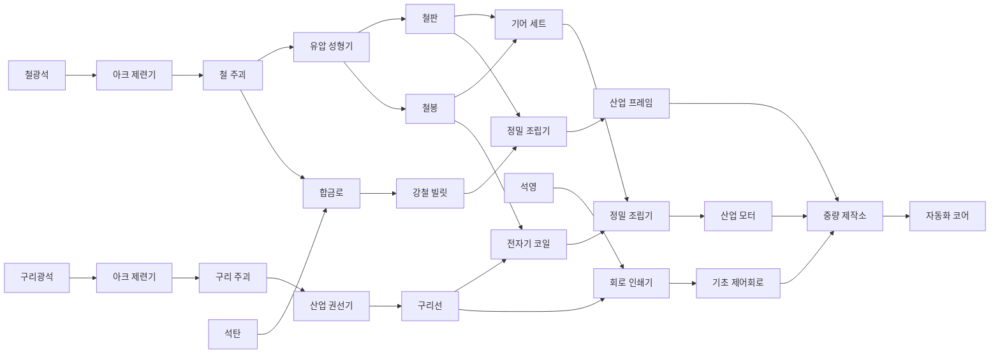
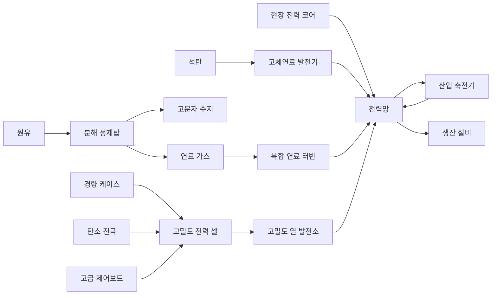

# FactoryX 자원·생산 계보 기획

> 문서 상태: 초안 v0.1  
> 적용 범위: 자원, 아이템, 생산 설비, 프로젝트 최종품, 단계별 해금 구조  
> 제외 범위: 텍스처, 최종 밸런스 확정, 최종 UI

## 1. 기획 목표

FactoryX의 생산 구조는 아이템 종류를 무작정 늘리는 대신, `A-17 개척 프로젝트`라는 하나의 장기 목표를 향해 공정이 확장되는 형태로 구성한다.

플레이어가 생산 단계를 올릴 때마다 새로운 자원뿐 아니라 새로운 공장 설계 문제를 하나씩 배우게 한다.

1. 채굴과 일대일 가공
2. 두 생산 라인의 합류와 합금
3. 다단계 부품 및 전자 공정
4. 유체, 부산물, 고급 복합 조립
5. 이전 단계 생산품을 대량으로 소비하는 최종 프로젝트

초기 버전에서는 `철·구리·석탄·석영 → 자동화 코어`까지 구현하고, 원유와 알루미늄 계보는 이후 단계에서 확장한다.

## 2. 레퍼런스에서 가져올 원칙

### Satisfactory

- 전용 프로젝트 부품을 납품해 다음 티어를 해금한다.
- 후반 프로젝트 부품이 초반 부품을 다시 요구하므로 기존 공장이 버려지지 않는다.
- 레시피와 생산 설비가 티어 및 연구 진행과 함께 해금된다.
- 대체 레시피는 기본 생산망이 안정된 이후의 최적화 수단으로 사용한다.

### Factorio

- 연구 단계마다 생산 복잡도가 점진적으로 상승한다.
- 화학 단계에서 원유와 플라스틱이라는 새로운 생산 문법을 도입한다.
- 회로처럼 여러 고급 제품에 반복 사용되는 핵심 중간재가 공장 규모 확장의 중심이 된다.
- 제작 시간과 소비량 차이가 자연스럽게 생산 비율 문제를 만든다.

### Dyson Sphere Program

- 작은 작업장에서 시작해 거대한 산업 프로젝트로 확장되는 장기 목표가 명확하다.
- 단순 생산 라인에서 복합 생산망으로 발전한다.
- 최종 프로젝트가 플레이어가 건설한 공장 규모를 시각적으로 증명한다.

위 원칙은 진행 구조만 참고하며, 아이템 이름과 레시피 및 세계관은 FactoryX에 맞게 새로 구성한다.

## 3. 세계관과 최종 목표

플레이어는 산업 개척 구역 `A-17`의 자동화 책임자다. 최종 목표는 새로운 개척지를 스스로 건설할 수 있는 자율 생산 설비인 `AX-17 개척 시드`를 제작해 프로젝트 도크로 출하하는 것이다.

| 단계 | 프로젝트 최종품 | 핵심 학습 요소 | 다음 단계 해금 |
| --- | --- | --- | --- |
| 1단계 | 기초 정착 패키지 | 채굴, 제련, 단일 가공 | 합금 및 고속 물류 |
| 2단계 | 산업 전력 노드 | 두 재료 합류, 생산 비율 | 전자 공정 및 자동 제어 |
| 3단계 | 자율 생산 코어 | 복합 부품, 다단계 조립 | 화학 및 경금속 공정 |
| 4단계 | AX-17 개척 시드 | 유체, 부산물, 대량 생산 | 최종 완료 및 반복 목표 |

프로젝트 최종품은 일반 건설 재료와 분리한다. 플레이어가 프로젝트 도크에 납품한 물품은 되돌릴 수 없는 영구 소비처가 된다.

## 4. 천연자원 계보

| 해금 단계 | 자원 | 주 사용처 | 텍스처 없는 형태 기준 |
| --- | --- | --- | --- |
| 시작 | 철광석 | 판재, 봉, 기어, 프레임 | 묵직하고 각진 청회색 덩어리 |
| 시작 | 구리광석 | 전선, 코일, 회로 | 얇고 뾰족한 적갈색 파편 |
| 시작 | 석회암 | 건축 블록과 기초재 | 밝고 둥근 파쇄석 덩어리 |
| 2단계 | 석탄 | 강철, 전력, 탄소 소재 | 작고 불규칙한 검은 조각 |
| 2단계 | 석영 | 회로 기판, 센서, 렌즈 | 길쭉한 반투명 결정 기둥 |
| 3단계 | 원유 | 수지, 절연재, 연료 | 파이프로만 운송되는 점성 유체 |
| 3단계 | 보크사이트 | 알루미늄과 경량 케이스 | 여러 붉은 알갱이가 뭉친 형태 |
| 4단계 | 텅스텐광 | 고온 부품과 정밀 공구 | 짧고 조밀한 짙은 금속 결정 |

한 티어에서 새로운 천연자원을 두 종류 이상 동시에 도입하지 않는 것을 원칙으로 한다. 새 자원은 반드시 기존 생산망과 결합되어야 하며 독립된 별도 라인으로 끝나지 않아야 한다.

## 5. 생산 설비 목록

### 5.1 채취 및 1차 가공

| 설비 | 역할 | 입력 수 | 출력 수 | 형태 키워드 |
| --- | --- | ---: | ---: | --- |
| 광맥 채굴기 | 고체 자원 채굴 | 0 | 1 | 수직 드릴, 지지 풋, 배출 슈트 |
| 유체 추출기 | 원유 추출 | 0 | 1 | 펌프 잭, 왕복 암, 배관 |
| 파쇄기 | 석회암과 석영 분쇄 | 1 | 1 | 이중 롤러, 투입 호퍼, 분진 후드 |
| 아크 제련기 | 광석을 금속 주괴로 제련 | 1 | 1 | 노심, 단열 링, 굴뚝 |
| 합금로 | 두 소재를 고온 합금으로 변환 | 2 | 1 | 이중 투입구, 두꺼운 용기, 주조 슈트 |
| 분해 정제탑 | 원유를 수지와 연료로 분리 | 1 | 2 | 수직 탑, 배관, 분리 탱크 |

### 5.2 성형 및 부품 생산

| 설비 | 역할 | 입력 수 | 출력 수 | 형태 키워드 |
| --- | --- | ---: | ---: | --- |
| 유압 성형기 | 판, 봉, 빔, 케이스 성형 | 1 | 1 | 대형 프레스, 금형, 슬라이드 |
| 산업 권선기 | 전선과 코일 생산 | 1 | 1 | 회전 스풀, 가이드 암, 장력 롤러 |
| 회로 인쇄기 | 기판, 회로, 센서 생산 | 2 | 1 | 밀폐 작업대, 헤드 레일, 검사등 |
| 정밀 조립기 | 두 부품을 하나로 조립 | 2 | 1 | 열린 작업 셀, 두 공구 암, 턴테이블 |
| 중량 제작소 | 3~4종 고급 부품 조립 | 4 | 1 | 넓은 갠트리, 다중 투입 베이, 이젝터 |

### 5.3 물류 및 프로젝트

| 설비 | 역할 |
| --- | --- |
| 컨베이어 Mk.1~3 | 고체 아이템 운송 |
| 분배기 | 한 입력을 여러 출력으로 분리 |
| 병합기 | 여러 입력을 한 출력으로 합류 |
| 소형 저장고 | 단일 품목의 초기 저장 |
| 산업 저장고 | 대용량 적층 저장 |
| 유체 탱크 | 원유와 정제 유체 저장 |
| 개척 프로젝트 도크 | 프로젝트 최종품 납품 및 단계 해금 |

## 6. 초기 구현 생산 계보

초기 구현은 자원 4종, 주요 가공품 11종, 프로젝트 최종품 1종으로 제한한다.



### 6.1 권장 초기 레시피

| 제품 | 재료 | 설비 | 기본 주기 |
| --- | --- | --- | ---: |
| 철 주괴 1 | 철광석 2 | 아크 제련기 | 4초 |
| 구리 주괴 1 | 구리광석 2 | 아크 제련기 | 4초 |
| 철판 2 | 철 주괴 1 | 유압 성형기 | 4초 |
| 철봉 2 | 철 주괴 1 | 유압 성형기 | 4초 |
| 구리선 4 | 구리 주괴 1 | 산업 권선기 | 4초 |
| 강철 빌릿 1 | 철 주괴 1 + 석탄 1 | 합금로 | 6초 |
| 기어 세트 1 | 철판 1 + 철봉 2 | 정밀 조립기 | 5초 |
| 전자기 코일 1 | 구리선 4 + 철봉 1 | 정밀 조립기 | 5초 |
| 기초 제어회로 1 | 석영 1 + 구리선 3 | 회로 인쇄기 | 6초 |
| 산업 모터 1 | 기어 세트 1 + 전자기 코일 2 | 정밀 조립기 | 10초 |
| 산업 프레임 1 | 강철 빌릿 2 + 철판 4 | 정밀 조립기 | 10초 |
| 자동화 코어 1 | 산업 모터 1 + 기초 제어회로 2 + 산업 프레임 1 | 중량 제작소 | 16초 |

현재 프로토타입의 목표인 `조립품 20개 생산`은 `자동화 코어 20개 생산`으로 교체한다.

### 6.2 초기 단계의 학습 순서

1. 철광석을 제련해 철 주괴를 만든다.
2. 철 주괴를 철판과 철봉으로 분기한다.
3. 구리 생산 라인을 추가해 구리선을 만든다.
4. 두 입력을 조립기에 넣어 기어와 코일을 만든다.
5. 석탄을 투입해 강철 생산을 시작한다.
6. 석영과 구리선을 결합해 회로를 만든다.
7. 세 생산 분기를 중량 제작소에 모아 자동화 코어를 생산한다.

## 7. 확장 생산 계보

### 7.1 화학 및 경금속 단계

- 원유 → 고분자 수지 + 연료 가스
- 고분자 수지 → 절연 시트
- 보크사이트 → 알루미나 → 알루미늄 주괴
- 알루미늄 주괴 → 경량 케이스
- 석탄 → 탄소 전극
- 경량 케이스 + 탄소 전극 + 절연 시트 → 전력 셀
- 기초 제어회로 + 절연 시트 + 정제 석영 → 고급 제어보드
- 산업 모터 + 고급 제어보드 + 경량 케이스 → 정밀 액추에이터

원유 단계부터 부산물을 도입한다. 그 이전 단계에는 한 레시피에서 여러 출력이 발생하지 않도록 해 기본 물류 학습을 단순하게 유지한다.

### 7.2 최종 프로젝트 부품

| 제품 | 주요 재료 | 용도 |
| --- | --- | --- |
| 경량 구조 셸 | 산업 프레임 + 알루미늄 케이스 + 절연 시트 | 개척 시드 외장 |
| 정밀 액추에이터 | 산업 모터 + 제어보드 + 경량 케이스 | 자율 건설 장치 |
| 전력 셀 | 알루미늄 케이스 + 탄소 전극 + 절연 시트 | 독립 전원 |
| 열 제어 모듈 | 구리 코일 + 알루미늄 케이스 + 텅스텐 부품 | 열 관리 |
| AX-17 개척 시드 | 자율 생산 코어 + 위 4종 프로젝트 부품 | 최종 납품품 |

후반 제품은 초반 부품을 계속 소비해야 한다. 철판, 구리선, 모터, 프레임 생산 라인이 후반에도 의미를 유지하도록 한다.

## 8. 아이템 명명 원칙

아이템 이름은 별도 설명 없이 생산 기능을 짐작할 수 있어야 한다.

- 원재료: `철광석`, `석탄`, `원유`
- 1차 소재: `철 주괴`, `강철 빌릿`, `알루미늄 주괴`
- 형태 가공품: `철판`, `철봉`, `구리선`, `경량 케이스`
- 기능 부품: `기어 세트`, `전자기 코일`, `산업 모터`
- 시스템 부품: `기초 제어회로`, `정밀 액추에이터`, `자율 생산 코어`
- 프로젝트 부품: `산업 전력 노드`, `AX-17 개척 시드`

`고급 재료`, `특수 부품`, `복합 아이템`처럼 기능이나 형태가 드러나지 않는 이름은 사용하지 않는다.

영문 내부 ID는 표시 이름과 분리한다.

```text
iron_ore
iron_ingot
steel_billet
copper_wire
gear_set
electromagnetic_coil
basic_control_circuit
industrial_motor
industrial_frame
automation_core
colony_seed_ax17
```

## 9. 텍스처 이전의 아이템 형태 규칙

컨베이어 위에서 작은 크기로 보여도 공정 단계를 구별할 수 있어야 한다.

| 아이템 계열 | 기본 형태 |
| --- | --- |
| 광석 | 불규칙 다면체 또는 결정 묶음 |
| 주괴 | 사다리꼴 또는 모서리가 잘린 금속 덩어리 |
| 판재 | 얇고 넓은 직육면체 |
| 봉과 선재 | 원통 묶음 또는 감긴 코일 |
| 기계 부품 | 기어, 축, 링처럼 회전축이 읽히는 형태 |
| 회로 부품 | 얇은 기판과 돌출된 칩 블록 |
| 프레임 | 중앙이 비어 있는 구조체 |
| 최종 코어 | 여러 계열이 결합된 밀폐 캡슐 또는 프레임형 장치 |

색상만으로 아이템을 구분하지 않는다. 같은 재료라도 광석, 주괴, 판재, 완성 부품은 서로 다른 실루엣을 가져야 한다.

## 10. 밸런스 원칙

- 첫 생산 라인은 `채굴기 1 : 제련기 1`처럼 이해하기 쉬운 비율로 시작한다.
- 새 티어는 천연자원보다 새로운 가공 방식 하나를 먼저 강조한다.
- 자주 쓰이는 중간재는 최소 세 종류 이상의 후속 제품에서 소비한다.
- 프로젝트 최종품은 생산망의 영구 소비처 역할을 한다.
- 초반에는 부산물과 순환 레시피를 금지한다.
- 대체 레시피는 기본 계보가 완성된 이후 최적화 콘텐츠로 추가한다.
- 최종품 하나에 필요한 원재료 총량은 이전 단계 최종품보다 약 3~5배 증가시키되, 공정 깊이는 한 단계에 한두 층만 추가한다.

## 11. 구현을 위한 데이터 구조 요구사항

아이템과 레시피가 늘어날 예정이므로 생산 로직을 개별 조건문으로 확장하지 않는다.

### ItemDefinition

- 내부 ID
- 표시 이름
- 카테고리
- 해금 단계
- 운송 형태
- 기본 색상 및 지오메트리 타입
- 스택 크기

### RecipeDefinition

- 레시피 ID
- 표시 이름
- 사용 설비
- 입력 아이템과 수량
- 출력 아이템과 수량
- 생산 시간
- 소비 전력
- 해금 단계
- 부산물 여부

### BuildingDefinition

- 건물 ID와 이름
- 입력 및 출력 포트 수
- 사용 가능한 레시피 목록
- 기본 처리 속도
- 전력 소비
- 저장 용량
- 모델 및 애니메이션 타입

현재 `ore / ingot / component`처럼 제한된 아이템 구분은 이 정의 기반 레지스트리로 교체하는 것을 장기 목표로 한다.

## 12. 권장 구현 순서

1. 기존 `조립품`을 `자동화 코어`로 교체한다.
2. 철광석, 철 주괴, 철판, 철봉의 분기 생산을 구현한다.
3. 구리광석, 구리 주괴, 구리선을 추가한다.
4. 레시피 선택이 가능한 유압 성형기 또는 단일 가공기를 추가한다.
5. 석탄과 합금로를 추가해 강철 계보를 연다.
6. 석영과 회로 인쇄기를 추가한다.
7. 산업 모터, 산업 프레임, 자동화 코어 조립을 완성한다.
8. 프로젝트 도크와 납품 기반 단계 해금을 추가한다.
9. 생산 UI와 계보 화면을 추가한다.
10. 그 이후에만 원유, 부산물, 알루미늄을 구현한다.

## 13. 참고 자료

- [Satisfactory 공식 위키: Recipes](https://satisfactory.wiki.gg/wiki/Recipes)
- [Satisfactory 공식 위키: Space Elevator](https://satisfactory.wiki.gg/wiki/Space_Elevator)
- [Satisfactory 공식 위키: Production Line Tutorial](https://satisfactory.wiki.gg/wiki/Tutorial%3AProduction_line)
- [Factorio 공식 위키: Science Pack](https://wiki.factorio.com/Science_pack)
- [Factorio 공식 위키: Oil Refinery](https://wiki.factorio.com/Oil_refinery)
- [Factorio 공식 위키: Advanced Circuit](https://wiki.factorio.com/Advanced_circuit)
- [Dyson Sphere Program 공식 Steam 페이지](https://store.steampowered.com/app/1366540/Dyson/_Sphere/_Program/)

이 문서의 이름, 레시피, 수치, 진행 단계는 참고 게임의 데이터를 복제한 것이 아니라 FactoryX의 현재 웹 3D 프로토타입 규모와 조작 흐름에 맞춰 설계한 초안이다.

## 14. 러프 디자인 공통 규격

이 절은 텍스처 없이 기본 지오메트리, 재질 대비, 실루엣과 애니메이션만으로 설비와 아이템을 구분하기 위한 블록아웃 기준이다. 세부 표현은 [기계 시각 디자인 원칙](./machine-visual-design-principles.ko.md)을 함께 따른다.

### 14.1 설비 공통 구조

모든 생산 설비는 다음 다섯 층이 읽혀야 한다.

1. 지면에 하중을 전달하는 기초와 풋
2. 기계를 지탱하는 어두운 구조 프레임
3. 공정을 수행하는 핵심 장치
4. 재료가 통과하는 입력 및 출력 경로
5. 상태등, 점검 패널, 손잡이 같은 사람 크기의 장치

장식 부품은 동력, 지지, 냉각, 배기, 안전, 정비 또는 물류 중 하나의 기능을 설명해야 한다. 기능을 설명할 수 없는 파이프, 링, 막대는 추가하지 않는다.

### 14.2 포트 규격

- 현재 게임의 기본 회전에서 로컬 `-X`를 입력, `+X`를 출력으로 사용한다.
- 벨트 운반면과 포트 바닥의 기준 높이는 약 `0.36`으로 통일한다.
- 단일 포트의 유효 폭은 벨트 폭보다 조금 좁은 `0.62~0.68` 범위로 잡는다.
- 입력은 넓게 열렸다가 안으로 좁아지는 호퍼 또는 가이드 형태를 사용한다.
- 출력은 내부에서 밖으로 밀어내는 슈트, 셔터 또는 이젝터 형태를 사용한다.
- 두 입력을 쓰는 설비는 같은 면의 두 포트를 억지로 붙이지 않고, 설비 폭을 넓히거나 측면별로 분리한다.
- 유체 포트는 고체 벨트 포트와 혼동되지 않도록 원형 플랜지와 굵은 배관으로 표현한다.

### 14.3 재질과 색의 역할

| 역할 | 블록아웃 재질 |
| --- | --- |
| 구조 프레임과 기초 | 어두운 청회색 금속 |
| 외장 패널과 탱크 | 밝은 회색 도장 금속 |
| 축, 레일, 실린더 | 밝고 반사가 강한 강재 |
| 위험 구역과 가동부 가드 | 무광 주황색 |
| 정상 상태와 연결 완료 | 제한된 청록 발광 |
| 주의 및 출력 대기 | 앰버 발광 |
| 막힘, 가득 참, 치명 오류 | 적색 발광 |
| 고온부 | 외부가 아니라 깊은 틈 안쪽의 주황 발광 |

주황색과 청록색은 넓은 외장 전체에 칠하지 않는다. 구조와 공정이 형태로 읽힌 뒤 작은 기능 강조에만 사용한다.

### 14.4 권장 크기 등급

| 등급 | 점유 예시 | 대상 |
| --- | --- | --- |
| S | 1×1 | 벨트, 분배기, 병합기 |
| M | 2×2 | 채굴기, 제련기, 파쇄기, 성형기, 권선기, 소형 저장고 |
| L | 3×3 | 합금로, 정제탑, 중량 제작소, 산업 저장고 |
| XL | 5×5 이상 | 개척 프로젝트 도크 |

모델의 가장 큰 장식은 논리 점유 영역을 과도하게 벗어나지 않아야 한다. 굴뚝이나 배관처럼 높이 방향으로 확장되는 장치는 허용하되, 플레이어가 보이는 외형과 충돌 영역을 일치시킨다.

## 15. 건물별 러프 디자인

### 15.1 광맥 채굴기

- **실루엣:** 네 개의 넓은 지지 풋, 높은 A자 마스트, 한쪽으로 낮게 뻗는 출력 슈트.
- **큰 덩어리:** 열린 사각 기초 위 중앙 드릴, 상부 수평 모터, 하부 수집 챔버로 구성한다.
- **재료 흐름:** 광맥 → 드릴 접촉점 → 수집 챔버 → 측면 출력 슈트 순서가 보이게 한다.
- **대표 동작:** 모터 가속 → 드릴 하강 및 회전 → 짧은 충격 → 챔버 진동 → 광석 배출.
- **근거리 초점:** 눈높이 상태 패널, 드릴 측면 크랭크, 회전체 가드.

### 15.2 유체 추출기

- **실루엣:** 낮고 넓은 펌프 기초 위에서 비대칭 왕복 암이 크게 움직이는 형태.
- **큰 덩어리:** 지면 웰 헤드, 뒤쪽 구동 모터, 중앙 피벗, 전면 펌프 로드, 출력 매니폴드로 구성한다.
- **재료 흐름:** 지면 웰 헤드에서 올라온 유체가 측면 압력 챔버를 거쳐 원형 파이프 출력으로 이동한다.
- **대표 동작:** 모터 플라이휠 회전 → 암의 느린 상하 왕복 → 로드 압축 → 압력계 펄스.
- **근거리 초점:** 밸브 휠, 압력계, 누출 방지 플랜지, 점검 사다리.

### 15.3 파쇄기

- **실루엣:** 위가 넓고 아래가 좁은 투입 호퍼와 하부의 무거운 이중 롤러.
- **큰 덩어리:** 상부 호퍼, 중앙 파쇄 케이스, 좌우 모터, 하부 진동 슈트로 나눈다.
- **재료 흐름:** 상부 또는 낮은 경사 입력 → 맞물린 롤러 → 체망 → 출력 벨트 순서로 읽히게 한다.
- **대표 동작:** 두 롤러가 반대 방향으로 회전하고, 접촉 순간 케이스와 출력 체망이 짧게 진동한다.
- **근거리 초점:** 걸림 해제 레버, 롤러 보호 덮개, 분진 흡입 덕트.

### 15.4 아크 제련기

- **실루엣:** 두꺼운 원통 노체, 높은 비대칭 굴뚝, 측면 송풍기.
- **큰 덩어리:** 무거운 원형 기초 위에 단열 노심, 외부 클램프 링, 상부 후드와 굴뚝을 쌓는다.
- **재료 흐름:** 낮은 입력 호퍼 → 노심 → 반대편 주조 몰드 → 출력 슈트가 물리적으로 이어져야 한다.
- **대표 동작:** 입력 셔터 개방 → 노심 발광 상승 → 팬 가속과 열 호흡 → 주조 게이트 개방 → 잉곳 배출.
- **근거리 초점:** 깊은 관찰창, 송풍기 가드, 내화 패널 체결부, 온도 상태등.

### 15.5 합금로

- **실루엣:** 제련기보다 낮고 넓으며, 양쪽 투입 호퍼가 중앙 용기를 감싸는 형태.
- **큰 덩어리:** 중앙의 기울어지는 다각형 도가니, 두 개의 원료 투입 베이, 전면 주조 레일로 구성한다.
- **재료 흐름:** 철 계열과 탄소 계열이 서로 다른 포트로 들어와 도가니에서 합쳐지고 하나의 주조 슈트로 나온다.
- **대표 동작:** 두 투입 게이트 순차 개방 → 교반축 회전 → 도가니 소폭 기울기 → 몰드에 합금 주입.
- **근거리 초점:** 도가니 회전축, 대형 베어링, 비상 잠금 핀, 용탕 가드.

### 15.6 분해 정제탑

- **실루엣:** 세 구간으로 나뉜 높은 증류탑과 높이가 다른 두 개의 측면 탱크.
- **큰 덩어리:** 원통 탑, 하부 가열기, 중단 분리 챔버, 상부 응축기와 외부 배관을 수직으로 쌓는다.
- **재료 흐름:** 하부 원유 입력 → 가열기 → 탑 내부 상승 → 서로 다른 높이의 두 출력 배관으로 분리한다.
- **대표 동작:** 하부 펌프 회전, 탑 구간별 순차 발광, 밸브 작동, 응축기 팬 회전.
- **근거리 초점:** 배관 색 대신 플랜지 형태로 유체 종류를 구분하고, 샘플 밸브와 압력계를 배치한다.

### 15.7 유압 성형기

- **실루엣:** 두꺼운 H자 프레임 안에서 큰 프레스 헤드가 수직으로 움직이는 형태.
- **큰 덩어리:** 하부 금형대, 양쪽 구조 기둥, 상부 유압 실린더, 전후 재료 레일로 구성한다.
- **재료 흐름:** 입력 레일 → 중앙 금형 → 출력 푸셔가 직선으로 이어진다.
- **대표 동작:** 재료 정렬 → 측면 클램프 고정 → 헤드 가속 하강 → 짧은 충격 정지 → 출력 푸셔.
- **근거리 초점:** 양손 안전 스위치, 금형 잠금 레버, 유압 호스, 압착 위험 경고판.

### 15.8 산업 권선기

- **실루엣:** 좌우 크기가 다른 두 릴과 그 사이를 오가는 가이드 암.
- **큰 덩어리:** 입력 소재 드럼, 중앙 장력 롤러, 출력 코일 스핀들, 하부 모터 베드로 구성한다.
- **재료 흐름:** 선재가 여러 가이드 롤러를 통과해 출력 스풀에 감기는 경로를 노출한다.
- **대표 동작:** 입력 릴 회전 → 장력 암 미세 이동 → 가이드가 좌우 왕복 → 완성 코일 이젝터 작동.
- **근거리 초점:** 장력 게이지, 교체 가능한 스풀 축, 손 끼임 방지 가드.

### 15.9 회로 인쇄기

- **실루엣:** 낮고 넓은 밀폐 작업 셀과 위쪽을 가로지르는 얇은 헤드 레일.
- **큰 덩어리:** 입력 기판 트레이, 중앙 인쇄 베드, 이동 헤드, 후단 검사 챔버로 구성한다.
- **재료 흐름:** 기판과 도체 재료가 전면 버퍼에서 합쳐져 인쇄 베드를 거쳐 하나의 회로 출력으로 나온다.
- **대표 동작:** 기판 고정 → 헤드 X축 이동 → 짧은 스캔 광 → 검사등 점등 → 출력 셔터 개방.
- **근거리 초점:** 청정실형 덮개, 교체 카트리지, 작은 검사 모니터. 투명 재질 없이 프레임과 열린 틈으로 내부를 보인다.

### 15.10 정밀 조립기

- **실루엣:** 넓은 포털 프레임 안에 서로 다른 두 공구 타워와 중앙 작업대가 보이는 형태.
- **큰 덩어리:** 입력 버퍼, 위치 결정 턴테이블, 고정 암, 가공 암, 출력 이젝터 순으로 구성한다.
- **재료 흐름:** 입력 재료 두 개가 서로 다른 버퍼에 놓이고 중앙에서 결합된 뒤 반대편 출력으로 이동한다.
- **대표 동작:** 턴테이블 정렬 → 고정 암 접근 → 가공 암 작동 → 검사등 → 이젝터 배출.
- **근거리 초점:** 서로 다른 공구 헤드, 케이블 체인, 레일 스토퍼, 보호 프레임.

### 15.11 중량 제작소

- **실루엣:** 다른 설비보다 넓은 3×3 기초, 높은 천장 크레인, 네 방향의 재료 베이.
- **큰 덩어리:** 중앙 회전 지그, 양쪽 중량 공구, 상부 이동 갠트리, 후면 출력 도크로 구성한다.
- **재료 흐름:** 3~4종의 부품이 각 버퍼에 쌓인 뒤 중앙 지그로 순차 공급되고, 큰 완성품 하나가 출력된다.
- **대표 동작:** 버퍼 잠금 → 지그 회전 → 공구별 순차 작업 → 상부 크레인 이동 → 완성품 배출.
- **근거리 초점:** 바닥 안전선, 대형 체결 클램프, 유지보수 발판, 천장 케이블 트롤리.

### 15.12 컨베이어 Mk.1~3

- **Mk.1:** 노출된 검은 운반면, 단순 강재 프레임, 작은 끝단 구동 모터. 느리고 기계적인 인상.
- **Mk.2:** 높아진 측면 가이드, 촘촘한 트레드, 밀폐된 기어박스와 추가 지지 풋. 더 빠른 흐름이 읽히게 한다.
- **Mk.3:** 낮고 단단한 프레임, 중앙 이송 레일과 분절된 가속 코일. 완전한 공중 부양보다 고급 산업용 선형 모터처럼 보이게 한다.
- **공통 동작:** 운반면 트레드, 끝단 롤러, 아이템 이동 방향이 항상 일치해야 한다.
- **상태 표현:** 정상은 작은 청록 상태등, 막힘은 트레드 정지와 출력단 앰버 점멸로 표시한다.

### 15.13 분배기

- **실루엣:** 입력 쪽은 좁고 출력 쪽으로 두 갈래 벌어지는 낮은 Y자 하우징.
- **큰 덩어리:** 중앙 회전 게이트, 두 출력 가이드, 상부 방향 상태판으로 구성한다.
- **재료 흐름:** 내부 게이트 위치가 어느 출력으로 보낼지 직접 보여줘야 한다.
- **대표 동작:** 아이템 도착 → 게이트 전환 → 해당 출력 롤러만 짧게 가속.
- **근거리 초점:** 우선순위 선택 패널과 막힌 출력별 독립 상태등.

### 15.14 병합기

- **실루엣:** 두 입력이 넓게 시작해 하나의 출력으로 좁아지는 낮은 깔때기형 프레임.
- **큰 덩어리:** 두 입력 스토퍼, 중앙 교차 셔터, 단일 출력 롤러로 구성한다.
- **재료 흐름:** 두 라인이 중앙에서 물리적으로 합쳐지는 모습을 덮개로 완전히 숨기지 않는다.
- **대표 동작:** 한쪽 스토퍼 잠금 → 반대쪽 아이템 통과 → 교대 전환.
- **근거리 초점:** 입력 대기 상태를 각각 표시하는 두 개의 작은 램프.

### 15.15 소형 저장고

- **실루엣:** 낮고 긴 직육면체와 반복되는 세 개의 적층 띠.
- **큰 덩어리:** 두꺼운 모서리 프레임, 닫힌 적재 패널, 입력 수용부, 전면 용량 게이지로 구성한다.
- **재료 흐름:** 현재 최종 도착지이므로 입력 포트와 짧은 내부 수용 레일만 만들고 출력 포트는 두지 않는다.
- **대표 동작:** 아이템 입고 순간 셔터가 열리고 본체가 짧게 반응한 뒤 용량 게이지가 한 단계 상승한다.
- **근거리 초점:** 큰 품목 라벨판, 손잡이, 점검함, 입력 상태등.

### 15.16 산업 저장고

- **실루엣:** 소형 저장고 모듈을 세로로 쌓은 높은 직육면체와 외부 승강 레일.
- **큰 덩어리:** 하부 입고 도크, 중앙 수직 리프트, 반복 적재 베이, 상부 서비스 캡으로 구성한다.
- **재료 흐름:** 입력된 아이템이 내부 리프트를 타고 비어 있는 층으로 올라가는 구조를 틈 사이로 보여준다.
- **대표 동작:** 입고 셔터 → 리프트 짧은 상승 → 해당 층 표시등 점등. 상시 회전 동작은 사용하지 않는다.
- **근거리 초점:** 층별 번호판, 외부 사다리, 잠금 장치, 세로 용량 게이지.

### 15.17 유체 탱크

- **실루엣:** 세로 원통 탱크, 상부 돔, 한쪽 점검 사다리와 하부 배관 매니폴드.
- **큰 덩어리:** 원형 기초, 압력 용기, 보강 링, 상부 밸브, 하부 입출력 플랜지로 구성한다.
- **재료 흐름:** 입력과 출력 파이프를 높이 또는 플랜지 모양으로 구분한다.
- **대표 동작:** 유체량에 따라 측면 기계식 게이지가 이동하고, 입출고 순간 밸브 액추에이터가 짧게 회전한다.
- **근거리 초점:** 압력계, 샘플 밸브, 사다리 보호 케이지, 과압 안전밸브.

### 15.18 개척 프로젝트 도크

- **실루엣:** 멀리서도 보이는 높은 중앙 조립 프레임과 양쪽 대형 납품 베이.
- **큰 덩어리:** 5×5 이상 기초, 중앙 개척 시드 크래들, 상부 크레인, 단계별 조립 링, 다중 입력 도크로 구성한다.
- **재료 흐름:** 납품품이 내부에서 사라지지 않고 크래들 주변에 실제 구조물로 축적되어야 한다.
- **대표 동작:** 납품 컨테이너 잠금 → 크레인 운반 → 조립 링 일부 완성 → 단계 완료 시 큰 기계 동작 한 번.
- **근거리 초점:** 프로젝트 진행 패널, 각 납품 베이의 품목 표식, 완성된 구간과 비어 있는 구간의 명확한 대비.

## 16. 운송 오브젝트 러프 디자인

### 16.1 공통 운송 규격

- 벨트 위 단일 오브젝트의 권장 최대 크기는 약 `0.42 × 0.32 × 0.42`다.
- 나사, 펠릿, 가루처럼 너무 작은 물품은 개별 조각 대신 표준 운송 트레이 또는 묶음으로 표현한다.
- 아이템의 로컬 전방축을 통일해 벨트 위 회전과 기계 투입 애니메이션을 재사용한다.
- 같은 재료라도 `광석 → 주괴 → 판재 → 기능 부품` 단계마다 실루엣을 바꾼다.
- 유체는 고체 큐브로 포장하지 않는다. 파이프 시스템이 추가되기 전에는 유체 레시피를 잠근다.

### 16.2 천연자원

| 오브젝트 | 러프 형태 | 구별 포인트 |
| --- | --- | --- |
| 철광석 | 크기가 다른 3개의 각진 다면체 묶음 | 무겁고 낮은 중심, 청회색 |
| 구리광석 | 얇은 결정 파편 4~5개가 한 방향으로 솟은 묶음 | 적갈색, 날카로운 실루엣 |
| 석회암 | 둥근 저면체 4개가 쌓인 밝은 덩어리 | 밝고 부드러운 면 |
| 석탄 | 작은 검은 파편을 담은 얕은 금속 트레이 | 가루 자원을 트레이로 표준화 |
| 석영 | 길이가 다른 육각 결정 3개 | 반투명 없이 밝은 면 대비로 결정 표현 |
| 보크사이트 | 붉은 구형 알갱이가 뭉친 불규칙 결절 | 다른 광석보다 입자감이 큰 형태 |
| 텅스텐광 | 짧고 조밀한 어두운 금속 결정 블록 | 작은 크기와 높은 금속 반사 |
| 원유 | 고체 운송물 없음 | 파이프 내부 흐름과 탱크 게이지로만 표현 |

### 16.3 1차 소재와 성형품

| 오브젝트 | 러프 형태 | 애니메이션 및 적재 방식 |
| --- | --- | --- |
| 철 주괴 | 모서리가 잘린 사다리꼴 금속 덩어리 | 벨트 위 긴 축이 진행 방향과 평행 |
| 구리 주괴 | 철 주괴보다 낮고 중앙 홈이 있는 적갈색 덩어리 | 두 개가 포개져도 읽히는 홈 사용 |
| 강철 빌릿 | 길고 어두운 육각 또는 사각 봉재 | 무겁게 낮게 놓이고 회전은 적게 함 |
| 건축 블록 | 홈이 파인 밝은 직육면체 | 두 개가 맞물릴 수 있는 형태 |
| 철판 | 얇은 판 두 장을 어긋나게 쌓은 묶음 | 이동 중 흔들림 없이 평평하게 유지 |
| 철봉 | 짧은 원통 세 개를 밴드로 묶은 형태 | 개별 봉 대신 한 운송 단위로 취급 |
| 구리선 | 낮은 토러스형 코일과 작은 고정 클립 | 이동 시 축을 중심으로 약하게 회전 |
| 강철 빔 | 짧은 I형 빔 한 쌍을 묶은 형태 | 실루엣의 빈 공간으로 판재와 구분 |
| 알루미늄 주괴 | 밝고 낮은 팔각형 주괴 | 철보다 가볍고 넓게 표현 |
| 경량 케이스 | 한 면이 열린 얇은 셸 또는 프레임 | 내부가 비어 있어 주괴와 구분 |
| 절연 시트 | 얇은 판 여러 장과 모서리 클립 | 금속판보다 무광이고 모서리가 둥글다 |

### 16.4 기계 부품

| 오브젝트 | 러프 형태 | 기능이 읽히는 요소 |
| --- | --- | --- |
| 체결재 팩 | 얕은 트레이 안의 굵은 육각 볼트 4개 | 작은 나사를 큐브 하나로 대체하지 않음 |
| 기어 세트 | 크기가 다른 기어 두 개와 짧은 공용 축 | 치형과 축 방향이 명확함 |
| 전자기 코일 | 구리색 토러스 코일과 어두운 철심 | 권선기 생산품임을 바로 인식 가능 |
| 산업 모터 | 짧은 원통 하우징, 양쪽 캡, 노출 출력축 | 한쪽 축과 냉각 핀으로 방향 표현 |
| 산업 프레임 | 중앙이 빈 정육면체형 구조 프레임 | 완전한 상자가 아니라 하중 구조로 표현 |
| 정밀 액추에이터 | 사각 서보 하우징과 짧은 피스톤 로드 | 이동축과 고정 브래킷이 보임 |
| 열 제어 모듈 | 여러 장의 냉각 핀과 중앙 유체 블록 | 방열 방향이 실루엣으로 드러남 |

### 16.5 전자 및 화학 부품

| 오브젝트 | 러프 형태 | 기능이 읽히는 요소 |
| --- | --- | --- |
| 정제 석영 | 낮은 육각 프리즘 두 개 | 원석보다 정돈되고 균일한 형태 |
| 기판 | 얇은 직사각 판과 세 개의 큰 접점 | 미세 회로 대신 큰 기능 블록만 사용 |
| 기초 제어회로 | 기판, 중앙 칩, 한쪽 커넥터 | 입력과 출력 방향을 커넥터로 표시 |
| 고급 제어보드 | 두 층 기판과 방열판, 두 커넥터 | 기초 회로보다 높고 복잡한 실루엣 |
| 광학 센서 | 다각형 렌즈를 보호 프레임이 감싼 형태 | 투명도 없이 밝은 렌즈 면으로 표현 |
| 고분자 수지 | 표준 트레이에 담긴 큰 펠릿 6개 | 석탄과 다른 둥근 입자 형태 |
| 탄소 전극 | 검은 원통 두 개와 금속 단자 | 석탄보다 가공되고 규격화된 형태 |
| 전력 셀 | 육각 원통 셀 세 개를 프레임에 고정 | 양극과 음극 캡을 형태로 구분 |
| 연료 가스 | 고체 운송물 없음 | 파이프, 탱크, 압력 표시로만 표현 |

### 16.6 프로젝트 부품

| 오브젝트 | 러프 형태 | 시각적 위계 |
| --- | --- | --- |
| 기초 정착 패키지 | 철판, 건축 블록, 체결재를 묶은 소형 팔레트 | 일반 부품보다 크지만 벨트 운송 가능 |
| 산업 전력 노드 | 사각 프레임 안에 대형 코일과 버스바가 결합된 장치 | 청록 발광은 작은 중앙 상태부에만 사용 |
| 자율 생산 코어 | 육각 보호 케이지 안의 회전 가능한 중앙 코어 | 현재 프로토타입의 첫 번째 대표 최종품 |
| 경량 구조 셸 | 곡면 패널과 프레임이 결합된 큰 반쪽 셸 | 중량 제작소 전용 대형 운송 팔레트 사용 |
| AX-17 개척 시드 | 세로 캡슐형 본체, 하부 제조 노즐, 상부 센서 링 | 일반 벨트가 아닌 프로젝트 도크 크레인으로만 운반 |

프로젝트 부품은 일반 재료보다 크고 복합적인 실루엣을 사용한다. 단, 발광을 많이 사용하는 것으로 등급을 표현하지 않고 여러 기능 부품이 실제로 결합된 구조로 위계를 만든다.

## 17. 상태별 러프 표현

| 상태 | 건물 동작 | 오브젝트 표현 | 상태등 |
| --- | --- | --- | --- |
| 입력 대기 | 주 공정 정지, 입력 장치만 대기 | 입력 버퍼가 비어 있음 | 입력 쪽 낮은 앰버 |
| 정상 가동 | 공정 순서에 맞춘 2~5개 핵심 동작 | 중간 공정물이 핵심부에 보임 | 일정한 청록 |
| 출력 대기 | 공정 완료 위치에서 정지 | 완성품이 출력 슈트 또는 지그에 남음 | 출력 쪽 느린 앰버 |
| 막힘 | 위험한 이동 즉시 정지 | 막힌 위치에 아이템이 직접 보임 | 해당 포트 적색 |
| 미연결 | 내부 생산 가능 동작도 시작하지 않음 | 연결되지 않은 포트가 노출됨 | 포트의 낮은 주황색 |
| 가득 참 | 저장 동작 정지 | 용량 게이지가 최상단에 고정 | 느린 적색 이중 점멸 |

색만 바꾸는 상태 표현은 금지한다. 움직임 정지, 셔터 위치, 버퍼에 보이는 오브젝트, 상태등 위치를 함께 바꾼다.

## 18. 블록아웃 성능 목표

| 대상 | 메시 목표 | 삼각형 1차 목표 | 핵심 가동 그룹 |
| --- | ---: | ---: | ---: |
| 벨트 및 물류 소형 설비 | 15~35 | 500~1,500 | 1~3 |
| 2×2 생산 설비 | 40~80 | 2,000~4,000 | 2~5 |
| 3×3 중량 설비 | 60~110 | 3,500~6,000 | 3~6 |
| 프로젝트 도크 | 거리별 LOD 필수 | 근거리 10,000 내외 | 단계별 선택 재생 |
| 벨트 아이템 | 1~8 | 50~500 | 필요할 때만 1 |

- 반복되는 볼트, 리브, 롤러는 `InstancedMesh` 또는 병합 지오메트리를 사용한다.
- 상태에 따라 재질 값을 변경해야 하는 작은 표시등만 설비별 전용 재질을 갖는다.
- 작은 부품은 그림자를 끄고 큰 본체, 프레임, 대표 가동부만 그림자를 만든다.
- 오버뷰에서는 손잡이와 볼트보다 실루엣, 포트, 핵심 동작을 우선한다.

## 19. 러프 디자인 제작 순서

### 1차: 현재 프로토타입 정리

1. 광맥 채굴기
2. 아크 제련기
3. 정밀 조립기
4. 소형 저장고
5. 철광석, 철 주괴, 자동화 코어 운송 모델

### 2차: 초기 생산 계보 확장

1. 유압 성형기
2. 산업 권선기
3. 합금로
4. 회로 인쇄기
5. 철판, 철봉, 구리선, 기어, 코일, 회로, 모터, 프레임

### 3차: 고급 공정

1. 파쇄기
2. 분해 정제탑
3. 중량 제작소
4. 유체 탱크와 파이프 포트
5. 화학 및 알루미늄 계열 오브젝트

### 4차: 장기 목표

1. 산업 저장고
2. 개척 프로젝트 도크
3. 프로젝트 부품의 대형 운송 규격
4. AX-17 개척 시드의 단계별 조립 외형

각 설비는 `실루엣 → 포트와 재료 경로 → 핵심 동작 → 상태 표현 → 근거리 디테일` 순서로 제작한다. 한 단계가 실제 화면에서 읽히기 전에는 다음 단계의 작은 디테일을 추가하지 않는다.

## 20. 생산 계보 그래프 UI

### 20.1 목적

`생산 계보` 창은 단순한 아이템 도감이 아니라 다음 질문에 빠르게 답하는 전체 화면 생산 지도다.

- 이 아이템은 무엇으로 만드는가?
- 어느 건물이 생산하는가?
- 다음 단계에서 어디에 사용되는가?
- 현재 공장에서 충분히 생산되고 있는가?
- 막힌 생산 라인의 상류 원인은 무엇인가?
- 다음 프로젝트 최종품까지 어떤 공정이 남았는가?

정적 레시피 정보와 실시간 공장 상태를 한 화면에 억지로 섞지 않고, `계보`와 `공장 현황` 두 모드로 나눈다.

### 20.2 진입 방식

- 기본 단축키는 `G`를 사용한다.
- 건설 도크 옆에 `계보` 버튼을 둬 단축키를 모르는 플레이어도 접근할 수 있게 한다.
- 첫 번째 자동화 코어 레시피를 해금할 때 한 번만 짧은 안내를 표시한다.
- 창이 열려 있는 동안 카메라 및 건설 입력은 막지만 공장 시뮬레이션은 계속 진행한다.
- 1인칭 모드에서 열면 포인터 잠금을 해제하고, 닫을 때 이전 카메라 모드로 돌아간다.

### 20.3 화면 구조

```text
┌──────────────────────────────────────────────────────────────────────────────┐
│ FX / PRODUCTION ATLAS     [계보] [공장 현황]       검색...   단계 1~4   [×] │
├──────────────┬────────────────────────────────────────────┬──────────────────┤
│ 필터         │                                            │ 선택 아이템      │
│              │   철광석 ─ 철 주괴 ─ 철판 ─┐              │                  │
│ ● 전체       │                            ├ 산업 프레임   │ 산업 모터        │
│ ○ 원자원     │   석탄 ───── 강철 빌릿 ───┘              │ TIER 02          │
│ ○ 소재       │                                            │                  │
│ ○ 기계 부품  │   구리광석 ─ 구리선 ─ 코일 ─ 산업 모터    │ 생산: 6 /분      │
│ ○ 전자 부품  │                         └──────┐            │ 수요: 8 /분      │
│ ○ 프로젝트   │   석영 ─ 기초 제어회로 ───────┼ 자동화 코어│ 재고: 14         │
│              │   산업 프레임 ────────────────┘            │                  │
│ 해금만 보기  │                                            │ [설비 보기]      │
│ 대체식 표시  │       드래그 이동 · 휠 확대 · F 포커스     │ [건설 도구 선택] │
├──────────────┴────────────────────────────────────────────┴──────────────────┤
│ 정상 24  ·  부족 3  ·  막힘 1     프로젝트: 자동화 코어 14 / 20             │
└──────────────────────────────────────────────────────────────────────────────┘
```

화면은 네 영역으로 구성한다.

1. **상단 바:** 모드 전환, 검색, 단계 필터, 닫기
2. **왼쪽 필터:** 아이템 계열과 해금 상태 필터
3. **중앙 그래프:** 계보 탐색, 확대·축소, 경로 강조
4. **오른쪽 상세 패널:** 선택한 아이템의 레시피, 생산량, 소비처와 관련 설비

하단 요약 바에는 전체 생산 상태와 현재 프로젝트 진행도를 계속 표시한다.

### 20.4 그래프 배치 원칙

- 기본 진행 방향은 `왼쪽 원자원 → 오른쪽 프로젝트 최종품`이다.
- 세로 열은 생산 단계, 가로 행은 철·구리·전자·화학 같은 소재 계열로 사용한다.
- 설비 자체를 주 노드로 만들지 않고 아이템을 주 노드로 사용한다. 변환 설비는 연결선 중앙의 작은 공정 배지로 표시한다.
- 동일한 아이템이 여러 레시피에 쓰여도 노드를 복제하지 않는다.
- 선 교차가 지나치게 많으면 계열 묶음을 접고 펼칠 수 있는 그룹 노드를 사용한다.
- 프로젝트 최종품은 가장 오른쪽의 고정된 프로젝트 열에 배치한다.
- 잠긴 단계는 위치를 유지한 채 이름과 실루엣만 제한적으로 보여줘 다음 목표를 암시한다.

그래프는 고정 좌표를 화면 코드에 직접 작성하지 않는다. `단계`, `계열`, `선행 관계`, `표시 우선순위`를 기준으로 레이아웃 데이터를 생성하고, 필요한 노드만 수동 오프셋을 허용한다.

### 20.5 노드 디자인

모든 노드는 작은 화면에서도 이름과 상태를 읽을 수 있는 가로형 카드로 만든다.

```text
┌─────────────────────┐
│ ◉  산업 모터   T2   │
│ 6 /분       재고 14 │
└─────────────────────┘
```

| 노드 요소 | 내용 |
| --- | --- |
| 오브젝트 미리보기 | 실제 운송 모델을 단색 아이콘 또는 저비용 3D 썸네일로 표시 |
| 이름 | 한국어 표시 이름, 한 줄 고정 |
| 단계 | `T1~T4` 짧은 표식 |
| 생산량 | 최근 60초 평균 생산량 |
| 재고 | 연결된 저장고를 포함한 확인 가능한 수량 |
| 상태 표식 | 정상, 부족, 막힘, 미연결, 잠금 |

카테고리는 색만 아니라 카드 외곽 형태로도 구분한다.

| 카테고리 | 노드 형태 |
| --- | --- |
| 천연자원 | 왼쪽 모서리가 거친 육각형 카드 |
| 1차 소재 | 단단한 직사각형 카드 |
| 기계 부품 | 좌우에 작은 체결 탭이 있는 카드 |
| 전자·화학 부품 | 상단에 얇은 회로형 홈이 있는 카드 |
| 프로젝트 부품 | 크기가 크고 이중 외곽선을 가진 카드 |

### 20.6 연결선 디자인

- 기본 연결선은 낮은 대비의 회색 실선이다.
- 선의 방향은 작은 이동 펄스 또는 반복 화살표로 보여주되 과도하게 흐르게 하지 않는다.
- 선택한 노드의 상류는 청록, 하류는 주황으로 강조한다.
- 선 굵기는 현재 운송량을 대략적으로 표현하고, 정확한 값은 상세 패널에서 보여준다.
- 재료가 부족한 연결은 앰버 점선, 막힌 출력은 적색 끝단 마커로 표시한다.
- 대체 레시피는 기본적으로 숨기고 `대체식 표시`를 켰을 때만 얇은 파선으로 보여준다.
- 부산물 연결은 주 생산물과 다른 이중선 패턴을 사용한다.
- 모션 감소 설정에서는 이동 펄스를 없애고 정적 화살표만 사용한다.

### 20.7 계보 모드

`계보` 모드는 플레이어가 아직 건설하지 않은 공정까지 포함하는 레시피 및 진행 지도다.

- 선택 아이템의 모든 기본 재료와 소비처를 표시한다.
- 필요한 설비, 제작 시간, 입력 및 출력 수량을 보여준다.
- 잠긴 아이템을 선택하면 해금 조건과 필요한 프로젝트 납품품을 표시한다.
- 프로젝트 부품을 선택하면 부족한 하위 부품을 수량 기준으로 역산한다.
- `이 설비 건설` 버튼으로 창을 닫고 해당 설비 건설 도구를 바로 선택할 수 있다.
- 아직 구현하지 않은 대체 레시피 영역은 UI에서 노출하지 않는다.

### 20.8 공장 현황 모드

`공장 현황` 모드는 현재 맵에 실제로 존재하는 생산 라인의 집계 화면이다.

| 표시 값 | 계산 방식 |
| --- | --- |
| 생산량 | 해당 아이템의 최근 60초 실제 출력 평균 |
| 소비량 | 실제 다음 공정으로 전달된 수량 평균 |
| 잠재 생산량 | 현재 설비 수와 레시피 속도로 계산한 최대치 |
| 재고 | 저장고 및 설비 버퍼에 존재하는 확인 가능 수량 |
| 균형 | 생산량 - 소비량 |

상태 판정은 다음 기준을 사용한다.

- **정상:** 생산량이 수요의 90% 이상이고 장시간 막힘이 없음
- **부족:** 소비 설비가 입력을 기다리는 시간이 일정 비율 이상
- **과잉:** 재고가 증가하고 소비량보다 생산량이 지속적으로 높음
- **막힘:** 출력 버퍼 또는 연결 벨트가 일정 시간 이상 정지
- **미구축:** 레시피는 해금됐지만 생산 설비가 하나도 없음

노드를 선택하면 오른쪽 패널에 해당 아이템을 생산하거나 소비하는 실제 설비 목록을 보여준다. `설비 보기`를 누르면 생산량이 가장 낮거나 막힌 설비부터 월드 카메라가 포커스한다.

### 20.9 오른쪽 상세 패널

선택한 아이템에 따라 다음 정보를 위에서 아래 순서로 배치한다.

1. 실제 오브젝트 미리보기, 이름, 내부 카테고리
2. 해금 단계와 프로젝트 조건
3. 현재 선택 레시피의 입력, 출력, 제작 시간
4. 생산 설비 이름과 필요한 포트 수
5. 생산량, 수요량, 잠재 생산량, 재고
6. 주요 소비처 최대 4개
7. `상류 경로만 보기`, `하류 경로만 보기`, `전체 복원`
8. `설비 보기` 또는 `건설 도구 선택`

입력 재료는 텍스트 목록만 쓰지 않고 작은 아이템 노드로 표시한다. 클릭하면 선택이 해당 재료로 이동하며 상단에는 탐색 경로를 남긴다.

```text
철광석 > 철 주괴 > 철판 > 산업 프레임
```

### 20.10 검색과 필터

- 한국어 이름과 영문 내부 ID를 모두 검색할 수 있게 한다.
- 결과가 하나라면 `Enter`로 해당 노드를 중앙에 포커스한다.
- 카테고리, 단계, 해금 여부, 현재 생산 여부로 필터링한다.
- 필터는 노드를 완전히 재배치하기보다 숨긴 노드의 자리를 압축해 방향 감각을 유지한다.
- `프로젝트 경로` 버튼은 현재 목표에 필요하지 않은 가지를 일시적으로 흐리게 한다.
- `문제만 보기`는 부족, 막힘, 미구축 노드만 남긴다.

### 20.11 확대 단계별 정보량

| 확대 단계 | 표시 내용 |
| --- | --- |
| 축소 | 자원 계열, 단계와 프로젝트 최종품만 표시 |
| 기본 | 아이템 이름, 상태, 대표 연결선 표시 |
| 확대 | 입력 수량, 생산량, 설비 배지, 재고 표시 |

모든 정보를 항상 노출해 그래프가 숫자 표처럼 보이지 않도록 한다. 확대 수준이 바뀌어도 선택 노드와 강조 경로는 유지한다.

### 20.12 조작감

- 빈 공간 드래그: 그래프 이동
- 휠: 포인터 위치를 중심으로 확대·축소
- 노드 클릭: 상세 선택
- 노드 더블클릭 또는 `F`: 선택 노드를 중앙에 포커스
- `Shift + 클릭`: 최대 두 노드 비교 고정
- `Alt + 클릭`: 해당 노드까지의 프로젝트 경로만 표시
- `Esc`: 상세 선택 해제 후 한 번 더 누르면 창 닫기
- 방향키: 인접 노드 이동
- `Enter`: 선택 및 상세 열기

그래프 이동에는 짧은 관성만 적용하고 확대 중심이 갑자기 튀지 않게 한다. 노드 선택 애니메이션은 120~180ms 범위로 제한한다.

### 20.13 작은 화면 대응

화면 폭이 좁을 때는 자유 배치 그래프를 억지로 축소하지 않는다.

- 중앙 그래프를 단계별 세로 계보로 전환한다.
- 왼쪽 필터는 상단 드롭다운으로 합친다.
- 오른쪽 상세 패널은 하단 시트로 표시한다.
- 단계별 아이템 묶음을 접고 펼칠 수 있게 한다.
- 터치에서는 한 손가락 이동, 두 손가락 확대, 노드 한 번 탭 선택을 사용한다.

### 20.14 접근성

- 상태를 색에만 의존하지 않고 아이콘, 외곽선 패턴, 텍스트로 함께 표시한다.
- 모든 노드에 `아이템 이름, 단계, 생산 상태, 생산량`이 포함된 접근성 이름을 제공한다.
- 키보드만으로 검색, 노드 이동, 상세 확인과 닫기가 가능해야 한다.
- 모션 감소 설정에서는 연결선 펄스와 카메라형 포커스 이동을 제거한다.
- 그래프와 동일한 데이터를 읽기 쉬운 계층형 목록으로 전환하는 `목록 보기`를 제공한다.

### 20.15 데이터 요구사항

그래프 UI는 화면 전용 계보 데이터를 별도로 복제하지 않고 생산 정의에서 파생한다.

```text
ItemDefinition
  id, name, category, tier, modelKey

RecipeDefinition
  id, buildingId, inputs[], outputs[], duration, unlockId

ProductionMetric
  itemId, producedPerMinute, consumedPerMinute, stock, blockedSeconds

UnlockState
  unlockedItems[], unlockedRecipes[], projectPhase
```

그래프 노드는 `ItemDefinition`, 연결선은 `RecipeDefinition`으로 생성한다. 실제 생산 상태는 일정 주기의 집계 데이터만 React UI로 전달하고 매 프레임 전체 그래프를 다시 렌더링하지 않는다.

### 20.16 구현 단계

#### 1차: 정적 계보 MVP

- 전체 화면 열기 및 닫기
- 아이템 노드와 기본 레시피 연결선
- 드래그, 확대, 노드 선택
- 검색, 단계 필터, 오른쪽 레시피 상세
- 자동화 코어까지의 프로젝트 경로 강조

#### 2차: 공장 현황

- 최근 생산량, 소비량, 재고 집계
- 부족, 과잉, 막힘 상태
- 문제만 보기
- 선택 아이템 생산 설비 목록과 월드 포커스

#### 3차: 확장 기능

- 대체 레시피 전환
- 부산물과 유체 연결
- 프로젝트 필요량 역산
- 두 노드 비교
- 계층형 접근성 목록과 모바일 레이아웃

### 20.17 완료 판정 기준

- 처음 보는 플레이어가 철광석에서 자동화 코어까지의 경로를 10초 안에 찾을 수 있다.
- 선택한 아이템의 생산 설비와 입력 재료를 3초 안에 확인할 수 있다.
- 현재 막힌 생산 단계와 상류 원인을 5초 안에 구별할 수 있다.
- 확대하지 않은 상태에서도 원자원, 중간재, 프로젝트 최종품의 위계가 구분된다.
- 그래프를 열고 닫아도 기존 카메라와 건설 도구 상태가 손실되지 않는다.
- 아이템 또는 레시피가 추가되어도 화면 컴포넌트를 직접 수정하지 않고 데이터 정의만으로 노드와 연결선이 생성된다.

## 21. 전력 생산 및 전력망 기획

### 21.1 시스템 목표

전력은 단순한 건물 설치 비용이 아니라 생산망을 확장하게 만드는 두 번째 자원 흐름이다. 다만 초반부터 케이블 용량, 전압, 주파수까지 시뮬레이션하지 않고 다음 네 가지 판단에 집중한다.

1. 현재 발전량으로 공장을 얼마나 더 확장할 수 있는가?
2. 어떤 연료 생산 라인이 발전을 유지하는가?
3. 전력이 부족할 때 어떤 설비를 먼저 유지할 것인가?
4. 정전 후 공장을 어떻게 다시 기동할 것인가?

초기 구현은 `발전 용량`, `현재 소비`, `최대 예상 소비`, `저장 전력`, `연결 여부`, `우선순위`만 계산한다. 송전 손실과 전압 단계는 시각적 설정으로만 남기고 실제 수치 계산에서는 제외한다.

### 21.2 전력 진행 단계

| 단계 | 전력 설비 | 역할 | 새로 배우는 것 |
| --- | --- | --- | --- |
| 시작 | 현장 전력 코어 | 첫 공장을 기동하는 제한된 기본 전원 | 연결과 소비량 확인 |
| 2단계 | 고체연료 발전기 | 석탄 기반 최초 자동 발전 | 발전용 연료 생산 |
| 2단계 후반 | 산업 축전기·우선순위 분전반 | 잉여 전력 저장과 선택적 차단 | 예비율과 정전 대비 |
| 3단계 | 복합 연료 터빈 | 정제 부산물인 연료 가스 소비 | 생산 부산물의 발전 활용 |
| 3단계 후반 | 변전소·고압 송전탑 | 장거리 및 대규모 공장 연결 | 전력 구역 분리 |
| 4단계 | 고밀도 열 발전소 | 제조된 고밀도 전력 셀 소비 | 고급 발전 연료 자동화 |

발전 단계는 새로운 연료 생산 계보와 연결한다. 석탄은 강철과 발전 사이에서, 연료 가스는 화학 생산과 발전 사이에서 경쟁하게 만들어 생산 선택을 만든다.

### 21.3 전력 자원 흐름



### 21.4 발전 설비

수치는 시스템 관계를 확인하기 위한 1차 기준이며 플레이 테스트 후 조정한다.

| 설비 | 해금 | 정격 출력 | 연료 | 연료 소비 | 특징 |
| --- | ---: | ---: | --- | ---: | --- |
| 현장 전력 코어 | 시작 | 24 MW | 없음 | 없음 | 지도당 1개, 철거·복제 불가 |
| 고체연료 발전기 | 2단계 | 72 MW | 석탄 | 12개/분 | 최초 완전 자동 발전 |
| 복합 연료 터빈 | 3단계 | 240 MW | 연료 가스 | 20㎥/분 | 정제 부산물 소비 |
| 고밀도 열 발전소 | 4단계 | 720 MW | 고밀도 전력 셀 | 1개/분 | 최종 대규모 발전 |

발전기는 정격 출력만큼 항상 연료를 태우지 않는다. 현재 전력 수요에 맞춰 출력을 조절하고 실제 출력 비율만큼 연료를 소비한다. 단, 고체연료 발전기는 안정 운전을 위해 가동 중 최소 25% 출력을 유지한다.

#### 현장 전력 코어

- **용도:** 채굴기, 제련기, 조립기 한 줄을 시험할 수 있는 부트스트랩 전원.
- **제약:** 지도당 하나만 존재하고 출력 업그레이드가 불가능하다.
- **러프 디자인:** 낮은 장갑형 본체 안에 작은 플라이휠과 세 개의 전력 셀 모듈이 들어간 형태.
- **대표 동작:** 부하가 증가하면 플라이휠 회전과 중앙 상태 링의 밝기가 상승한다.
- **의도:** 연료 발전을 만들 전력이 없어서 복구하지 못하는 완전한 교착을 방지한다.

#### 고체연료 발전기

- **용도:** 석탄을 사용하는 첫 자동 발전소.
- **실루엣:** 긴 연소실, 굵은 발전기 드럼, 한쪽 석탄 호퍼, 높은 배기 스택.
- **재료 흐름:** 벨트 석탄 입력 → 연소실 → 회전축 → 발전기 드럼 → 전력 버스바.
- **대표 동작:** 연료 셔터 → 내부 화염 상승 → 드럼 가속 → 배기 펄스.
- **상태 표현:** 연료 부족은 호퍼 쪽 앰버, 출력 차단은 버스바 쪽 적색으로 위치를 분리한다.

초기 버전에서는 물과 증기 배관을 요구하지 않는다. 고체연료의 열을 밀폐식 열전 모듈과 공랭식 터빈으로 변환하는 FactoryX 고유 설비로 설정해, 파이프가 해금되기 전에도 자동 발전을 완성할 수 있게 한다.

#### 복합 연료 터빈

- **용도:** 분해 정제탑의 연료 가스를 소비하는 중반 발전소.
- **실루엣:** 수평 터빈 케이스, 큰 흡기 덕트, 후면 배기 챔버, 측면 연료 매니폴드.
- **재료 흐름:** 원형 유체 입력 → 연소 챔버 → 다단 터빈 → 발전기 → 상부 배기.
- **대표 동작:** 압축기 팬 가속 → 점화 펄스 → 터빈 고속 회전 → 배기 열기.
- **상태 표현:** 연료 압력, 회전수, 실제 출력률을 서로 다른 기계식 게이지로 표시한다.

#### 고밀도 열 발전소

- **용도:** 고밀도 전력 셀을 소비하는 최종 대규모 전력원.
- **실루엣:** 중앙 밀폐 코어를 여러 차폐 링과 대형 냉각 루프가 감싸는 형태.
- **재료 흐름:** 전력 셀 카트리지 투입 → 중앙 열 코어 → 열 교환 링 → 다중 발전기 모듈.
- **대표 동작:** 카트리지 잠금 → 차폐 셔터 폐쇄 → 링 순차 기동 → 냉각 펌프 가속.
- **상태 표현:** 외장 전체가 빛나지 않고 코어 관찰 틈과 냉각 상태등만 발광한다.

### 21.5 송전 및 배전 설비

| 설비 | 기능 | 권장 연결 방식 |
| --- | --- | --- |
| 배전 기둥 Mk.1 | 근거리 설비에 전력 공급 | 반경 3.5타일, 최대 6개 소비 설비 |
| 배전 기둥 Mk.2 | 중형 공장 구역 공급 | 반경 5타일, 최대 12개 소비 설비 |
| 고압 송전탑 | 멀리 떨어진 전력 구역 연결 | 송전탑끼리 장거리 수동 연결 |
| 변전소 | 고압망을 지역 배전망으로 변환 | 반경 내 기둥과 자동 연결 |
| 전력 차단기 | 두 전력망을 수동 연결·분리 | 단일 스위치 |
| 우선순위 분전반 | 부족 시 낮은 우선순위 구역부터 차단 | 최대 4개 출력 구역 |

초기 UX에서는 생산 설비마다 케이블을 직접 꽂지 않는다. 배전 기둥의 공급 반경 안에 들어오면 설비가 자동 연결되고, 기둥과 기둥 또는 발전 설비 사이의 주 케이블만 플레이어가 배치한다.

이 방식은 케이블 수를 줄이고 1인칭에서 공장 바닥이 전선으로 뒤엉키는 것을 막는다. 직접 연결이 필요한 특수 설비는 프로젝트 도크와 발전소처럼 큰 건물로 제한한다.

### 21.6 송전 설비 러프 디자인

#### 배전 기둥

- 어두운 단일 기둥, 위쪽 삼각 크로스암, 청록 절연 캡 세 개로 구성한다.
- 바닥에는 작은 차단함과 현재 부하를 보여주는 세로 막대가 있다.
- Mk.2는 기둥을 단순히 키우지 않고 이중 크로스암과 더 큰 하부 분전함으로 구분한다.
- 건설 모드에서만 지면 공급 반경과 자동 연결 예정 설비를 표시한다.

#### 고압 송전탑

- 높은 A자 강재 프레임과 세 줄의 굵은 송전 케이블을 사용한다.
- 플레이어가 오를 수 있는 사다리와 중간 점검 발판으로 크기 기준을 제공한다.
- 케이블 연결점은 일반 배전 기둥보다 높고 크며, 멀리서도 송전 방향을 읽을 수 있어야 한다.
- 전력망이 차단되면 작은 절연 상태등만 꺼지고 탑 전체가 발광하지 않는다.

#### 변전소

- 낮고 넓은 기초 위에 두 개의 대형 변압 코일, 중앙 차단기, 여러 출력 버스바를 배치한다.
- 고압 입력은 높은 포트, 지역 배전 출력은 낮은 포트로 높이를 달리한다.
- 부하가 높아질수록 코일의 낮은 진동음과 냉각 팬 회전이 증가한다.

#### 우선순위 분전반

- 사람 키 정도의 제어 캐비닛과 외부에 드러난 네 개의 큰 차단 레버로 구성한다.
- 레버 위치가 실제 연결 상태와 일치해야 한다.
- 각 출력 구역은 숫자 `P1~P4`, 외곽선 패턴, 상태등 위치를 함께 사용해 구분한다.

### 21.7 케이블 표현

- 두 연결점 사이를 직선으로 잇지 않고 중력 처짐이 있는 완만한 곡선으로 그린다.
- 일반 배전선은 한 줄 또는 두 줄, 고압선은 세 줄 묶음으로 구분한다.
- 케이블 색은 항상 어두운 재질로 유지하고 에너지 흐름을 네온 선으로 표현하지 않는다.
- 건설 모드에서만 케이블 위를 이동하는 작은 방향 펄스를 표시한다.
- 연결 가능은 청록, 거리 초과는 적색, 다른 구역과 병합 예정은 앰버 미리보기로 표시한다.
- 기둥 이동이나 철거 시 연결선은 즉시 재계산하되, 삭제될 연결을 먼저 미리 보여준다.

### 21.8 산업 축전기

| 항목 | 1차 기준 |
| --- | ---: |
| 저장 용량 | 24 MWh |
| 최대 충전 | 24 MW |
| 최대 방전 | 48 MW |
| 대기 소비 | 0.1 MW |

- 잉여 발전이 있을 때 자동으로 충전하고 소비가 발전량을 초과하면 자동 방전한다.
- 완전 충전된 축전기는 추가 전력을 소비하지 않는다.
- 방전 중인 축전기는 전력망 차단 전에 플레이어가 대응할 시간을 제공한다.
- 여러 축전기는 같은 전력망에서 용량과 충방전 한도를 합산한다.
- 러프 디자인은 세로 프레임 안에 여섯 개의 전력 셀 모듈을 쌓고, 측면 기계식 용량 게이지와 하부 냉각 팬을 배치한다.
- 충전 중에는 아래에서 위로, 방전 중에는 위에서 아래로 게이지가 이동한다. 색만으로 방향을 구분하지 않는다.

### 21.9 전력 소비 설비

다음 수치는 상대적인 규모를 잡기 위한 초안이다.

| 설비 | 가동 소비 | 대기 소비 |
| --- | ---: | ---: |
| 광맥 채굴기 | 4 MW | 0.2 MW |
| 유체 추출기 | 6 MW | 0.2 MW |
| 파쇄기 | 6 MW | 0.2 MW |
| 아크 제련기 | 6 MW | 0.2 MW |
| 합금로 | 12 MW | 0.3 MW |
| 유압 성형기 | 7 MW | 0.2 MW |
| 산업 권선기 | 6 MW | 0.2 MW |
| 회로 인쇄기 | 10 MW | 0.3 MW |
| 정밀 조립기 | 10 MW | 0.3 MW |
| 중량 제작소 | 24 MW | 0.5 MW |
| 분해 정제탑 | 18 MW | 0.5 MW |
| 개척 프로젝트 도크 | 32 MW | 2 MW |

컨베이어, 분배기, 병합기, 소형 저장고와 유체 탱크는 초기 구현에서 전력을 소비하지 않는다. 산업 저장고의 내부 리프트와 파이프 펌프처럼 명확한 능동 장치만 별도 소비 설비로 취급한다.

### 21.10 전력 계산 모델

각 독립 전력망은 다음 값을 유지한다.

```text
capacityMW        모든 가동 가능한 발전기의 정격 출력 합
productionMW      현재 실제 발전량
consumptionMW     현재 가동 중 설비의 소비량
maxConsumptionMW  연결된 모든 설비가 가동할 때의 예상 소비량
storedMWh         연결된 축전기의 저장 에너지
reserveMW         capacityMW - maxConsumptionMW
satisfaction      공급 가능한 전력 / 현재 요구 전력
```

발전기는 우선순위에 따라 필요한 출력만 분담한다.

1. 현장 전력 코어와 연료 소비가 없는 발전원
2. 고체연료 발전기
3. 복합 연료 터빈
4. 고밀도 열 발전소
5. 축전기 방전

이 순서는 연료 효율 최적화가 아니라 이해하기 쉬운 기본값이다. 이후 전력망 UI에서 발전원별 우선순위를 변경할 수 있게 확장한다.

### 21.11 부족 전력과 차단

FactoryX는 작은 부족에도 전체 공장이 즉시 꺼지는 방식 대신 `저전압 → 선택 차단 → 구역 정전`의 세 단계를 사용한다.

| 조건 | 결과 |
| --- | --- |
| 만족도 100% 이상 | 모든 설비 정상 속도 |
| 만족도 80~100% | 생산 속도와 애니메이션을 만족도 비율로 감속 |
| 만족도 80% 미만이 3초 지속 | 우선순위가 낮은 구역부터 자동 차단 |
| 차단 후에도 공급 부족 | 해당 전력망 주 차단기 작동 |

자동 차단 우선순위 기본값은 다음과 같다.

| 우선순위 | 기본 설비 |
| --- | --- |
| P1 필수 | 현장 전력 코어, 연료 채굴·정제, 발전 보조 설비 |
| P2 물류 | 핵심 채굴기, 파이프 펌프, 산업 저장고 |
| P3 생산 | 일반 제련기, 성형기, 조립기 |
| P4 선택 | 프로젝트 도크, 과잉 생산 라인, 장식 설비 |

플레이어가 우선순위 분전반을 설치하지 않았다면 모든 소비 설비를 P3으로 간주하고 저전압 감속 후 전체 구역 차단을 적용한다.

### 21.12 정전 복구와 블랙 스타트

발전 연료를 생산하는 채굴기와 정제기가 정전으로 멈추면 발전소도 재기동할 수 없는 교착이 생길 수 있다. 이를 막기 위해 다음 복구 수단을 둔다.

- 현장 전력 코어는 절대 연료가 고갈되지 않으며 수동 차단 전에는 항상 재기동할 수 있다.
- 발전기는 내부에 약 15초 분량의 기동 연료 버퍼를 보관한다.
- 축전기는 발전 설비와 연료 공급 라인에 먼저 방전할 수 있다.
- 주 차단기 패널에는 예상 재기동 소비량과 현재 가용 전력을 표시한다.
- 전력이 부족한 상태에서 `전체 재기동`을 누르면 P1부터 한 단계씩 순차 기동한다.
- 플레이어는 구역별 수동 차단을 통해 작은 발전망만 먼저 복구할 수 있다.

정전 복구는 실패 원인을 숨기지 않는다. `연료 없음`, `발전 용량 부족`, `축전기 방전`, `망 미연결`을 서로 다른 문구와 위치 표식으로 알려준다.

### 21.13 전력 상태의 기계 표현

| 상태 | 움직임 | 표시등 | 소리 및 형태 |
| --- | --- | --- | --- |
| 미연결 | 모든 가동부 정지 | 전원 포트 낮은 주황 | 케이블 소켓 노출 |
| 대기 | 보조 팬만 약하게 유지 | 낮은 흰색 또는 청록 | 주 공정 셔터 닫힘 |
| 정상 | 생산 진행도에 맞춘 동작 | 일정한 청록 | 안정된 모터음 |
| 저전압 | 전체 동작이 무겁게 감속 | 앰버 이중 점멸 | 팬과 조명이 함께 약해짐 |
| 구역 차단 | 안전 위치로 복귀 후 정지 | 차단기 적색 | 레버가 실제 OFF 위치 |
| 복구 중 | 작은 장치부터 순차 기동 | 아래에서 위로 청록 점등 | 기동음이 단계적으로 상승 |

전력 부족 시 애니메이션만 느려지고 실제 생산 속도는 그대로인 불일치를 허용하지 않는다. 시뮬레이션 처리율과 모델 동작 속도는 같은 `satisfaction` 값을 사용한다.

### 21.14 전력 HUD

기존 상단 `MW` 표시는 단일 숫자 대신 현재 전력망의 핵심 상태를 압축해 보여준다.

```text
POWER
68 / 96 MW
MAX 112 · BAT 42%
```

- 첫 번째 값은 현재 소비, 두 번째 값은 발전 용량이다.
- `MAX`는 모든 설비가 동시에 가동할 때의 예상 소비다.
- `BAT`는 연결된 전체 축전기의 충전율이다.
- 예비율이 15% 아래로 내려가면 앰버, 만족도가 100% 아래면 적색 외곽선을 사용한다.
- HUD를 클릭하면 현재 전력망 상세 창을 연다.

발전량이 충분해도 최대 예상 소비가 용량을 넘으면 `잠재 과부하`로 표시해 플레이어가 공장 전체 가동 전에 대비할 수 있게 한다.

### 21.15 생산 계보 창의 전력망 탭

생산 계보 그래프 UI에 세 번째 모드인 `전력망`을 추가한다.

```text
[계보] [공장 현황] [전력망]
```

전력망 모드의 주 노드는 아이템이 아니라 다음 전력 구성요소다.

- 발전 설비
- 축전기
- 변전소
- 차단기와 우선순위 분전반
- 소비 설비 그룹

연결선은 실제 전력 케이블 관계를 나타낸다. 선 굵기는 현재 전력 흐름, 끝단 표식은 구역 상태를 보여준다.

오른쪽 상세 패널에는 다음 정보를 표시한다.

1. 발전 용량과 실제 발전량
2. 현재 소비와 최대 예상 소비
3. 예비 전력 및 만족도
4. 저장 전력과 현재 소비 기준 예상 유지 시간
5. 연료별 발전 설비 수와 남은 내부 연료
6. 우선순위별 소비량
7. 차단된 구역과 정전 원인
8. `월드에서 보기`, `구역 차단`, `순차 재기동`

#### 전력망 그래프 상태

| 상태 | 그래프 표현 |
| --- | --- |
| 정상 | 낮은 대비 선과 청록 끝점 |
| 예비율 부족 | 발전 노드 외곽 앰버 |
| 축전지 방전 | 축전기에서 망 방향으로 이동 펄스 |
| 저전압 | 소비 구역 카드에 속도 저하 퍼센트 표시 |
| 차단 | 연결선 단절과 실제 차단기 아이콘 OFF |
| 연료 부족 | 해당 발전소의 연료 입력 경로를 앰버로 강조 |

### 21.16 건설 UX

- 발전기 또는 소비 설비 배치 중 가장 가까운 전력망과 예상 연결 상태를 미리 보여준다.
- 배전 기둥 배치 시 공급 반경, 포함될 설비, 연결 후 예상 최대 소비를 표시한다.
- 케이블을 연결하면 병합될 두 전력망의 용량과 소비량을 즉시 비교한다.
- 새로운 설비 때문에 최대 예상 소비가 발전 용량을 넘으면 배치는 허용하되 명확한 경고를 표시한다.
- 전력망이 없는 곳에 생산 설비를 배치할 수 있지만 `미연결` 상태로 정지한다.
- 발전소 철거 전에는 철거 후 남는 용량과 정전 예상 구역을 표시한다.
- 변전소 또는 주 차단기 철거처럼 큰 범위에 영향을 주는 작업은 한 번 더 확인한다.

### 21.17 데이터 구조 요구사항

```text
PowerPort
  ownerId, localPosition, connectionKind

PowerEdge
  id, fromNodeId, toNodeId, cableType, enabled

PowerConsumer
  structureId, activeMW, idleMW, priority, satisfaction

PowerGenerator
  structureId, capacityMW, currentMW, fuelItemId, fuelRate, fuelBuffer

PowerStorage
  structureId, capacityMWh, storedMWh, maxChargeMW, maxDischargeMW

PowerGridSnapshot
  id, capacityMW, productionMW, consumptionMW,
  maxConsumptionMW, storedMWh, reserveMW, satisfaction, tripped
```

- 전력망은 연결 그래프의 독립된 연결 요소별로 계산한다.
- 구조물 설치, 철거, 케이블 연결과 차단기 변경 시에만 연결 요소를 재계산한다.
- 발전 및 소비 수치는 시뮬레이션 틱마다 갱신하되 UI에는 낮은 빈도의 스냅샷을 전달한다.
- 모델 애니메이션은 각 설비의 `satisfaction`, `powered`, `tripped` 상태만 전달받는다.
- 생산 레시피는 전력 만족도를 실제 진행 속도에 곱한다.

### 21.18 구현 단계

#### 1차: 전력 MVP

1. 현장 전력 코어와 설비별 소비량
2. 배전 기둥 공급 반경과 자동 연결
3. 발전 용량, 현재 소비, 최대 예상 소비
4. 전력 미연결 및 저전압에 따른 생산 속도 변화
5. 상단 HUD 전력 표시

#### 2차: 자동 발전과 복구

1. 석탄 및 고체연료 발전기
2. 발전 연료 버퍼와 연료 소비
3. 산업 축전기
4. 주 차단기와 순차 재기동
5. 정전 원인 안내

#### 3차: 전력 구역

1. 우선순위 분전반
2. 고압 송전탑과 변전소
3. 구역별 자동 차단
4. 생산 계보 창의 전력망 탭
5. 월드 포커스와 원격 차단

#### 4차: 고급 발전

1. 연료 가스와 복합 연료 터빈
2. 고밀도 전력 셀
3. 고밀도 열 발전소
4. 발전원 우선순위 및 연료 효율 분석

### 21.19 완료 판정 기준

- 시작 전력만으로 첫 자동 생산 라인을 기동할 수 있다.
- 플레이어가 현재 소비, 발전 용량, 최대 예상 소비를 HUD에서 구분할 수 있다.
- 미연결, 연료 부족, 용량 부족, 구역 차단의 원인을 5초 안에 식별할 수 있다.
- 전력 부족 시 실제 생산 속도와 설비 애니메이션이 같은 비율로 느려진다.
- 정전 이후 현장 전력 코어 또는 축전기로 발전 연료 생산 라인을 다시 기동할 수 있다.
- 우선순위 구역을 설정하면 발전 보조 설비를 유지하면서 선택 생산 라인을 차단할 수 있다.
- 발전소, 송전선, 변전소와 소비 구역의 관계를 전력망 그래프에서 추적할 수 있다.
- 전력 설비를 추가해도 생산 시뮬레이션의 아이템 레시피를 개별 조건문으로 수정하지 않는다.

### 21.20 전력 시스템 참고 자료

- [Satisfactory 공식 위키: Power](https://satisfactory.wiki.gg/wiki/Power)
- [Satisfactory 공식 위키: Coal-Powered Generator](https://satisfactory.wiki.gg/wiki/Coal-Powered_Generator)
- [Satisfactory 공식 패치 노트: Priority Power Switch와 Power Tower](https://satisfactory.wiki.gg/wiki/Patch_0.8.0.0)
- [Factorio 공식 위키: Electric system](https://wiki.factorio.com/Electricity)

FactoryX는 발전·소비·저장·차단이라는 공통 원리만 참고한다. 발전 설비 이름, 출력 수치, 자동 배전 반경, 저전압 감속과 순차 복구 규칙은 현재 프로토타입의 작은 맵과 조작 부담에 맞춰 새로 설계한 값이다.
