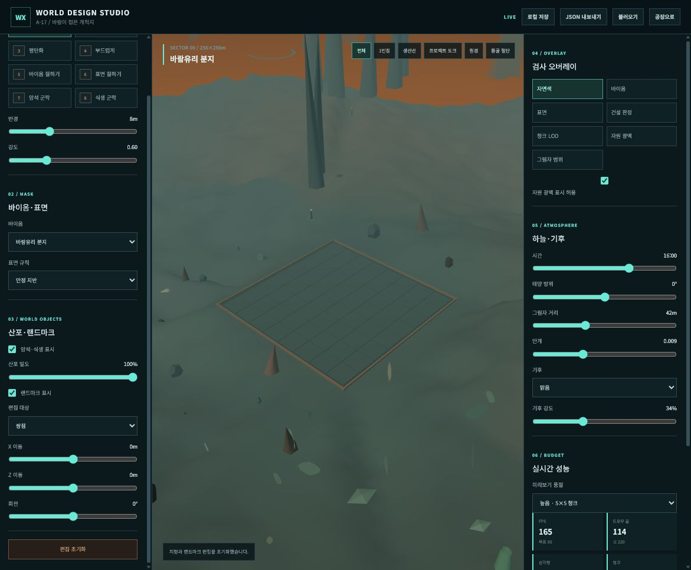
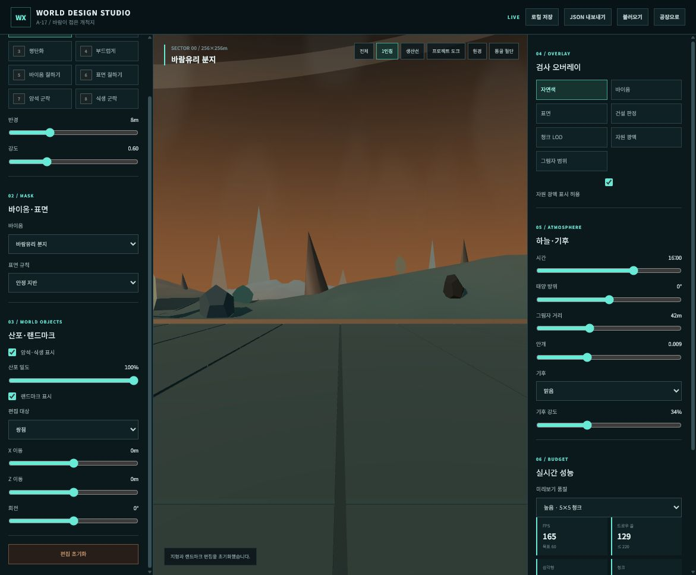
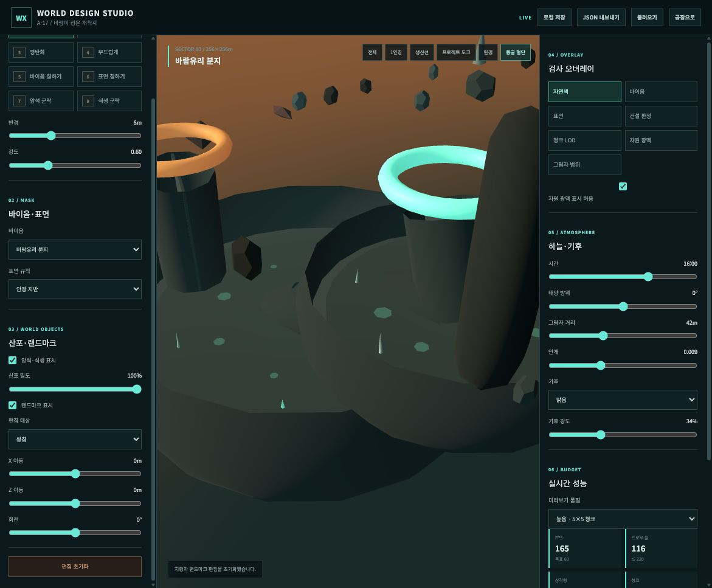

# FactoryX 지형 레퍼런스 연구

> - 문서 상태: 조사 통합본 v0.1
> - 주 기준: Satisfactory
> - 비교 대상: No Man's Sky, Subnautica, Death Stranding, The Planet Crafter, Astroneer
> - 목적: 참고작에서 확인된 제작 사실과 FactoryX에 적용할 해석을 구분하고 시각·게임플레이 원칙을 추출한다.
> - 상위 계획: `terrain-worldbuilding-plan.ko.md`

---

## 1. 조사 방식과 출처 기준

이 문서는 다음 세 종류의 내용을 구분한다.

- **확인된 사실**: 개발사 공식 페이지, 개발자 발표, 인터뷰와 실제 제작자의 포트폴리오에서 확인한 내용
- **시각 분석**: 공개 스크린샷에서 형태, 거리층, 이동망과 시야를 분석한 내용
- **FactoryX 적용**: 위 자료를 현재 웹 기반 공장 게임 조건에 맞게 번역한 설계 판단

출처 우선순위:

1. 개발사 공식 개발 기록과 발표
2. 해당 작업을 직접 수행한 개발자의 포트폴리오와 인터뷰
3. 공식 게임 사이트, 프레스킷과 공식 위키
4. 팬 위키와 팬 제작 지도는 위치 확인용 보조 자료로만 사용

스크린샷에서 도출한 공간 구성은 FactoryX의 설계 해석이며 원작 개발사가 직접 밝힌 사실과 혼동하지 않는다.

---

## 2. 현재 FactoryX 시각 기준선

현재 지형의 핵심 문제는 노이즈의 양이 아니라 **형태 위계와 장소 문법의 부족**이다.

- 비슷한 높이의 둥근 언덕이 반복되어 어느 방향을 봐도 같은 장소처럼 보인다.
- 바이옴이 고유한 지형보다 색과 산포 오브젝트로 구분된다.
- 원뿔과 기둥이 많지만 주변 여백과 시야축이 없어 랜드마크가 되지 못한다.
- 실제 수직 절벽, 오버행, 자연 아치와 연결된 수계가 없다.
- 동굴 입구, 지표 균열과 지하 단면이 하나의 지질 구조로 이어지지 않는다.
- 전역 먼지와 안개가 원경 깊이를 만드는 대신 화면 전체를 탁하게 만든다.

이후 레퍼런스의 목적은 소품 스타일을 복제하는 것이 아니라 이 여섯 문제를 해결할 공간 구성 규칙을 찾는 것이다.

---

## 3. Satisfactory — 주 기준 조사

### 3.1 핵심 결론

Satisfactory의 웅장함은 거대한 절차 노이즈가 아니라 다음 요소가 겹쳐서 나온다.

- 수작업으로 고정한 매크로 지형과 자원 위치
- 건설 가능한 여백과 탐험 지형의 반복
- 차량이 통과하는 지역 간 도로와 좁은 보행 지름길
- 플레이어 크기, 지역 랜드마크와 원거리 비스타의 3단 실루엣
- 평온한 자연과 거대한 산업 구조물의 대비
- 협곡을 통과한 뒤 다음 바이옴과 목적지가 열리는 시야 연출
- 공장 확장이 새로운 지역과 물류망을 요구하는 자원 거리

### 3.2 고정 월드와 기존 공장의 보존

#### 확인된 사실

Satisfactory의 레벨 디자이너 Michiel Werring은 지형 조각과 텍스처링, 정적 메시와 식생의 최종 배치를 담당했다고 설명한다. 라이브 게임의 특성상 기존 자원 노드를 함부로 옮길 수 없고, 플레이어가 이미 건설한 공장과 기존 높이장을 보존하면서 월드를 개편해야 했다. [레벨 디자이너 작업 기록](https://www.michielwerring.com/satisfactory.html)

Coffee Stain은 게임의 월드를 탐험할 수 있는 아름다운 수작업 환경으로 설명한다. [Unreal Engine 개발자 인터뷰](https://www.unrealengine.com/developer-interviews/how-satisfactory-is-combining-crafting-gunplay-and-vehicles-into-one-ambitious-building-simulator?lang=en-US)

#### FactoryX 적용

- 자원 노드, 공장 후보지와 주요 물류 통로를 지형 이후의 장식물이 아니라 토폴로지의 고정 제약으로 둔다.
- 지형 수정 시 필수 자원 패드, 기존 건물 영역, 차량 통과 폭과 벨트·철도 후보 회랑을 검사한다.
- 노이즈 시드 변경으로 전체 지형이 달라지는 구조는 제작 단계에서 사용하지 않는다.
- 절차 생성은 고정된 매크로 지형 위의 침식 흔적, 돌과 식생 산포에만 사용한다.

### 3.3 건설 여백과 탐험 지형의 교대

#### 확인된 사실

레벨 제작 업무에는 공장 건설에 적합한 평원뿐 아니라 밀집 숲, 암석 미로와 동굴 입구 같은 모험 지역 제작도 포함됐다. 작은 공장을 넣을 수 있을 만큼 큰 크레이터, 차량과 생물의 통과 폭, 지름길, 수직 이동과 전망대도 별도 설계 대상으로 다뤘다. [레벨 디자이너 작업 기록](https://www.michielwerring.com/satisfactory.html)

플레이어가 자연 위로 플랫폼을 놓거나 식생을 제거할 수 있기 때문에, 제작자는 자연을 무시하고 지나가는 대신 이동 자체가 재미있도록 지형을 설계해야 했다고 설명한다.

#### FactoryX 적용

- 한 지역을 전부 건설 평지나 전부 장애물로 만들지 않는다.
- `건설 여백 → 좁은 이동 구간 → 전망대 → 다음 건설 여백`의 리듬을 반복한다.
- 절벽은 길을 막는 장식이 아니라 우회도로, 교량, 리프트와 고지 공장 중 하나를 선택하게 한다.
- 지름길은 보행에 유리하지만 차량과 대량 물류에는 불리하게 역할을 나눈다.
- 작은 분지와 크레이터도 실제 전초기지가 들어갈 수 있는 크기로 만든다.

### 3.4 자연과 산업의 대비

#### 확인된 사실

Coffee Stain은 평온한 자연이 공장 내부의 기계음과 산업 활동에 대비되도록 환경을 설계했다고 설명한다. 또한 지구의 나무와 바위를 알아볼 수 있을 정도로 친숙하지만 고향처럼 느껴지지 않는, “익숙하지만 외계적인” 미술 방향을 사용했다. 탐험도 게임의 핵심 축으로 정의했다. [Unreal Engine 개발자 인터뷰](https://www.unrealengine.com/developer-interviews/how-satisfactory-is-combining-crafting-gunplay-and-vehicles-into-one-ambitious-building-simulator?lang=en-US)

#### FactoryX 적용

- 외계성은 무작위 원뿔, 모든 표면의 발광과 네온 팔레트로 만들지 않는다.
- 지층, 풍화, 집수와 중력은 익숙하게 유지하고 크기, 암반 방향, 생태 반응과 광물 성질을 낯설게 만든다.
- 자연 구역에 기계와 배관이 없는 조용한 공간을 의도적으로 남긴다.
- 공장 밖에서는 바람, 물과 생물 소리가 다시 들리도록 음향 경계를 설계한다.
- 맑고 구름 있는 기본 하늘 아래에서 산업 구조물이 실루엣으로 드러나게 한다.

### 3.5 이동망과 차량 경로

#### 확인된 사실

Satisfactory의 월드 개편 작업에는 막다른 길, 길처럼 보이지만 통과할 수 없는 틈과 차량이 지나가기 어려운 절벽·협곡을 수정하는 작업이 포함됐다. 전망 지점, 새 지름길과 수직 이동도 함께 추가됐다. [공식 월드 제작 스트림](https://www.youtube.com/watch?v=5NBgetrxtpw), [레벨 디자인 스트림](https://www.youtube.com/watch?v=CB9bSigNYH8)

#### FactoryX 적용

- 차량 도로와 지역 간 관문을 암석 배치보다 먼저 정한다.
- 차량용 길, 보행 지름길, 벨트·파이프 통로와 철도 후보선을 한 지형에 겹쳐 검토한다.
- 길처럼 보이는 곳은 실제로 지나갈 수 있어야 한다.
- 지나갈 수 없는 틈은 실루엣과 장애물로 명확히 설명한다.
- 좁은 협곡에는 대형 물류의 우회 비용과 소형 물류의 직선 이득을 함께 둔다.

### 3.6 동굴 제작 절차

#### 확인된 사실

Satisfactory의 동굴 제작은 먼저 완전히 닫힌 셸을 만들고, 조명 구성·이동 방식·게임플레이 기믹·적 유형 중 하나를 중심 콘셉트로 정하는 방식으로 설명된다. 이후 물웅덩이와 주요 구조물을 추가하고, 이동 경험과 높이 변화를 다듬은 뒤 입구 장식, 최종 조명과 VFX를 적용한다. [레벨 디자이너 작업 기록](https://www.michielwerring.com/satisfactory.html)

#### FactoryX 적용

동굴마다 다음 중 하나를 우선 정체성으로 삼는다.

- 수직 갱도와 승강 이동
- 지하강과 침수 구역
- 열 균열과 증기 분출
- 거대 화석 또는 광물 공동
- 좁은 운반 통로와 넓은 지하 공장실
- 위험 자원과 탈출 경로

제작 순서는 `닫힌 셸 → 주 이동선 → 밝은 출구와 기준 광원 → 자원·위험 → 장식 → VFX`로 고정한다. 모든 동굴을 균일한 발광 식물과 구형 방으로 채우지 않는다.

### 3.7 원경과 성능

#### 확인된 사실

Coffee Stain은 넓은 월드를 멀리서 볼 수 있도록 Level LOD, 절벽 묶음의 드로우콜을 줄이는 Hierarchical LOD, 컬링 볼륨, 식생 LOD와 원거리 단순 재질 교체를 사용했다고 설명한다. [Unreal Engine 개발자 인터뷰](https://www.unrealengine.com/developer-interviews/how-satisfactory-is-combining-crafting-gunplay-and-vehicles-into-one-ambitious-building-simulator?lang=en-US)

#### FactoryX 적용

- 원경 산맥을 플레이 영역과 같은 해상도로 렌더링하지 않는다.
- 원경은 저해상도 실루엣 메시, 단순 재질과 제한된 그림자를 사용한다.
- 절벽 모듈은 구역 단위 병합 또는 인스턴싱을 고려한다.
- 월드 확장 전에 카메라 중심 청크 생성과 객체 풀링을 구현한다.
- 보이는 월드 크기와 현재 시뮬레이션하는 월드 크기를 분리한다.

### 3.8 비주얼 레퍼런스 분석

#### 분지와 삼중 거리층

관찰:

- 전경의 낮은 테두리와 작은 암석이 크기 기준을 제공한다.
- 중경에는 실제 공장이 들어갈 만큼 넓은 분지와 수체가 있다.
- 원경 암벽이 화면의 주 실루엣을 담당한다.
- 중앙의 큰 빈 공간이 절벽의 크기와 건설 후보지를 동시에 읽게 한다.
- 분지 가장자리는 전망대이고 중앙은 목표 지점이다.

FactoryX 검수 질문:

- 한 프레임에 전경·중경·원경이 모두 있는가?
- 건설 가능한 여백의 경계가 자연스럽게 읽히는가?
- 원경 랜드마크 주위에 실루엣을 방해하지 않는 빈 공간이 있는가?
- 플레이어·차량·설비처럼 크기를 비교할 대상이 있는가?

#### 암석 미로와 자연 아치

관찰:

- 좌우의 비대칭 암반이 이동 방향을 만들고 공간을 압축한다.
- 상부의 자연 아치가 지역의 이름이 될 수 있는 실루엣과 방향 프레임을 만든다.
- 길 끝에서 하늘과 원경이 다시 열려 단순 복도가 되지 않는다.
- 바닥은 비교적 조용해 차량 통과 가능성이 보인다.
- 암벽 전체가 같은 높이로 이어지지 않고 단차와 틈이 반복된다.

FactoryX 검수 질문:

- 아치가 장식이 아니라 이동 프레임과 방향 표지 역할을 하는가?
- 차량 경로와 보행 지름길이 구분되는가?
- 협곡의 폭과 높이가 일정하지 않은가?
- 통과 전후로 시야의 압축과 해방이 있는가?

#### 동굴 통로

관찰:

- 장식 수보다 닫힌 실루엣, 한 가지 조명색과 명확한 진행 방향이 정체성을 만든다.
- 밝은 영역이 목표가 되고 나머지 표면은 상대적으로 절제돼 있다.
- 바닥과 천장 높이가 바뀌어 이동 리듬이 생긴다.

#### 동굴 공동과 천창

관찰:

- 좁은 통로에서 넓은 공동으로 열리며 공간 크기가 변한다.
- 상부 천창과 제한된 발광 띠가 높이와 방향을 설명한다.
- 모든 면이 같은 밝기로 발광하지 않는다.

### 3.9 Satisfactory에서 추출한 원칙 12개

1. 매크로 지형은 수작업으로 고정하고 노이즈는 표면 파쇄에만 쓴다.
2. 바이옴은 색보다 지형 난도, 건설 여백, 자원, 수계와 위험도로 먼저 나눈다.
3. 지질, 토양, 식생과 대기가 서로 다른 폭으로 바뀌는 전이대를 둔다.
4. 원거리 비스타, 지역 랜드마크와 플레이어 크기 오브젝트를 동시에 사용한다.
5. 랜드마크를 방향 탐색과 다음 목적지 예고에 사용한다.
6. 차량 이동망을 암석과 식생 배치보다 먼저 설계한다.
7. 넓은 공장 평지, 중형 테라스와 좁은 탐험 지형을 교대로 배치한다.
8. 희귀 자원을 고지·절벽·동굴에 둬 전초기지와 운송망 확장을 유도한다.
9. 높이장은 절벽 상·하단만 만들고 실제 수직면은 메시가 담당한다.
10. 동굴마다 조명, 이동, 위험과 보상 중 하나의 중심 콘셉트를 둔다.
11. 물을 고지 집수부부터 하류까지 이어지는 흐름망으로 만든다.
12. 식생은 균등 산포가 아니라 군집과 의도적인 빈 공간으로 배치한다.

### 3.10 피해야 할 오해

- Satisfactory 같은 복잡성은 노이즈 레이어가 많다는 뜻이 아니다.
- 맵 크기만 키우면 웅장해지는 것이 아니다. 크기 기준물과 실루엣 위계가 필요하다.
- 모든 곳을 빽빽하게 채우면 자연스러워지는 것이 아니다.
- 바이옴 경계는 재질 색만 섞는 문제가 아니다.
- 거대한 바위가 반드시 길을 막아야 위압적인 것은 아니다.
- 모든 먼 산이 플레이 가능할 필요는 없다.
- 동굴은 어두운 복도와 발광 소품만으로 완성되지 않는다.

---

## 4. No Man's Sky — 절차 생성의 형태 어휘

### 확인된 사실

Hello Games는 수학적 생성으로 현실적이면서도 외계적인 지형을 만들고, 사실상 무한한 환경을 테스트하는 과정 자체가 큰 기술 문제였다고 설명한다. 별도 미술 발표에서는 절차 기술과 미술적 통제를 함께 발전시켜야 품질을 유지할 수 있다고 설명한다. [Sean Murray의 GDC 발표](https://www.gdcvault.com/play/1024514/Building-Worlds-Using%3E), [Grant Duncan의 GDC 미술 발표](https://www.gdcvault.com/play/1021805/Art-Direction-Bootcamp-How-I)

Worlds Part II 업데이트는 새로운 산맥, 깊은 계곡과 광대한 평원을 포함하도록 생성 알고리즘을 확장했다. 깊은 바다도 별도의 거리감, 광원과 생태 환경을 갖는다. [Hello Games 공식 업데이트](https://www.nomanssky.com/worlds-part-ii-update/)

### FactoryX 적용

- 무한 월드 기술이 아니라 저·중·고 주파수의 역할 분리를 가져온다.
- 저주파는 산맥·분지·대평원, 중주파는 능선·테라스·계곡, 고주파는 침식과 표면 파쇄를 담당한다.
- 저주파 형태가 확정되기 전에는 중·고주파 노이즈를 추가하지 않는다.
- 거대 산맥과 깊은 협곡은 희귀한 영웅 형태로 사용한다.
- 절차 결과는 항상 World Studio에서 고정·수정할 수 있어야 한다.

### 피할 것

- 절차 생성 결과를 그대로 건설 지형으로 사용하는 것
- 모든 방향에 영웅 형태를 만들어 서로 경쟁시키는 것
- 한 행성 전체가 같은 노이즈 문법으로 반복되는 것

### 비주얼 자료

- [Worlds Part II 공식 갤러리](https://www.nomanssky.com/worlds-part-ii-update/)
- [Origins 공식 갤러리](https://www.nomanssky.com/origins-update/)
- [공식 거대 지형 이미지](https://www.nomanssky.com/media/d12p3zmo/snl-4-1040w.jpg)

---

## 5. Subnautica — 수직 바이옴과 공간 정체성

### 확인된 사실

Unknown Worlds는 서로 크게 다른 환경을 Subnautica의 핵심 설계 요소로 둔다. Kelp Forest는 지구의 숲을 연상시키면서도 외계적인 형태를 사용하며, 바이옴 사이의 자연스럽고 몰입감 있는 전이를 기술적 과제로 다뤘다. [Kelp Forest 개발 자료](https://unknownworlds.com/en/news/subnautica-concept-art-kelp-forest)

Coral Reef는 얕고 상대적으로 안전한 시작 바이옴으로, 좁은 협곡과 낮은 통로 때문에 큰 잠수함보다 작은 이동 수단이 유리하도록 구상됐다. 자산 수를 무한히 늘리는 대신 지배 요소를 반복해 지역 정체성을 유지했다. [Coral Reef 개발 자료](https://unknownworlds.com/en/news/subnautica-concept-art-coral-reef-3)

Lost River는 거대 골격을 중심 랜드마크로 사용하고 그 내부에 차량이 들어갈 수 있을 정도의 크기를 고려했다. [Lost River 초기 제작 자료](https://unknownworlds.com/en/news/farming-rivers-more-future-stuff)

게임 디렉터 Charlie Cleveland는 탐험, 발견과 미지를 설계 축으로 두고 라디오 신호와 이야기 단서로 샌드박스를 과도하게 지시하지 않으면서 구조화했다고 설명한다. [GDC 발표](https://www.gdcvault.com/play/1025745/The-Design-of-Subnautica)

### FactoryX 적용

- 바이옴을 평면적으로 나열하지 않고 `지표 → 얕은 동굴 → 심층 동굴`의 수직 관계로 설계한다.
- 깊이에 따라 이동 수단, 조명, 위험, 자원과 공간 폭이 달라진다.
- 각 바이옴에는 지배 색상보다 지배 형태를 먼저 부여한다.
- 거대 화석, 결정 공동과 지하강 같은 기준물을 한 바이옴에 하나만 배치한다.
- 좁은 구역은 보행, 넓은 공동은 차량이나 지하 공장처럼 서로 다른 용도를 갖는다.
- 전이 지대에서는 식생 밀도, 지층 방향, 습윤도와 통로 폭도 단계적으로 바뀐다.

### 피할 것

- 모든 동굴을 비슷한 구형 방과 관으로 만드는 것
- 깊이를 단순히 어둡게만 표현하는 것
- 공장 운영 구역까지 식생과 안개로 계속 가리는 것

### 비주얼 자료

- [Kelp Forest 공식 콘셉트](https://unknownworlds.com/en/news/subnautica-concept-art-kelp-forest)
- [Lost River 공식 콘셉트와 거대 골격](https://unknownworlds.com/en/news/farming-rivers-more-future-stuff)
- [Crag Field와 Lost River 공식 이미지](https://unknownworlds.com/en/news/infected-update-released)
- [Jellyshroom 동굴](https://unknownworlds.com/en/news/subnautica-seamoth-update-released)

---

## 6. Death Stranding — 현실적인 지표와 이동 비용

### 확인된 사실

Kojima Productions의 환경 아티스트는 배경을 보기 좋게 만드는 것만으로 충분하지 않고 게임 디자인을 고려해 제작해야 한다고 설명한다. Death Stranding의 암석은 실제 지역에서 스캔한 자료를 사용했다. [환경 아티스트 인터뷰](https://www.kojimaproductions.jp/en/Staff-interview-06)

공식 경로 계획 가이드는 3D 지도에서 경사도를 확인하고 직선 등반보다 완만한 우회가 빠를 수 있다고 설명한다. [공식 경로 계획 가이드](https://www.kojimaproductions.jp/en/death-stranding-directors-cut-beginners-guide)

### FactoryX 적용

- 암종별 실제 사진을 기준으로 비례, 파쇄 방향과 퇴적 위치를 설계한다.
- 경사, 느슨한 자갈, 얕은 물과 암반 계단에 이동 비용을 부여한다.
- 같은 목적지라도 보행, 차량, 벨트와 철도에 적합한 경로가 다르게 보이게 한다.
- 플레이어가 바닥만 보지 않도록 중거리 능선과 원거리 랜드마크를 유지한다.
- 낙석은 절벽 하단, 자갈은 수로처럼 형성 원인을 갖게 한다.
- 자주 사용하는 물류로 주변에 길, 토양 노출과 눌린 식생이 남는 후속 상태 레이어를 고려한다.

### 피할 것

- 바닥 전체를 걷거나 운전하기 불쾌한 돌밭으로 만드는 것
- 방향 기준점 없는 넓은 공백
- 공장 확장 후보지를 지나치게 희소하게 만드는 것

### 비주얼 자료

- [공식 풍경 비교와 사진 제작 자료](https://www.kojimaproductions.jp/index.php/en/a-playground-for-photographers)
- [공식 포토모드 갤러리](https://www.kojimaproductions.jp/DSPhotomodeCP-2026_01)
- [PlayStation 공식 풍경 갤러리](https://blog.playstation.com/?p=219014)

---

## 7. The Planet Crafter — 같은 장소의 시간 변화

### 확인된 사실

The Planet Crafter의 핵심은 산소, 열과 압력을 생성해 불모 행성을 생물권으로 바꾸는 과정이다. [공식 Steam 페이지](https://store.steampowered.com/app/1284190/The_Planet_Crafter/)

개발사 업데이트는 폭포, 유성 지대와 버섯 강 같은 신규 바이옴, 테라포밍 단계에 따른 생물과 식생 출현을 함께 다뤘다. [Miju Games 공식 업데이트 기록](https://store.steampowered.com/news/posts/?enddate=1659280231&feed=steam_community_announcements)

### FactoryX 적용

- 지형 메시를 실시간으로 크게 바꾸기보다 같은 지형의 상태 레이어를 변화시킨다.
- 상태를 `건조 → 습윤 → 이끼 → 식생 → 산업 오염 또는 회복`으로 나눈다.
- 물이 차오를 지역에는 처음부터 수위선, 침수 위험과 높은 건설지를 설계한다.
- 공장 확장에 따라 토양 압착, 매연, 폐수와 식생 감소가 누적될 수 있다.
- 변화 전후에 같은 랜드마크와 실루엣을 유지해 플레이어의 영향을 알아보게 한다.

### 피할 것

- 지형은 그대로인데 색과 식생만 일괄 교체하는 것
- 수위 변화가 예고 없이 기존 공장을 잠기게 하는 것
- 전혀 다른 테마를 짧은 간격으로 붙이는 것

이 기능은 첫 지형 완성 뒤의 후속 시스템으로 보류한다.

### 비주얼 자료

- [Miju Games 공식 프레스킷](https://mijugames.com/pages/planetcrafter/presskit.html)
- [공식 Steam 스크린샷](https://store.steampowered.com/app/1284190/The_Planet_Crafter/)

---

## 8. Astroneer — 지층 규칙과 피해야 할 기술 범위

### 확인된 사실

Astroneer는 절차 월드, 부드러운 실시간 지형 변형과 대량 동적 오브젝트가 네트워크와 성능 양쪽에 큰 부담이 된다고 설명한다. 넓은 월드에서 프레임을 유지하기 위해 플레이어 주변만 시뮬레이션하고 인접 지형에만 충돌면을 만든다. [System Era 기술 글](https://blog.astroneer.space/p/day-1-multiplayer-and-beyond/)

먼 오브젝트를 언로드하는 스트리밍과 Marching Cubes 지형의 최적화도 핵심 과제로 다뤘다. [System Era 성능 글](https://blog.astroneer.space/p/going-faster/)

저폴리 스타일은 작은 팀이 빠르게 제작하고 반복하기 위한 생산 결정이었고 텍스처보다 삼각형 면과 실루엣으로 지형을 읽히게 했다. [공식 미술 제작 글](https://blog.astroneer.space/p/the-art-of-astroneer-low-poly/)

### FactoryX 적용

- 현재 단계에서는 자유 복셀 굴착과 런타임 Marching Cubes를 도입하지 않는다.
- 동굴과 터널은 수작업 셸과 정해진 포털로 제작한다.
- 근거리만 충돌·시뮬레이션하는 구조, 스트리밍과 형태 우선 자산 제작을 가져온다.
- 장기적으로 굴착이 필요하면 전체 월드가 아니라 특정 광산 볼륨으로 격리한다.
- 동굴을 `표토층 → 얕은 자원 동굴 → 지하 수계층 → 광물 맨틀 → 고대 구조 코어`로 나눈다.

### 피할 것

- 공장 기초 아래를 어디서나 파낼 수 있는 완전 자유 굴착
- 모든 자연 장벽을 즉석 터널로 무력화하는 것
- 매끈한 점토형 표면만 사용해 산업 세계의 중량감을 잃는 것

### 비주얼 자료

- [Astroneer 공식 미술 제작 과정](https://blog.astroneer.space/p/the-art-of-astroneer-low-poly/)
- [공식 초기 월드 이미지](https://blog.astroneer.space/p/hello-worlds/)
- [System Era 공식 프레스 갤러리](https://www.systemera.net/press-kit/astroneer)

---

## 9. 참고작 비교 결론

| 설계 질문 | Satisfactory | No Man's Sky | Subnautica | Death Stranding | Planet Crafter | Astroneer | FactoryX 결정 |
| --- | --- | --- | --- | --- | --- | --- | --- |
| 월드 골격 | 수작업 고정 | 절차 생성 | 수작업 바이옴·동굴 | 수작업 현실 지형 | 고정 월드 | 절차 복셀 | 수작업 고정 |
| 세부 배치 | 수작업+도구 | 절차 규칙 | 지역별 군집 | 현실 참조 | 단계별 활성화 | 절차 산포 | 제한적 절차 |
| 수직성 | 절벽·고원·동굴 | 산맥·심해 | 깊이별 바이옴 | 경사와 고도 | 동굴·침수 | 지표부터 코어 | 절벽·동굴 셸 |
| 건설과 지형 | 평지와 물류 선택 | 자유 기지 | 제한된 기지 공간 | 이동 중심 | 침수와 환경 변화 | 완전 변형 | 건설 마스크와 경로 비용 |
| 웅장함 | 수작업 비스타 | 희귀 거대 생성물 | 깊이와 거대 기준물 | 현실 스케일과 여백 | 전후 변화 | 행성 규모 | 거리층과 영웅 지형 |
| 웹 구현 적합성 | 높음 | 전체 방식은 낮음 | 높음 | 미술 원칙만 높음 | 상태 레이어는 높음 | 전체 방식은 낮음 | 혼합 방식 |

FactoryX는 다음 역할을 결합한다.

- Satisfactory: 수작업 매크로 월드, 건설 여백과 물류 동선
- No Man's Sky: 희귀한 거대 원경 실루엣
- Subnautica: 수직 바이옴, 수작업 전이와 동굴 정체성
- Death Stranding: 지형이 이동 비용과 인프라 선택을 만드는 구조
- The Planet Crafter: 충돌을 바꾸지 않는 환경 상태 변화
- Astroneer: 깊이에 따른 지층 규칙과 근거리 스트리밍

---

## 10. 연구에서 확정한 지형 원칙

1. 매크로 지형은 수작업하고 노이즈는 표면 디테일에만 사용한다.
2. 건설 여백과 탐험 지형을 교대로 배치한다.
3. 바이옴마다 대표 매크로 형태 하나와 보조 형태 최대 두 개만 사용한다.
4. 높이장은 보행 가능한 표면을 담당하고 수직 절벽·오버행·아치·동굴은 별도 메시로 제작한다.
5. 모든 지형 특징은 이동, 물류, 자원, 건설 또는 방향 탐색 중 하나의 역할을 갖는다.
6. 웅장함은 폴리곤 수보다 전경·중경·원경, 빈 공간, 실루엣과 크기 기준물로 만든다.
7. 동굴은 각자 하나의 조명 또는 이동 콘셉트를 가진다.
8. 원경, 플레이 영역과 시뮬레이션 영역을 서로 분리한다.
9. 자유 복셀 굴착은 현재 범위에서 제외한다.
10. 환경 변화는 지형 전체 재생성보다 상태 레이어 전환으로 구현한다.
11. 탑뷰뿐 아니라 1인칭 높이에서 스크린샷 검수를 수행한다.
12. 텍스처와 소품 전에 흑백 형태만으로 장소와 이동망이 구분돼야 한다.

복잡한 지형은 작은 요철이 많은 지형이 아니다. **멀리서 기억되는 형태, 비용이 다른 경로, 수직 지층, 물의 흐름과 시간에 따른 변화가 함께 존재하는 지형**이다.
