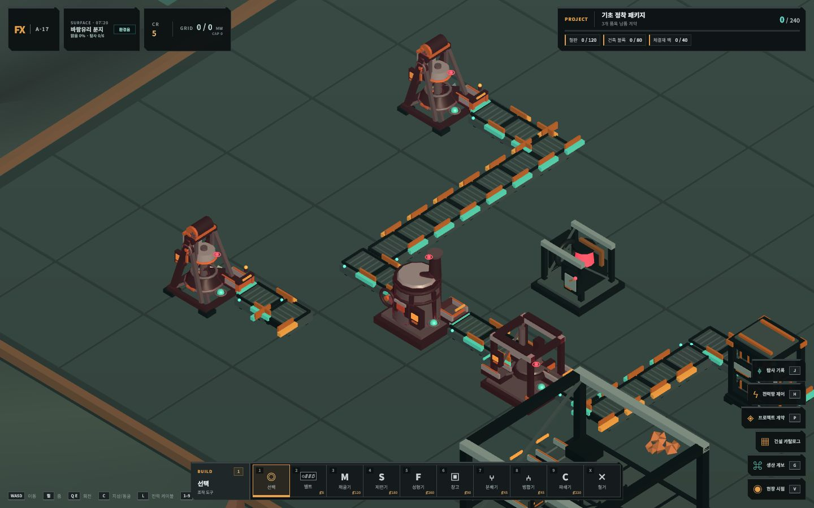
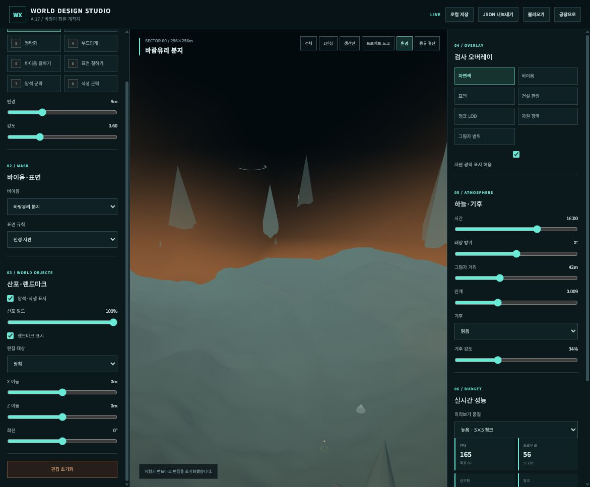

# FactoryX 월드·환경 0단계 기준선

> - 상태: 0단계 완료 기준
> - 측정일: 2026-08-02
> - 소스 기준: `5dddbea`
> - 대상: A-17 `a17_folded_by_wind` 환경 v1
> - 목적: 지형·환경 고도화 전 현재 화면, 결정성, 성능과 구조 결함을 재현 가능한 기준으로 고정한다.

## 1. 고정 측정 조건

| 항목 | 값 |
| --- | --- |
| 월드 크기 | 256×256m, `X/Z -128..127` |
| 환경 seed | `171703` |
| 청크 크기 | 32m |
| 브라우저 viewport | 1440×900 |
| World Studio 품질 | 높음, 별도 저품질 표본 포함 |
| 시간 | `0.68`, UI 기준 16:00 |
| 태양 방위 | 0° |
| 안개 밀도 | `0.0085` |
| 기후 | 맑음 |
| 산포 밀도 | 100% |
| 랜드마크 | 표시 |
| 오버레이 | 자연색 |
| 편집 stroke | 없음 |

`A17_ENVIRONMENT.seed`와 World Studio 문서 seed 검증이 이미 연결되어 있으므로 현재 데이터 수준의 seed는 고정되어 있다. 캡처를 다시 만들 때는 위 조건을 먼저 적용한다.

## 2. 기준 캡처

### 2.1 실제 게임 오버뷰



- 공장과 설비 가독성은 양호하다.
- 공장 패드가 화면 대부분을 차지하면 자연 지형의 상태를 판단하기 어렵다.
- 이후 환경 변경에서도 공장 상태색인 청록·주황과 바닥 대비를 보존해야 한다.

### 2.2 World Studio 전체 뷰


- 시작 패드와 넓은 지형의 배치는 확인할 수 있다.
- 맑음인데도 지평선이 주황색이고 안개가 두꺼워 바이옴과 원경 형태가 묻힌다.
- 지형 표면이 큰 저해상도 면과 단색 vertex color로 읽힌다.
- 소품이 생태 군락보다 독립된 프리미티브 산포로 보인다.

### 2.3 1인칭 뷰


- 지면에 재질의 두께, 퇴적, 침식과 작은 형태 계층이 없다.
- 뾰족한 원뿔 실루엣이 반복되고 암석 변형 수가 부족하다.
- 하늘은 맑음 상태에서도 갈색 그라데이션이며 구름이 거의 읽히지 않는다.
- 멀리 있는 지형이 절벽이나 산맥이 아니라 완만한 높이맵 덩어리로 보인다.

### 2.4 원경 뷰



- 원경 산맥이 동일 계열 원뿔의 원형 배치로 명확하게 보인다.
- 실제 플레이 지형과 원경 사이의 지질적 연결이 없다.
- 검은 상부와 주황 지평선 때문에 지구형 맑은 하늘 목표를 만족하지 못한다.

### 2.5 동굴 절단 뷰


- 동굴이 이동 가능한 내부 공간보다 외부에 놓인 원통·링 구조물로 읽힌다.
- 절단 뷰에서 지상 소품과 주황 하늘이 계속 보인다.
- 방, 회랑, 입구, 천장과 지층 단면의 관계를 판단할 수 없다.

## 3. 성능 기준선

World Studio 표시값을 0.5초 간격으로 10회 읽었다. 동일 뷰의 값은 첫 표본을 제외하고 모두 같았다.

| 품질·뷰 | FPS | 프레임 | 드로우콜 | 삼각형 | 활성 청크 | 표시 소품 |
| --- | ---: | ---: | ---: | ---: | ---: | ---: |
| 높음·전체 | 165 | 6.1ms | 114 | 43,158 | 25 | 140 |
| 높음·1인칭 | 165 | 6.1ms | 129 | 43,774 | 25 | 166 |
| 높음·원경 | 165 | 6.1ms | 56 | 41,154 | 9 | 30 |
| 높음·동굴 절단 | 161 | 6.2ms | 116 | 11,563 | 15 | 60 |
| 낮음·전체 | 164~165 | 6.1ms | 45 | 39,462 | 9 | 14 |

판정:

- 현재 화면은 문서 예산인 220 draw calls와 700k triangles 안에 있다.
- 수치상 여유는 크지만 현재 자산과 지형 디테일이 매우 낮은 상태의 값이다. 향후 예산을 모두 폴리곤으로 소모하지 않는다.
- 현재 FPS는 표시 장치 주사율 근처에서 고정되며 GPU 시간, `p95`, 메모리와 shader compile 비용을 포함하지 않는다. 최종 성능 승인의 근거로 사용하지 않는다.
- 동굴 절단 뷰의 활성 청크·소품 값은 실제로 숨겨진 렌더 비용을 정확히 뜻하지 않으므로 계측 항목도 이후 보정한다.
- 게임과 World Studio의 console warning/error는 캡처 시점에 0건이었다.

기계 판독 데이터는 `assets/world-baseline/step-0-metrics.json`에 함께 둔다.

## 4. 결정성 지문

현재 `TerrainSampler`를 4m 격자로 샘플해 높이, 바이옴과 표면을 직렬화한 SHA-256이다.

```text
411786fb691231faf7a30ca92cda4645431bc09d423e040084c1ba443de9848d
```

이 지문은 현재 지형을 영구 보존하기 위한 golden 값이 아니다. 다음 생성기로 교체할 때 변경 전후를 명시적으로 구분하고, 저장 마이그레이션 없이 몰래 지형이 바뀌지 않았음을 확인하기 위한 기준이다.

| 좌표 | 높이 | 경사 | 바이옴 | 표면 |
| --- | ---: | ---: | --- | --- |
| 0, 0 | -0.500000 | 0.000° | 바람유리 분지 | stable |
| 72, -48 | -4.148971 | 43.245° | 철풍 단층지 | steep |
| -72, 18 | 3.126885 | 17.025° | 규산 돛숲 | stable |
| 74, 58 | -5.467124 | 0.000° | 검은수맥 습지 | hazard |
| -62, -72 | 3.334030 | 1.371° | 적철 왕관고원 | stable |
| 12, 96 | -5.034450 | 4.179° | 열극 심층부 | stable |

0.5m 전역 표본의 높이 범위는 `-10.296618..14.939200m`, 최대 계산 경사는 `85.388°`였다.

## 5. 확인된 구조 결함

### P0 — 다음 지형 작업 전에 제거

1. **높이 불연속:** `TerrainSampler.rawHeightAt()`이 `floor(x / 4)`, `floor(z / 4)` 해시를 높이에 직접 더한다. 4m 셀 경계를 `±0.001m`로 검사했을 때 최대 높이 점프는 `1.582728m`였다.
2. **LOD 접합 계약 부재:** 현재 32m 청크는 고품질 `16/8/4` segment이고 저품질은 `8/4/3`이다. 공유 edge, skirt, geomorph가 없으며 각 메시가 자체적으로 `computeVertexNormals()`를 실행한다.
3. **실제 원경 지형 부재:** 원경은 `ConeGeometry` 42개를 두 개의 원형 ring으로 배치하고 카메라 X/Z를 추종한다.
4. **맑은 하늘 기준 불일치:** 기본 하늘 셰이더의 horizon color 자체가 갈색이며 구름은 낮은 opacity의 사인 띠다.
5. **실제 수체 부재:** `submerged` 지면 tint와 원형 wet patch는 있지만 수면, 깊이, shoreline과 수체 데이터가 없다.
6. **실제 절벽 부재:** 높이맵 외의 cliff spline, 수직벽 메시와 절벽 충돌 계약이 없다.
7. **동굴 누출:** 동굴 절단은 terrain만 숨기며 지상 소품과 하늘을 함께 차단하지 않는다.

### P1 — 첫 수직 절편에서 교체

1. 바이옴이 주로 중심점 거리와 색으로 구분되며 고유 지형 연산이 약하다.
2. 랜드마크와 동굴이 cone, cylinder, sphere, torus 중심의 코드 프리미티브다.
3. 암석과 식생이 독립 난수 산포로 읽히며 서식지·군락 구조가 약하다.
4. 지면은 vertex color 한 재질이며 triplanar, macro/micro normal, 퇴적·flow mask가 없다.
5. wet/dust 표현이 `CircleGeometry` 중심이라 가까이에서 원판으로 읽힐 위험이 있다.

### 계측 TODO

- 고정 카메라의 GPU frame time과 `p50/p95/p99`
- renderer memory, texture memory와 shader compile 시간
- 지형 seam 픽셀 검사와 LOD 전환 영상
- 1,000개 공유 edge 높이·법선 오차 검사
- 게임 스트레스 장면: 설비 40, 벨트 200, 환경 소품 500
- 고정 animation time을 사용하는 자동 screenshot 회귀

## 6. 이미 보존할 기반

- 환경 ID, version과 seed가 명시되어 있다.
- World Studio 문서가 환경 version과 seed 불일치를 거부한다.
- 렌더, 배치와 충돌이 `TerrainSampler`를 중심으로 연결되어 있다.
- props와 원경의 난수 생성은 seed 기반이다.
- 고품질 5×5, 저품질 3×3 청크 예산과 성능 패널이 존재한다.
- 저장은 환경 원본보다 식별자와 플레이 델타를 보관한다.

이 기반은 유지하되 지형 함수, LOD 메시와 시각 자산을 교체한다.

## 7. 0단계 완료 판정

- [x] 설계 문서 커밋
- [x] 환경 ID, version, bounds와 seed 기록
- [x] 1440×900 고정 조건의 게임·전체·1인칭·원경·동굴 캡처
- [x] 높음/낮음 성능 표시값 기록
- [x] console warning/error 확인
- [x] 현재 지형의 결정성 지문 생성
- [x] 코드 근거가 있는 P0/P1 결함 분류
- [x] 다음 단계에서 보존할 기존 계약 분류

0단계에서는 시각 수정이나 생성기 교체를 하지 않는다. 다음 작업은 Blender 자산 한 종의 수직 파이프라인을 닫는 1단계다.
